# WordPress Cluster Installation Guide

{}{}

**[WordPress](https://www.virtuozzo.com/application-platform-for-wordpress/)** is a highly popular open-source CMS, intended for creation of websites, blogs, and apps. This tutorial shows how to deploy a **WordPress** application into the platform and configure it as a scalable cluster - such approach ensures high availability and reliability to strengthen your application.

WordPress cluster helps to handle permanent high load and huge load spikes, ensures zero downtime, improves performance, cuts maintenance costs, and, as a result, offers an excellent experience for end-users.

In order to get the most from your WordPress Cluster, the following benefits can be configured:

* install a WordPress cluster powered by *LightSpeed* and a highly available *MariaDB Galera cluster*
* enable a lightning-fast *Premium CDN* with support of HTTP/3 (aka QUIC)
* get a free *Let's Encrypt SSL* certificate with automatic renewal
* bind a *custom domain* and update the certificate
* *scale dynamically* based on the load

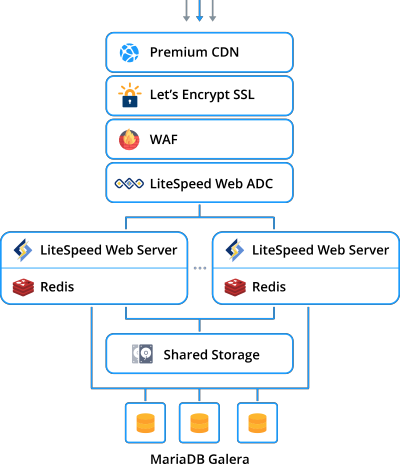

## WordPress Cluster Automatic Installation

Normally, WordPress cluster deployment is quite time-consuming and complex, but with PaaS, most of the work is done by the platform. Just a few clicks are needed to specify your preferences.

1\. If you have no PaaS account, you can register and deploy the WordPress Cluster by clicking the "**Deploy to PaaS**" button below. Within the opened widget, specify your email address, choose one of the [Public Cloud](https://www.virtuozzo.com/application-platform-partners/) providers, and press **Install**.

<a href="https://www.virtuozzo.com/install/?manifest=https://raw.githubusercontent.com/jelastic-jps/wordpress-cluster/v2.0.0/manifest.yml&keys=app.mycloud.by;app.jelastic.eapps.com;app.hidora.com;app.rag-control.hosteur.com;app.jpc.infomaniak.com;;app.jpe.infomaniak.com;app.trendhosting.cloud;app.cloudjiffy.com;app.paas.mamazala.com;app.mircloud.host;app.paas-infra.previder.com;app.my.reclaim.cloud;app.j.scaleforce.net;app.unicloud.pl;app.unispace.io;app.trendhosting.cloud;app.cloudlets.com.au&filter=auto_cluster" target="_blank"></a>

The registered users can install *WordPress Cluster Kit* by [importing](/environment-import/) the appropriate ***[manifest.jps](https://github.com/jelastic-jps/wordpress-cluster/blob/master/manifest.jps)*** file from GitHub or from the [platform Marketplace](/marketplace/) directly at the dashboard. Note that this clustered solution is available only for *billing* customers.

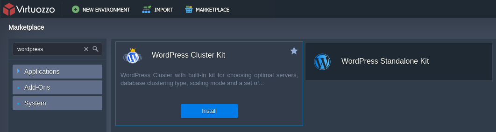

2\. In the opened installation window, you can customize your WordPress Cluster, starting with scaling mode.

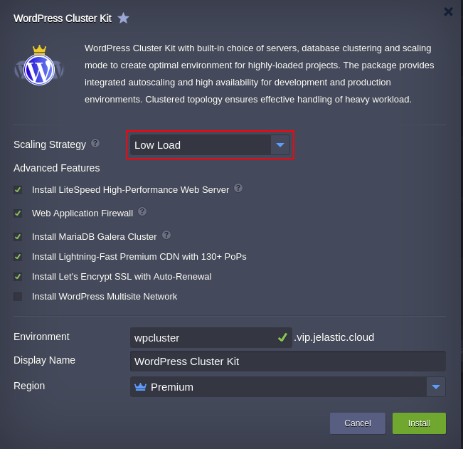

This **Scaling Strategy** parameter aims to foresee possible upcoming load growth in the cluster and scale out the application servers horizontally in order to prevent WordPress application downtime.

Based on our experience, we offer three common [scaling scenario automations](/automatic-horizontal-scaling/) for WordPress to prevent overload (these settings can be adjusted after installation):

* ***Low Load***
    * adds **1** application server node if the workload is higher than **70%**
    * removes **1** application server node if the workload goes below **20%**
* ***Medium Load***
    * adds **1** application server node if the workload is higher than **50%**
    * removes **1** application server node if the workload goes below **20%**
* ***High Load***
    * adds **2** application server node if the workload is higher than **30%**
    * removes **1** application server node if the workload goes below **10%**

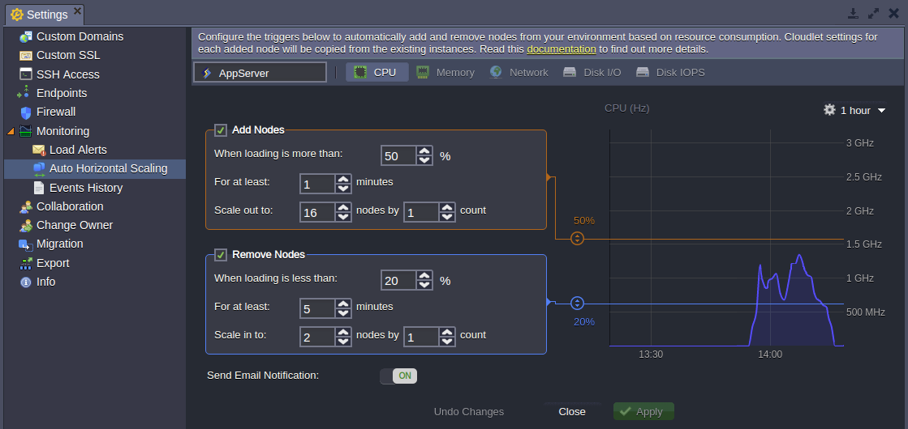

3\. Next, activate the preferred **Advanced Features** within the same installation frame.

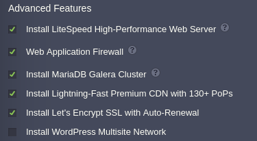

* **LiteSpeed High-Performance Web Server** installs cluster based on [LiteSpeed Web Server](/litespeed-web-server/) and [Web Application Delivery Controller](/litespeed-web-adc/). This option provides the highest possible speed of website content delivery to the clients via modern [HTTP/3](/http3/) protocol. In case you untick this option, the cluster will be installed using NGINX web server and load balancer.
* The **[Web Application Firewall](https://www.litespeedtech.com/support/wiki/doku.php/litespeed_wiki:waf)** (WAF) enables/disables the feature (works with the LiteSpeed Web Server only).
{}**Note:** It is not recommended to use LiteSpeed Web Admin Console to configure **WAF** since it will cause functionality failure during horizontal scaling. If you need to adjust Web Application Firewall after the installation, the appropriate **WAF=TRUE/FALSE** [environment variable](/custom-environment-variables/) should be used.

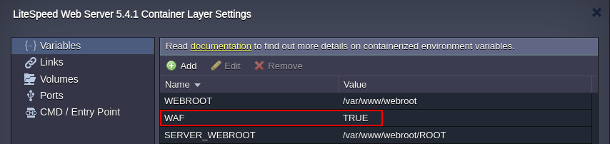

Don't forget to restart nodes in the application server layer after changing the variable.{}

* **[MariaDB Galera Cluster](https://mariadb.com/kb/en/library/galera-cluster/)** is a multi-master database cluster based on synchronous replication and InnoDB engine. When using the Galera Cluster, you can perform direct read and write operations to any node. If any single instance goes down, there will be no cluster downtime and no complex failover procedures.
In case you untick the checkbox, a regular standalone MariaDB database will be installed. Thus, high availability and failover capabilities will be significantly decreased.
{}**Note:** In case you are going to migrate an existing database to Galera Cluster, you have to take into consideration the following requirements:

* all tables must be of *InnoDB/XtraDB* type
* all tables must have a *PRIMARY* index
{}

* **[Lightning-Fast Premium CDN with 130+ PoPs](https://www.virtuozzo.com/company/blog/enterprise-cdn-verizon-integration/)** integrates Verizon Edgecast CDN into WordPress application.
* **[Let's Encrypt SSL with Auto-Renewal](https://www.virtuozzo.com/company/blog/free-ssl-certificates-with-lets-encrypt/)** add-on allows to issue and use a trusted, free certificate for a custom domain. The built-in functionality employs periodical renewal to prevent certificate expiration. The appropriate notifications are sent by email.
* **[WordPress Multisite Network](https://wordpress.org/support/article/glossary/#multisite)** enables/disables the same-named feature. It allows the application to act as a WordPress network hub, where the network can comprise several websites. With this built-in feature and the platform automation, you can create an independent network of websites and invite others to develop their sites on the same network even for commercial usage.

4\. Specify **Environment** name, **Display Name**, choose availability **Region** (if available) and click **Install**. Wait several minutes for Jelatic to set up your WordPress Cluster.

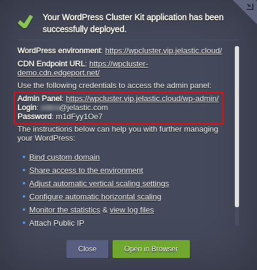

Use the links and credentials from the successful installation frame or from the appropriate email to manage your WordPress application (or even create a network).

### Domain and SSL Certificate Configurations

For production, the environment should have a public IP address and custom domain that help to share information regarding your resource across the Internet.

In case the WordPress was installed with [Let's Encrypt SSL Add-On](https://www.virtuozzo.com/company/blog/free-ssl-certificates-with-lets-encrypt/), the public IP address was added to the **Load Balancer** node automatically.

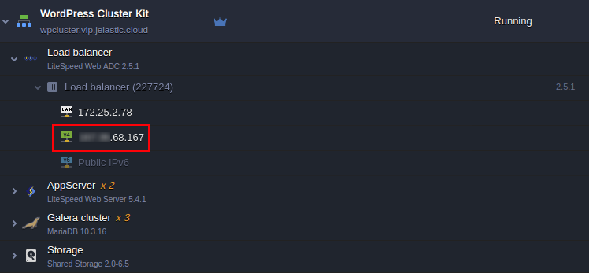

The next step is to bind a custom domain to the environment and issue a trusted SSL certificate for it.

1\. As for our example, create an A record for your [custom domain](/custom-domains/) that will map it to the public IP address attached to Load Balancer. If you are not familiar with this procedure, follow the steps in the linked guide.

2\. Then find the ***Let's Encrypt Free SSL*** among the Load Balancer **Add-Ons** and click the **Configure** button.

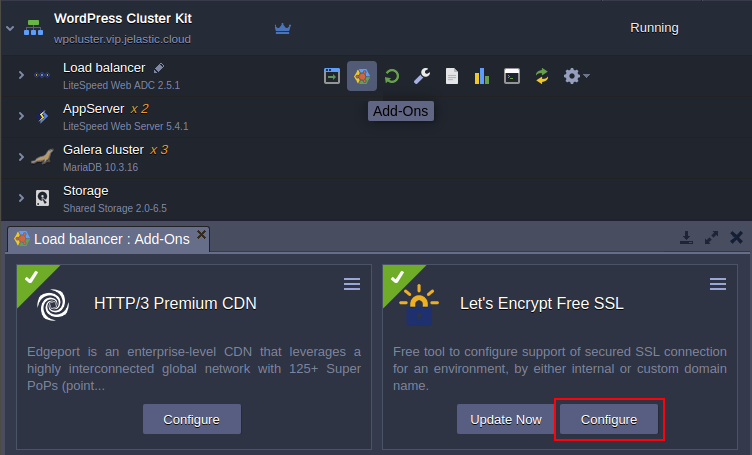

3\. Paste your custom domain (for example, *vip.wpaas.pro*) in the respective field and click **Apply**.

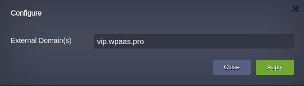

Once the SSL certificate is issued, you will be informed via popup and the appropriate email.

4\. The last step is to make sure all links within your WordPress application point to the custom domain. Open the admin panel using the link and credentials from the successful installation window or respective email. Go to the ***Settings*** and check whether the **WordPress Address (URL)** and **Site Address (URL)** fields contain the correct custom domain. If required, change it.

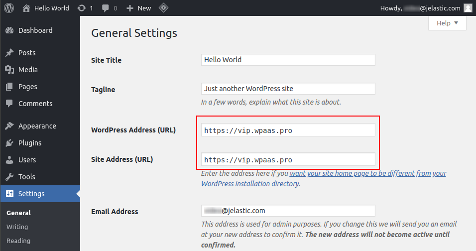

5\. Finally, click the **Save Changes** button at the bottom of the ***Settings*** page and open the application with a new address.

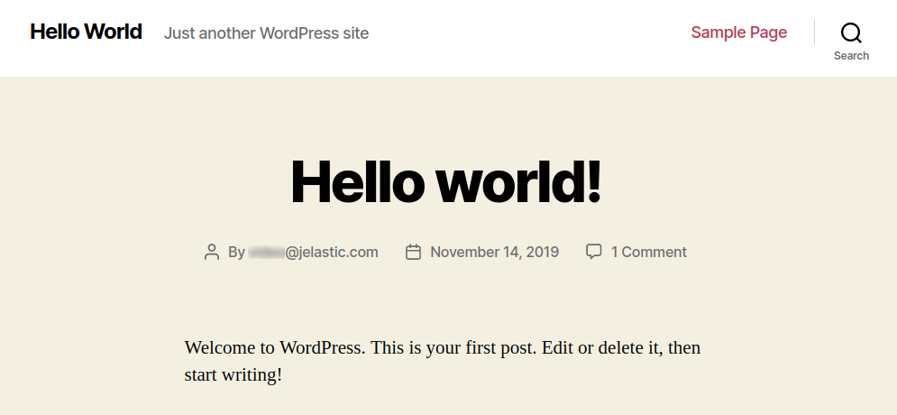

As a result, we got a production-ready WordPress cluster with high-availability capabilities and resistance to the web application security attacks. Extremely advanced performance is ensured by a new generation LiteSpeed application servers, load balancer with fast HTTP/3 protocol support, reliable MariaDB Galera, built-in CDN, and Let's Encrypt SSL.

## What's next?

* [WordPress Cluster Hosting](https://www.virtuozzo.com/company/blog/wordpress-hosting-enterprise-high-availability-auto-scaling/)
* [WordPress Hosting Comparison](https://www.virtuozzo.com/company/blog/wordpress-deployment-at-aws-azure-or-jelastic-cloud/)
* [Software Clustering](/cluster-in-cloud/)
* [Automatic Horizontal Scaling](/automatic-horizontal-scaling/)
* [Application Configuration](/configuration-file-manager/)