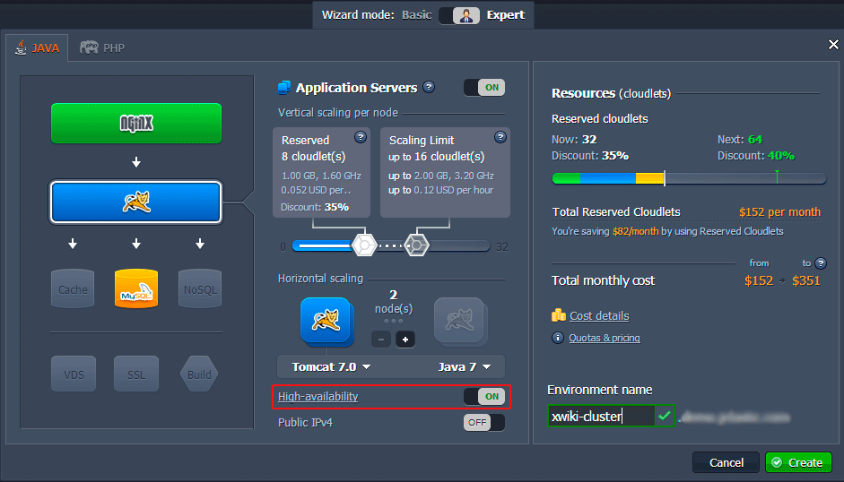

# XWiki Clustering     
                                                   
**XWiki cluster** consists of two XWiki instances located in different servers and working with the same database. NGINX load balancer handles and shares all the users' requests to different server instances according to their load and availability.

Distinctive XWiki feature is increasing performance through using great amount of different caches. Sometimes this can cause such problems as showing old cached version of data, already modified on another xWiki instance. To exclude such inconvenience XWiki uses system of event distribution. It forms a local event and updates the caches with it, i.e. cache of each instance in xWiki cluster is updated every time something has been changed on any instance.

Follow the next step-by-step tutorial to find out how to configure **XWiki cluster** in the cloud.

* **<big><span type="A">Create an environment</span></big>**
    * Log in to PaaS account.
    * Click the **Create environment** button in the top left dashboard corner.
    * In the wizard window pick up **Tomcat 7** as an application server and switch on **High-availability**. After this **NGINX** load balancer will be activated automatically.
Choose **MySQL** as a database you want to use. Set the cloudlet limits for all instances.
Specify the name of your environment and click **Create** button.</li>

Wait just a  minute and your highly available environment will be created.

* **<big><span type="A">*xWiki deployment*</span></big>**
Deploy XWiki to the environment you've just created as it is described in the instruction on [Manual XWiki installation](/xwiki-deploy/) (steps B - D).
* **<big><span type="A">Configuring XWiki cluster</span></big>**
XWiki gives an opportunity to easily set up clusters with network events distribution technology. Just follow the steps below.
    * Click the **Config** button for **Tomcat** server in your environment.</li>

    * Then open ***xwiki.properties*** file, located in *webapps/ROOT/WEB-INF* folder of any of the Tomcat nodes.
    * Enable event distribution by setting the ***observation.remote.enabled*** property value to *true*.

**Note**: if you use several application server nodes (2 nodes of Tomcat server in our case) the changes will be applied for all of them after saving, i.e. so there is no need to state all the required settings for each node separately.
    * Navigate to the *webapps/ROOT/WEB-INF/observation/remote/jgroups* folder and create new ***tcp.xml*** file with JGroup configuration specified for setting up communication channels.

See the example below:  
```xml
<config xmlns="urn:org:jgroups"
       xmlns:xsi="http://www.w3.org/2001/XMLSchema-instance"
       xsi:schemaLocation="urn:org:jgroups http://www.jgroups.org/schema/JGroups-3.2.xsd">
   <TCP bind_port="7800"
        loopback="false"
        recv_buf_size="${tcp.recv_buf_size:20M}"
        send_buf_size="${tcp.send_buf_size:640K}"
        max_bundle_size="64K"
        max_bundle_timeout="30"
        enable_bundling="true"
        use_send_queues="true"
        sock_conn_timeout="300"
        timer_type="wheel"
        timer.min_threads="4"
        timer.max_threads="10"
        timer.keep_alive_time="3000"
        timer.queue_max_size="500"
        thread_pool.enabled="true"
        thread_pool.min_threads="1"
        thread_pool.max_threads="10"
        thread_pool.keep_alive_time="5000"
        thread_pool.queue_enabled="false"
        thread_pool.queue_max_size="100"
        thread_pool.rejection_policy="discard"
        oob_thread_pool.enabled="true"
        oob_thread_pool.min_threads="1"
        oob_thread_pool.max_threads="8"
        oob_thread_pool.keep_alive_time="5000"
        oob_thread_pool.queue_enabled="false"
        oob_thread_pool.queue_max_size="100"
        oob_thread_pool.rejection_policy="discard"/>
   <TCPPING timeout="3000"
            initial_hosts="${jgroups.tcpping.initial_hosts:localhost[7800],localhost[7801]}"
            port_range="1"
            num_initial_members="10"/>
   <MERGE2 min_interval="10000"
           max_interval="30000"/>
   <FD_SOCK/>
   <FD timeout="3000" max_tries="3"/>
   <VERIFY_SUSPECT timeout="1500"/>
   <BARRIER/>
   <pbcast.NAKACK2 use_mcast_xmit="false"
                   discard_delivered_msgs="true"/>
   <UNICAST/>
   <pbcast.STABLE stability_delay="1000" desired_avg_gossip="50000"
                  max_bytes="4M"/>
   <pbcast.GMS print_local_addr="true" join_timeout="3000"
               view_bundling="true"/>
   <MFC max_credits="2M"
        min_threshold="0.4"/>
   <FRAG2 frag_size="60K"/>
   <!--RSVP resend_interval="2000" timeout="10000"/-->
   <pbcast.STATE_TRANSFER/>
</config>
```
    * Finally, restart your **Tomcat cluster** by clicking **Restart node** button next to it .
    


* **<big><span type="A">Start XWiki</span></big>**
    * Open your application in a browser window and install XWiki.

Now you have a highly available, scalable and reliable clustered environment in the Cloud with xWiki hosted. Enjoy the perfect fail-over capabilities!


## What's next?
* [JGroups Cluster](https://www.virtuozzo.com/company/blog/jgroups-cluster-on-jelastic/)
* [Joget Cluster](https://www.virtuozzo.com/company/blog/how-to-deploy-joget-cluster/)
* [Liferay Cluster](https://www.virtuozzo.com/company/blog/liferay-cluster/)