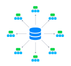
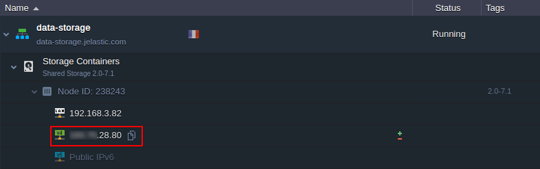
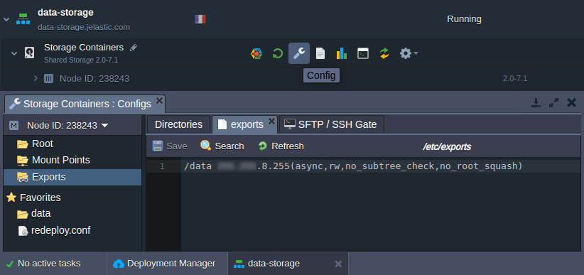
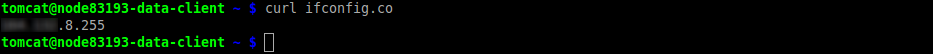
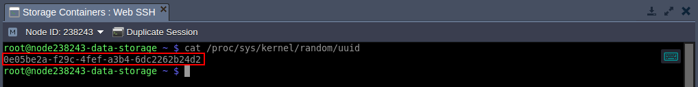
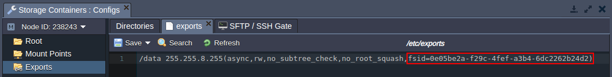
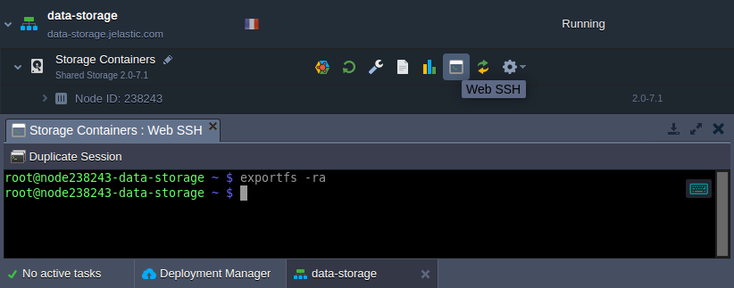
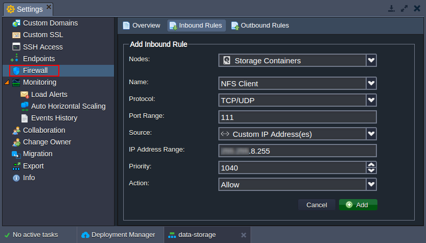
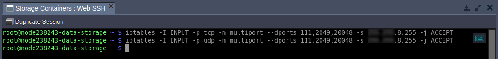

# External NFS Server Configuration

{}{}

The platform allows [sharing data](/data-storage-container/) between servers (where the files are physically located) and clients (gain access to the remote data as if it was kept locally). The configurations required to set up a share varied based on the following condition:

* *both instances are inside of the same PaaS account* - either [export data](/storage-exports/) from storage <u>*or*</u> [mount data](/mount-points/) on the clients (the platform automatically handles the second operation)

* *one instance is outside of the platform* - export data from external storage (described in this guide) <u>*and*</u> [mount external data](/mount-points/) on the clients

Below, we'll consider the configurations required to export data from the platform [Shared Storage Container](/shared-storage-container/) to the external instance. The described flow is suitable for any NFS-based storage server.

1\. First of all, to share data over the Internet, it's required to attach a [public IP](/public-ip/) address to your server:



2\. Next, you need to declare the list of directories you'd like to share within the corresponding ***etc/exports*** file. In the platform, it can be easily accessed with the **Configuration** button in the ***[Exports](/storage-exports/)*** section of the built-in *Configuration File Manager*.

Here, the following format should be used:

```
{directory} {server}([option],[option],..)
```



where:

* ***{directory}*** - path to the folder (relative to the Root folder) that should be exported
* ***{NFS_client}*** - [custom domain](/custom-domains/) name or public IP address of the client node (i.e where the exported files should be mounted)
{}**Note:** In case your instance does not have an external address attached, you can alternatively use the IP of the appropriate host. It could be obtained by connecting to the container via [SSH](/ssh-access/) and executing the following command:

```
curl ifconfig.co
```



<u>*Be aware*</u> that such flow is highly insecure and should not be used for production purposes, as it will make your shared data available for any container on the same host.{}

* ***[option]*** - some [additional parameters](https://linux.die.net/man/5/exports) to describe the access permissions, where the main ones are:
    * *async* - allows NFS clients to receive a response from the storage as soon as a request on adding content is processed. At the moment, the data is already in the cache but not actually written to storage yet. Compared to the opposite *sync* option, it gives a performance boost but leaves a slight risk of data loss (if stopped/crashed while still holding unwritten data in cache)
    * *ro* (or *rw*) - defines read-only (read & write) permissions to make the client node available to view (view and edit) the shared data
    * *no_root_squash* - gives root user on a client's server the same level of access as a root user on a storage container
    * *no_subtree_check* - sets accessibility for the whole directory (better performance but restricts providing individual rules for files inside)

{}**Tip:** For additional security, you can [configure](http://nfs.sourceforge.net/nfs-howto/ar01s03.html#hosts_allow_hosts_deny) the corresponding ***etc/hosts.allow*** and ***etc/hosts.deny*** files to manage a list of hosts that NFS server can work with.{}

3\. <u>*When working with the [Shared Storage Auto-Cluster](/shared-storage-container/#shared-storage-auto-cluster) based on the GlusterFS*</u>, take into consideration that only **/data** folder is replicated between instances, so the exported directory should be located inside.

Also, an additional ***fsid*** option should be obligatory added to the export configuration string. For example, the value of this parameter can be randomly generated with the next command:

```
cat /proc/sys/kernel/random/uuid
```



As a result, the export string would be similar to the following one:



Don't forget to **Save** the changes you've made.

4\. In order to apply new export settings, the corresponding ***exportfs*** command should be used (e.g. via [Web SSH](/web-ssh-client/)):

```
exportfs -ra
```



5\. Next, you need to open the NFS server ports (*111*, *2049*, and *20048*) for the NFS client IP address (the one used in the second step). Navigate to the storage environment **Settings > [Firewall](/custom-firewall/)** section to add required rules via intuitive UI:



{}**Tip:** This can be done through the console as well:

```
iptables -I INPUT -p tcp -m multiport --dports 111,2049,20048 -s {NFS_client} -j ACCEPT
iptables -I INPUT -p udp -m multiport --dports 111,2049,20048 -s {NFS_client} -j ACCEPT
```


{}

6\. When granting the RW rights, ensure that the same users have equal access permissions to the shared folder on both NFS client and server. For example, different [stacks](/software-stacks-versions/) can use different users by default (e.g. *root* and *jelastic*).

So, if needed, execute the following command on your storage server to adjust the rights:

```
chown {uid}:{gid} {path}
```
Here:

* ***{uid}*** - user name or ID, which can be found in the ***/etc/passwd*** file of your platform container
* ***{gid}*** - group name or identifier, that is shown within the ***/etc/group*** file of your node
* ***{path}*** - path to the directory you'd like to change the permissions for


That's all! Your data storage server is ready, so you can return to the client instance and start [mounting](/mount-points/).


## What's next?

* [Data Storage Overview](/data-storage-container/)
* [Shared Storage Container](/shared-storage-container/)
* [Mount Points](/mount-points/)
* [Exporting Data for Sharing](/storage-exports/)