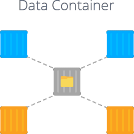

# Data Storage Container Overview

**Data Storage Container** is the commonly used solution for simple data storing and its remote control. Within the terms of the platform, it allows to make multiple environments operating with data in a single storage as easy as if it was kept locally: e.g. share media files, common configs or just store backups, logs, etc.

By using data storage container, you can apply smart organization to your projects' topology and achieve number of benefits, like:

* *Data Persistence and Security* - the data is totally safe and secure as it runs inside fully isolated containers and stored separately during the application updates
* *Simplified Management* - one set of configurations for multiple containers, different types of data storing, integration with Docker volumes and built-in file manager
* *Funds Saving* - shared data implies lower disk space consumption and therefore lower costs

Data storage container integration at the platform is based on network file system (**NFS**) protocol, used for client-server communication. Actually, the whole procedure is performed in two steps: at the first one, the data is exported (shared) from the storage container to some other instance, and at the second - the appropriate directory is mounted at a client container.

And in order to ensure the best experience while leveraging this feature, a dedicated [Shared Storage Container](/shared-storage-container/) stack is provided. It has a number of benefits for data storing compared to the rest of container types, such as depended software being pre-installed and enlarged amount of allocated disk space. Beside that, any node at the platform can be treated as data storage server, including custom Docker containers, where such integration is implemented based on [volumes](/container-volumes/) functionality.

With Data Storage Container you get a variety of opportunities to improve your projects' filesystem structure, make it more reliable and configurable. To get to know more, switch to the documents linked below, where we consider in details which types of storage are available at the platform and for what kind of data they suit the most:

* [Local filesystem](/local-filesystem-storage/)
* [Master container](/master-container-storage/)
* [Compound container](/compound-container-storage/)
* [Dedicated container](/dedicated-storage/)
* [External server](/external-nfs-storage/)

## What's next?

* [Shared Storage Container](/shared-storage-container/)
* [Mount Points](/mount-points/)
* [Exporting Data for Sharing](/storage-exports/)
* [External NFS Server Configuration](/configure-external-nfs-server/)