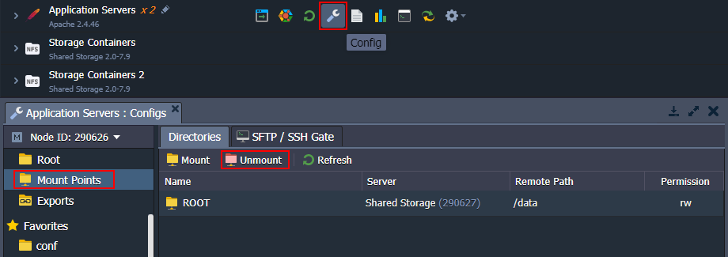

# Migrating Standalone Storage to GlusterFS Cluster 

Currently, automatic conversion of the existing standalone storage into the GlusterFS cluster is not supported. You'll need to recreate the storage from scratch. We recommend creating a temporary *Storage* node in the extra layer, copy data, and remount any existing shares. Then, recreate the initial Storage node as a GlusterFS cluster and restore data and mount shares back. The instruction below will guide you through the process step-by-step.

1\. Locate the required environment in your platform dashboard and click the **Change Environment Topology** button.


2\. Within the opened wizard, add a new **Shared Storage** node in the *Extra* layer. Click **Apply** to proceed.


3\. Connect to your initial (source) *Storage* node via [SSH](/ssh-access/), e.g. using the built-in **Web SSH** client. Run the following command to [generate](/ssh-generate-key/) a keypair that will be used to interconnect two storages:

```
ssh-keygen -f ~/.ssh/storage
```


You can view the generated public key with the command below:

```
cat  ~/.ssh/storage.pub
```


Use the **Ctrl+Shift+С** or **Сmd+C** shortcut in the Web SSH panel to copy the key.

4\. Switch to your new *Shared Storage* node and connect to it via [SSH](/ssh-access/) as well. Insert public key from the previous step to the  ***~/.ssh/authorized_keys*** file using any preferred editor, for example:

```
vim ~/.ssh/authorized_keys
```


5\. Return to the source storage and copy required data to a new node via the ***rsync*** utility:

```
cd /data; rsync -az . {NEW_STORAGE_IP}:/data/ -e "ssh -i $HOME/.ssh/storage"
```

Here, the ***{NEW_STORAGE_IP}*** placeholder should be substituted with the internal IP address of your new storage that can be viewed in the dashboard.


Confirm connection by typing "*yes*" when prompted. The operation may require some time that depends on the amount of copied data.

6\. [Remount](/mount-points/) application data from the initial to temporary storage.

* click the **Config** button next to our application server and **Unmount** the current Shared Storage


* next, create a new **Mount** to your temporary storage server


7\. Standalone Shared Storage can be replaced with a GlusterFS storage cluster in two steps:

* open the **Change Environment Topology** wizard, remove the appropriate storage node altogether, and **Apply** changes


* access topology wizard once more and add Shared Storage node with the **Auto-Clustering** option enabled


8\. Return data from the temporary storage server in the *Extra* layer to a new Shared Storage cluster with GlusterFS support. 

<u>*Repeat the 3-7 steps,*</u> using the temporary storage as source and master node of the GlusterFS cluster as target.


9\. Remove the temporary storage from the *Extra* layer.


That's all! Now, you have a GlusterFS cluster instead of the standalone storage node.


## What's next?

* [Shared Storage Container](/shared-storage-container/)
* [Mount Points](/mount-points/)
* [SSH Access](/ssh-access/)
* [Auto-Clustering of Instances](/auto-clustering/)