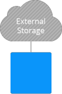

# Storing Data in External Server

External server mounting is intended for establishing connection to a third party NAS storage, which shares data via NFS. With PaaS, the process of integration is fairly simple, since you don't need to perform any additional configurations at either platform or storage side.

So, if you have your storage server with the properly structured content being already set up, with this option you get rid of the necessity to copy or transfer it anywhere - just mount and share data across the layers, environments or even multiple PaaS installations.  

Otherwise, i.e. if you are just planning to create your own highly performance and reliable storage, consider to leverage the [Shared Storage Container](/shared-storage-container/). It's delivered with all of the necessary software being preinstalled, thus you can [utilize such storage](/dedicated-storage/) just after the creation with no extra configurations required.

## Learn how to:

* Add [mount points](/mount-points/) to access data in remote folder
* [Export data](/storage-exports/) from one node to another
* Configure container as an [external NFS storage](/configure-external-nfs-server/)
* Use [dedicated container](/dedicated-storage/) for data storing