# Manual Database Backups

The platform provides all [certified database stacks](/software-stacks-versions/#databases) with a convenient and straightforward script for backing up the stored data. Thus, the process is as simple as providing the required parameters and can be accomplished in a matter of minutes. Herewith, no specialized knowledge is needed - just follow the [setup steps](#backups-scheduling) to configure the appropriate *cron* expression.

Additionally, we'll show how you can work with the created backups:

* [Check Backups](#check-backups)
* [Download Backup](#download-backup)
* [Restore Database](#restore-database)

For this tutorial, we'll use a MySQL database as an example. However, the required steps are similar for all the other databases.


## Backups Scheduling

Let's use the default backup script to automate the process of backup creation and configure it up to your specific needs (e.g. frequency, number of old backups to keep, etc.). Herewith, if you don't have an environment with a database yet, follow the [Database Hosting](/database-hosting/) guide to create one.

1\. The source code of the script can be viewed directly within the dashboard. Click the **Config** button next to your database to open the built-in file manager and locate the ***/var/lib/jelastic/bin/backup_script.sh*** file.

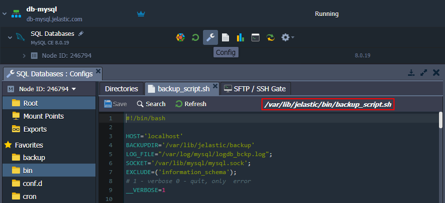

{}**Note:** The backup script is not available for the **[Redis](/redis/)** stack, which is key-value storage, usually used as cache.{}

2\. To automate the script execution, we'll use the *[cron scheduler](/cron-job/)* available within the containers out-of-box. Open the ***/var/spool/cron/mysql*** file and provide a cron expression in the following format:
```
{frequency} {path-to-script} {script-parameters}
```

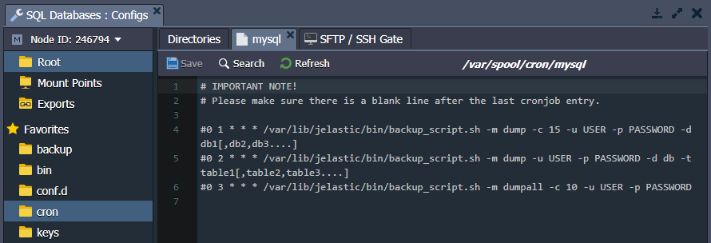

Here, you can use the commented examples as a template to define the required parameters:

* ***{frequency}*** - sets the time of the script execution (see the guide linked above for details), e.g. *\*/10 * * * \** to create backup every 10 minutes
* ***{path-to-script}*** - points to the required script (default backup script is available at */var/lib/jelastic/bin/backup_script.sh*)
* ***{script-parameters}*** - provides custom parameters for the defined script; the following ones are available in our case:
    * ***-m {mode}*** to backup whole or part of the database (\"*-m dumpall*\" or \"*-m dump*\" respectively)
    * ***-c {count}*** to set a number of the old backups to keep (e.g. \"*-c 3*\" to keep 3 old backups alongside the most recent one)
    * ***-u {user}*** and ***-p {password}*** to provide access credentials for your database (can be found in the after-creation email)
{}**Note:** If your ***{password}*** contains special characters, it should be included in the double quotation. Also, due to the cron specifics, you need to provide additional escaping for the ***%*** symbol by adding a backslash before it, for example *-p \"passw\\\\%rd\"*.{}

    * ***-d {databases}*** and ***-t {tables}*** to optionally specify list of databases (\"*-d db1[,db2,db3....]*\") or tables within a database (\"*-d db -t table1[,table2,table3....]*\") to backup

3\. *<u>For example,</u>* if you want to back up a whole database every 10 minutes with the help of the default script, then the string should be as follows:
```
*/10 * * * * /var/lib/jelastic/bin/backup_script.sh -m dumpall -c 3 -u root -p passw0rd
```

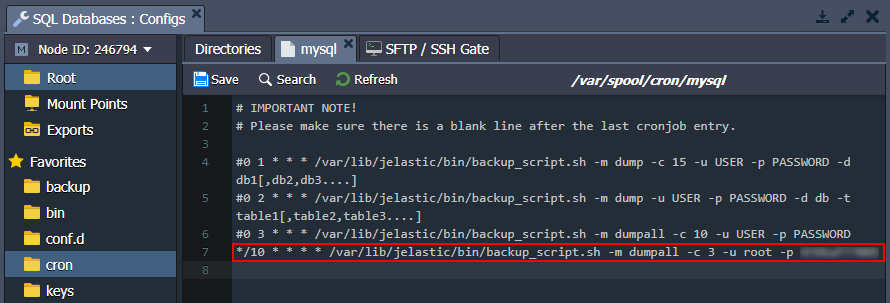

**Save** the settings to apply them.

4\. To store data on some other node or the remote server, you can configure the appropriate [mount point](/mount-points/) for your database.

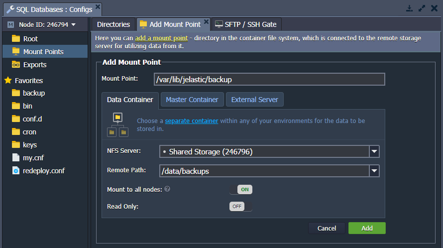

{}**Note:** Any existing data in the mount point folder will be replaced with the files from the remote directory.{}

Alternatively, you can create a custom backup script, runnable from the remote server (database host, user, and password details will be required to establish a connection).


## Check Backups

Wait for the script to be executed (depends on the configured cron frequency) and navigate to the **/var/lib/jelastic/backup** folder.

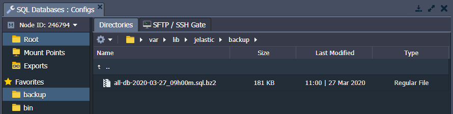

If the backup operation is successful, you'll see the appropriate ***bz2*** archive within the directory.


## Download Backup

There are multiple options to download a file from a container:

1\. The most straightforward variant is to use the [configuration file manager](/configuration-file-manager/) directly in the dashboard.

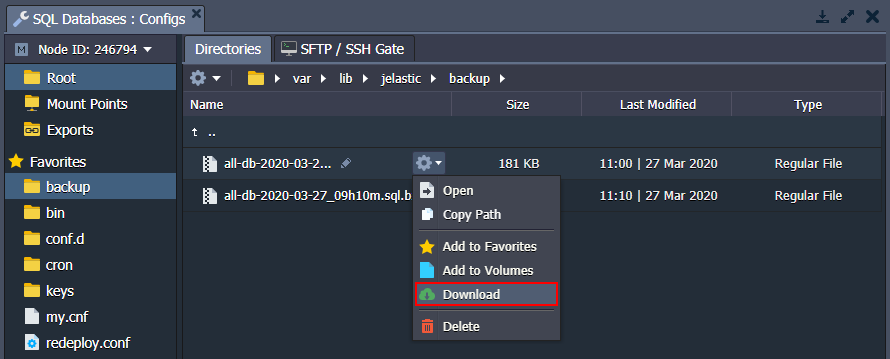

Locate the required file, hover over it, and select **Download** from the context menu.

2\. Another option is to use the [SFTP/FISH protocol](/ssh-protocols/) connection.

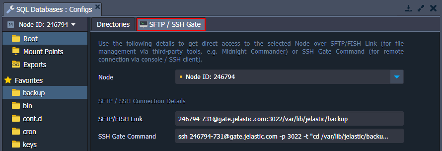

The required access details can be viewed within the dashboard.

3\. Also, you can install [FTP add-on](/ftp-ftps-support/) for your database to manage files via FTP.

{}**Note:** A [public IP](/public-ip/) address is required for this option. If needed, it will be automatically attached to the node during add-on installation.{}

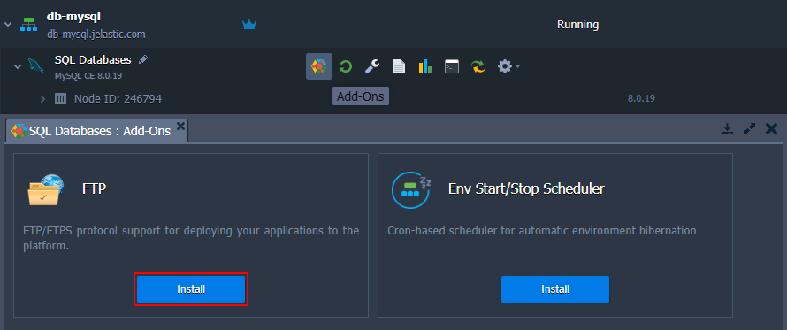

Based on your preferences, you can choose any of the proposed options.


## Restore Database

In case of necessity, you can easily restore your database from the backups. For our MySQL example, the following steps are required:

1\. Access the **phpMyAdmin** panel with the credentials from the email you've got after the creation of a DB node.

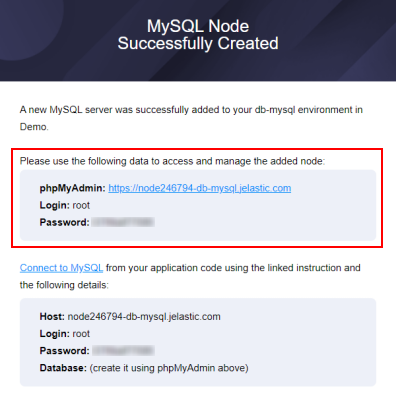

2\. Navigate to the **Import** tab, tick the *Browse your computer* option, and use the **Choose File** button to upload the required backup.

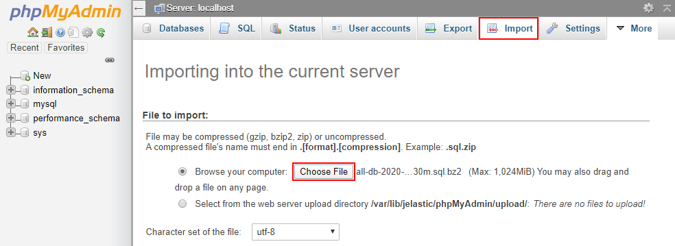

Click **Go** at the bottom of the page.

3\. When the import is successfully finished, you'll see the appropriate notification in the admin panel.

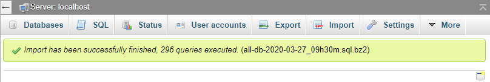

That's all! Now, you can be sure that all your data is periodically saved and, in case of necessity, can be restored or reused.


## What's next?

* [Database Hosting](/database-hosting/)
* [Database Connection Strings](/database-connection/)
* [Setting Up Cronjob](/cron-job/)
* [Shared Storage](/shared-storage-container/)