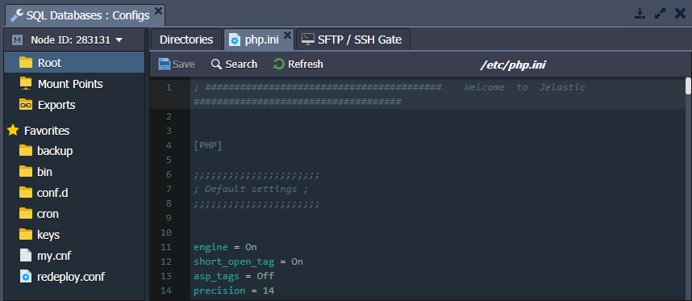
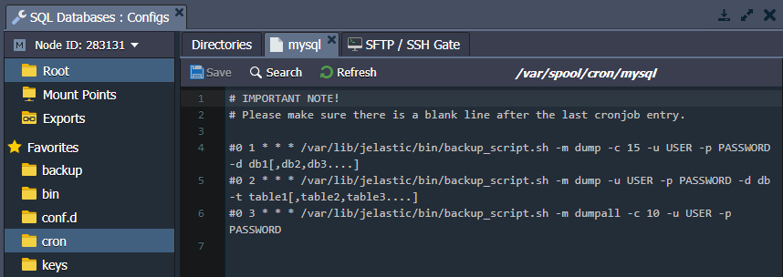
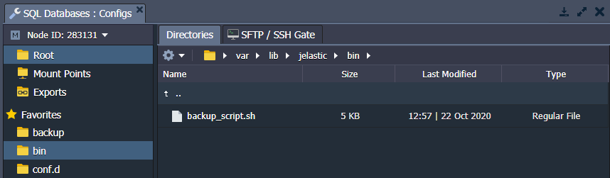
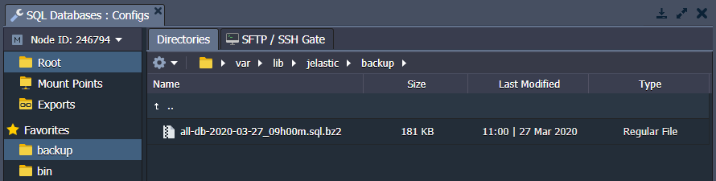
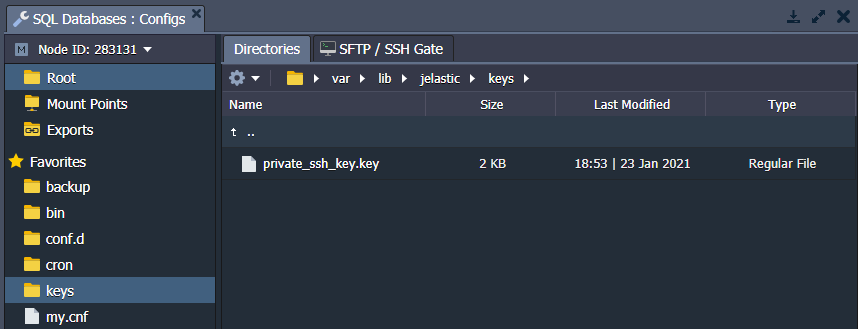
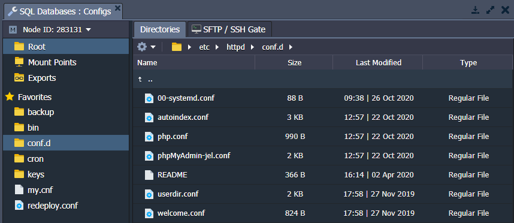
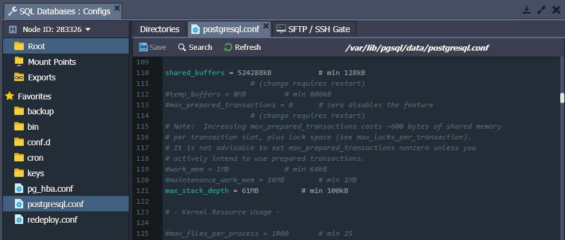

# Database Configuration Files

In this guide, we'll list all the main configuration files in the [platform-managed database](/software-stacks-versions/#databases) servers. Each line of the table corresponds to the folder with configs for the databases listed in the **Database Types** column.

Folder|Path|Database Types
---|---|---
[conf](#conf)|/var/lib/pgsql/data|PostgreSQL
[etc](#etc)|/etc|all
[cron](#cron)|/var/spool/cron|all
[scripts](#scripts)|/var/lib/jelastic/bin|all
[backup](#backup)|/var/lib/jelastic/backup|all
[keys](#keys)|/var/lib/jelastic/keys|all
[conf.d](#confd)|/etc/httpd/conf.d|MySQL, MariaDB, Percona, PostgreSQL

## ETC

The PHP configurations are performed in the ***php.ini*** file, which is located in the **etc** folder.

*MySQL*, *MariaDB* and *Percona* include the ***my.cnf*** configuration file for database management. Note that the platform automatically manages the following settings in this file:

- *key_buffer_size*
- *table_open_cache*
- *myisam_sort_buffer_size*
- *innodb_buffer_pool_size*

If you want to manually change any of the settings from the list above, you need to remove the "*#Jelastic autoconfiguration mark.*" line at the start of the file. Otherwise, your custom changes will be overwritten.

{}**Tip:** Alternatively, you can override any of the settings in the ***/etc/my.cnf*** file (including ones managed by the platform autoconfiguration mark) by stating them in the ***/etc/mysql/conf.d/custom.cnf*** file.{}

## CRON

The database servers include the **/var/spool/cron** folder with a config file, where cron jobs can be configured.

For example, you can set the [scheduled backups](/database-backups/) of your database. The required cron expression is included in the cron config file by default. You just need to uncomment the appropriate line and, if necessary, adjust it based on your custom requirements.

You can find more information in the [Setting Up Cronjob](/cron-job/) documentation.

## SCRIPTS

This folder contains the default ***[backup_script.sh](/database-backups/)*** script. You can also use the **/var/lib/jelastic/bin** folder for uploading your custom scripts.

## BACKUP

The **/var/lib/jelastic/backup** folder is used for storing the [database backup](/database-backups/) files. You can use these files for restoring your database data.

## KEYS

The **/var/lib/jelastic/keys** directory is used as a location for uploading private keys that are needed for your application.

Generate the key, save it as a simple file, and upload it to the **keys** folder. You can then use it for different cases by merely stating the path to your key, i.e. */var/lib/jelastic/keys/{keyName}*.

## CONF.D

The **/etc/httpd/conf.d** folder is usually used to store and manage sub-configs.

For example, you can access the admin panel configuration file (depends on the database, e.g. ***phpMyAdmin-jel.conf*** for MySQL) via the **conf.d** folder. Use these files to set appropriate criteria for allowing/denying access by IP address or domain.

## CONF

The main configuration files of the PostgreSQL database server are located in the /**var/lib/pgsql/data** folder. For example, it includes configs such as ***postgresql.conf***, ***pg_hba.conf***, ***pg_ident.conf***, etc.

PaaS automatically manages the following two parameters in the ***/var/lib/pgsql/data/postgresql.conf*** file for PostgreSQL databases:

* **shared_buffers** - calculates as a part of total RAM - quarter if a container has eight or more cloudlets, seventh part otherwise (but not less than 128 KB)
* **max_stack_depth** - calculates as 1024 subtraction from the maximum stack size (response of the ulimit -s command), converted to MB

If you want to change any of these settings manually, you need to remove the "*#Jelastic autoconfiguration mark.*" line at the start of the file. Otherwise, your custom changes will be overwritten.

## What's next?

* [Create DB Server](/database-hosting/)
* [Database Connection Strings](/database-connection/)
* [Database Backups](/database-backups/)