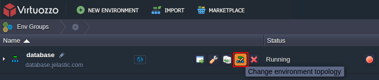
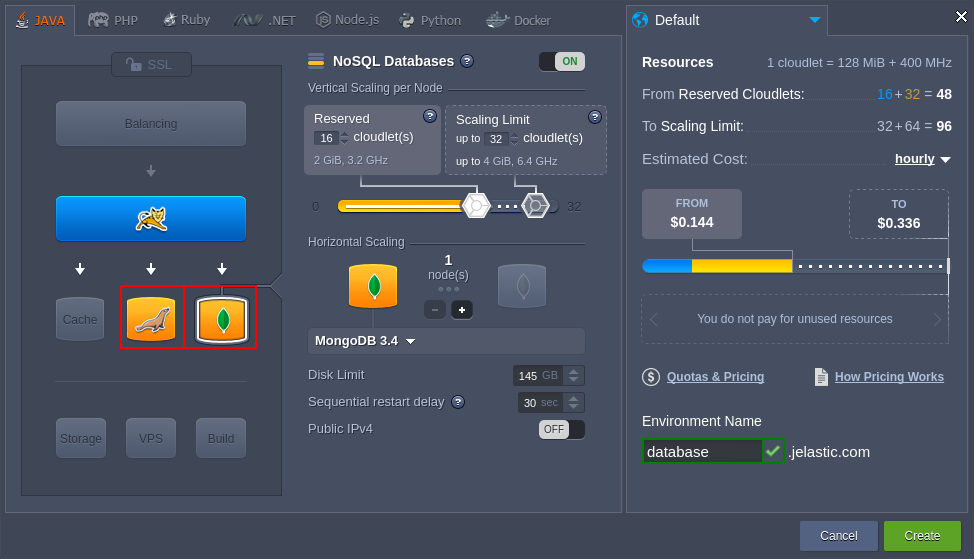
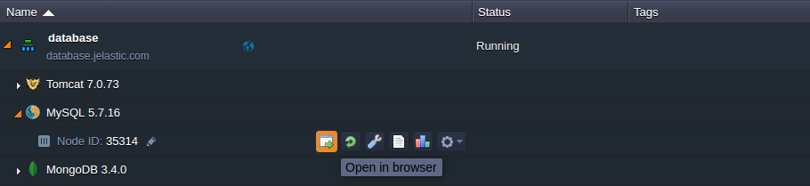
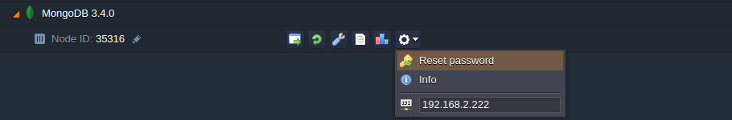
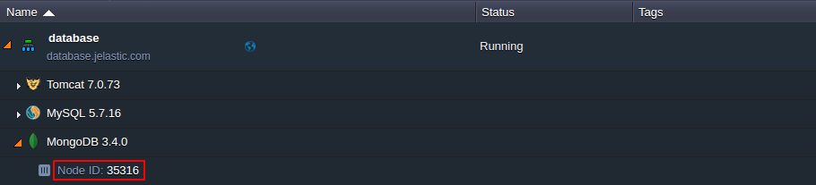

# Database Hosting

Platform provides a set of scalable and fully manageable database servers that you can easily install and operate with. The process of a new database creation is fairly simple and can be accomplished in just a few minutes.

1\. Open the Topology wizard through either clicking **New Environment** (to set up a new environment) or selecting the **Change environment topology** button (to add database to the already existing environment).

2\. Then refer to the **SQL** or **NoSQL** wizard section to select database server of the corresponding type.

Use the drop-down list to choose among the available DB management systems:

* for **SQL** - MySQL, MariaDB, PostgreSQL, PerconaDB
* for **NoSQL** - MongoDB, Couchbase, Redis, OpenSearch

{}**Note:** The list of available [database servers](/software-stacks-versions/#databases) can vary and depends on your hosting provider settings. If some of these servers are not available in your wizard, please, contact your hosting provider for activation.{}

When the corresponding database server is created, you'll receive an email notification with credentials (*access URL*, *login* and *password*) to the database administration panel.

3\. To launch your database admin panel, click the **Open in Browser** button next to the target database node at the dashboard (or compose the admin panel URL [manually](#database-admin-panel-url)).

In the opened page, use credentials from the email to log in and start applying configurations required by your application.

{}**Tip:** For containers without [Public IP](/public-ip/) address attached, the database admin console is available via *https://* by default.{}

When your database server is up and ready, you can [Connect your application to DB](/database-connection-strings/).

## Database Password Reset

To **Reset password** for a database node, click the same-named button next to it at the dashboard (or for a set of [scaled DB](/horizontal-scaling/) instances to get new credentials for all of them at once).

As a result, you'll receive email with a new password to access your database admin console.

## Database Admin Panel URL

The administration panel URL for DB servers should consist of the following parts:

*node{node_id}-{environment_name}.{hoster_domain}*

where

* *{node_id}* - ID of the target database container that can be located at the dashboard (e.g. *35316* for MongoDB)

* *{environment-name}* - name of the environment you've added the server to (e.g. *database*)
* *{hoster_domain}* - your hosting provider domain; can be found within the last column of the appropriate table in the [Hosters Info](/paas-hosting-providers/) page

{}**Note:** In case your hosting provider platform has several [environment regions](/environment-regions/) to choose, the *{hoster_domain}* value for your environment can differ from the general platform's one.{}

In such a way, the whole access URL for the database administration panel will be the following in our case:

*https\://node35316-database.jelastic.com*

## What's next?

* [Connection to Database](/connect-app-to-db/)
* [Database Configuration](/database-configuration-files/)
* [Scheduling DB Backups](/scheduling-backups/)
* [Connection to DB via JNDI](/connection-to-db-via-jndi/)
* [Connection to DB using Hibernate](/connect-db-hibernate/)