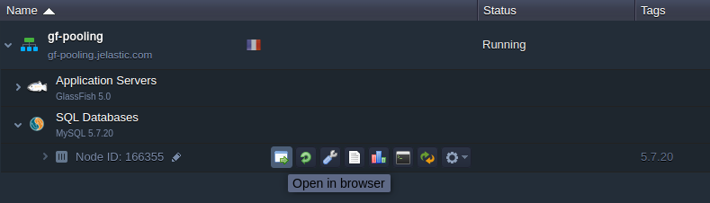
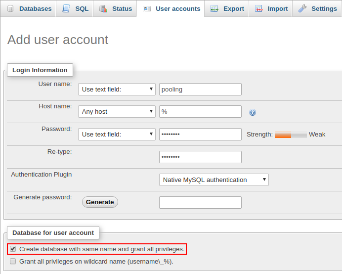
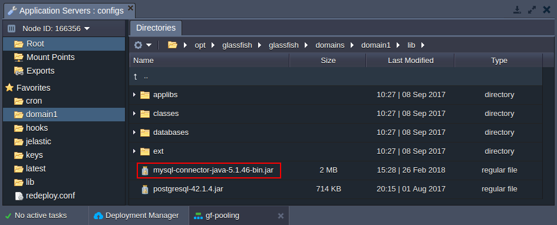
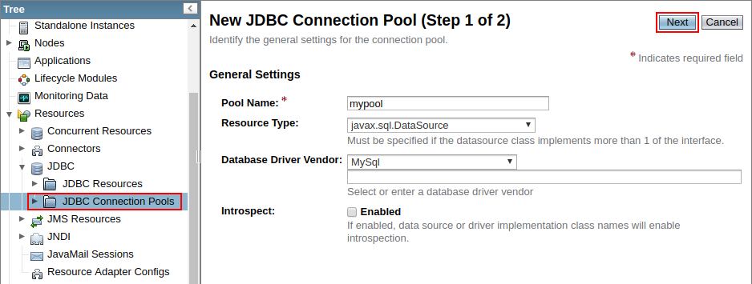
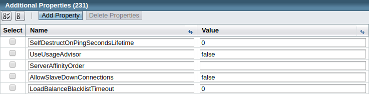
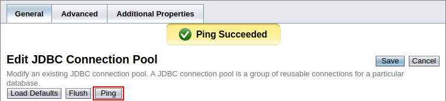
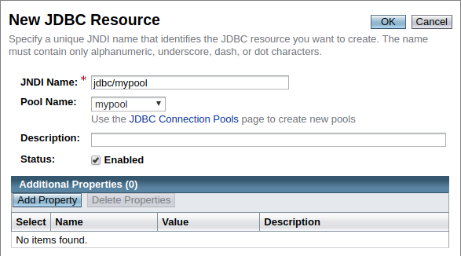

# JDBC Connection Pool

**Connection pooling** in JDBC (Java Database Connectivity) is an optimization feature, which caches database connections. Such implementation allows to reuse them, rather than spawning and closing one for each request, namely:

* *without JDBC connection pool* - opens connections to database services as required and closes when the page is done processing a particular request
* *with JDBC connection pool* - maintains open connections in a pool, so if a page requires access to the database, it just uses an existing connection (a new one is established only if no pooled connections are available)

Configuring JDBC pool connection for your application server can reduce delays and resource consumption compared to servicing each individual request. In such a way enhancing the performance of a database (especially for requests made to a dynamic database-driven applications).

Herewith, both GlassFish and Payara Java application servers provide a native support of the connection pooling mechanism to enhance a database access. Follow the simple steps below to configure JDBC connection pool:

* [Create Environment](#create-environment)
* [Prepare Database](#prepare-database)
* [Configure Application Server](#configure-application-server)
* [Connect from Java Code](#connect-from-java-code)


## Create Environment

1\. Log into your PaaS account.

2\. Click the **New Environment** button.


3\. In the topology wizard, switch to the ***Java*** tab, pick **GlassFish** or **Payara** as your application server and add the required database (as an example, we use *GlassFish* and *MySQL* pair). Next, set the resource limits for your containers and type any preferred environment name.


Click **Create**, wait for a few minutes to get your new environment and proceed to creating JDBC connection pool.


## Prepare Database

1\. Click the **Open in Browser** button for your MySQL node.



Use the received email with database credentials to login into the opened ***phpMyAdmin*** panel.

2\. Once inside, switch to the ***User accounts*** tab and click on the **Add user account** link. Within the opened form, specify all of the required data and tick the *Create database with same name and grant all privileges* option.



Click **Go** at the bottom of the page to initiate addition of a database and user for connection pooling.


## Configure Application Server

1\. The JDBC MySQL connector is provided by default with the stack (located in the **/opt/glassfish/glassfish/domains/domain1/lib** directory on your GlassFish server or **/opt/payara/glassfish/domains/domain1/lib** on Payara), so you don't need to upload one manually.



2\. Login to the GlassFish (or Payara) **Admin panel**, using credentials from the appropriate email.


3\. Navigate to the **Resources &gt; JDBC &gt; JDBC Connection Pools** section and click the **New** button on the tools panel. Within the appeared form, fill in the following fields:

* *Pool Name* - type any prefered name
* *Resource Type* - select the *javax.sql.DataSource* item from the drop-down list
* *Database Driver Vendor* - choose the *MySQL* option



Click the **Next** button to continue.

4\. Find and modify the following ***Additional Properties***:

* **User** - provides your database login (*pooling* in our case)
* **ServerName** - specifies your database host without the protocol (e.g. *node166355-gf-pooling.jelastic.com*)
* **Port** - sets port number to *3306*
* **DatabaseName** - provides your database name (*pooling* in our case)
* **Password** - stores a password for the specified user
* **URL** and **Url** - sets a JDBC connection string in the *jdbc:mysql://**{db_host}**:3306/* format; the ***{db_host}*** placeholder can be substituted with either node hostname (*node166355-gf-pooling.jelastic.com*) or IP address (*192.168.2.57*)



After these properties are specified, click **Finish**.

5\. In order to verify accessibility, select your just created connection pool and click the **Ping** button. If everything is OK, you should see the *Ping Succeeded* pop-up message.



6\. Go to the **Resources &gt; JDBC &gt; JDBC Resources** section and click the **New** button to create JDBC resources for pooling. Within the opened window, provide any desired *JNDI Name* and choose your *Pool Name* from the drop-down list.



Confirm resources creation with the **OK** button at the top.


## Connect from Java Code

Put the following strings into the Java class of your application code:

```java
InitialContext ctx = new InitialContext();
DataSource ds = (DataSource)ctx.lookup("{resources}");
Connection conn = ds.getConnection();
```

Here, substitute the ***{resources}*** placeholder with the your JNDI name from the previous section (i.e. *jdbc/mypool* in our case).

Now, you can deploy your Java application to the platform and enjoy the benefits of GlassFish and Payara Micro connection pooling!


## What's next?

* [Setting Up Environment](/setting-up-environment/)
* [Create DB Server](/database-hosting/)
* [Java App Server Configuration](/java-application-server-config/)
* [Database Configuration](/database-configuration-files/)