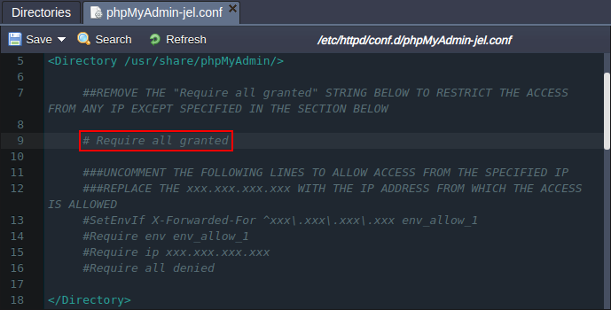
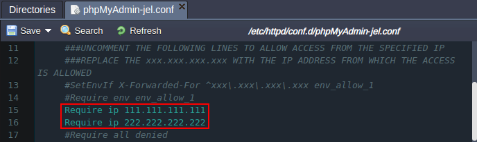
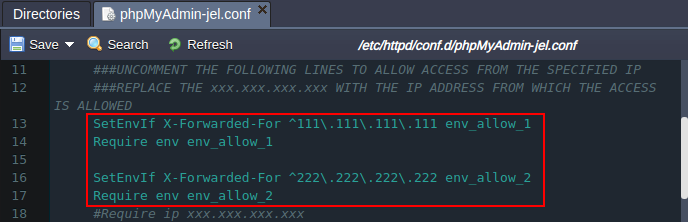
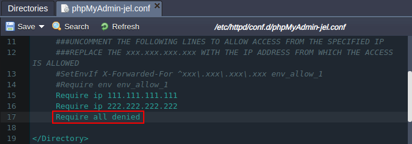
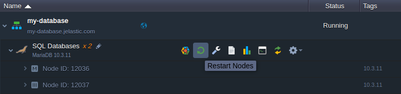
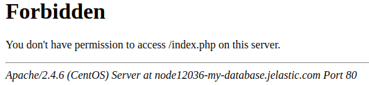

# Managing Access to PHPMyAdmin

The platform allows to flexibly manage access to the ***phpMyAdmin*** panel for the *MySQL*, *MariaDB* and *PerconaDB* database servers.

By default, all connections to phpMyAdmin are allowed and, if you want to change such a behaviour, adjust the ***/etc/httpd/conf.d/phpMyAdmin-jel.conf*** file. Just, locate the *<Directory /usr/share/phpMyAdmin/>* section, where the possible configs are described via comments:

```
<Directory /usr/share/phpMyAdmin/>
     ##REMOVE THE "Require all granted" STRING BELOW TO RESTRICT THE ACCESS FROM ANY IP EXCEPT SPECIFIED IN THE SECTION BELOW

     Require all granted

     ###UNCOMMENT THE FOLLOWING LINES TO ALLOW ACCESS FROM THE SPECIFIED IP
     ###REPLACE THE xxx.xxx.xxx.xxx WITH THE IP ADDRESS FROM WHICH THE ACCESS IS ALLOWED
     #SetEnvIf X-Forwarded-For ^xxx\.xxx\.xxx\.xxx env_allow_1
     #Require env env_allow_1
     #Require ip xxx.xxx.xxx.xxx
     #Require all denied
</Directory>
```

Let's move through it step-by-step:

1\. To change the default behavior, which allows all connections, you need to comment/remove the appropriate line, as it is shown in the image below (e.g. using the [file configuration manager](/configuration-file-manager/) or via [Web SSH](/web-ssh-client/)):




2\. Next, list the allowed IPs, which should be specified in the following format (you can uncomment the provided templates and specify the correct IP address):

* *if your database node has [public IP](/public-ip/)*
```
Require ip {ipAddress}
```

* *if your database node has internal IP only*
```
SetEnvIf X-Forwarded-For {ipAddress} {varName}
Require env {varName}
```
{}**Note:** In this case you should specify the ***{ipAddress}*** in the ***^xxx\.xxx\.xxx\.xxx*** format to be properly processed by Apache. Also, you can use any prefered ***{varName}*** variable name, for example *env_allow_1*.{}


If needed, you can specify multiple addresses as it is shown in the images above.

3\. Uncomment the last line within the section, to deny access from any IP other than specified one(s):



4\. **Save** the changes and **Restart Nodes** of your database server.



That's it! Any connection to the *phpMyAdmin* panel from the IP address, which is not in the allowed list, will lead to the page similar to the following one:



Now, you can be sure that your database admin panel is protected from the unallowed connections.


## What's next?

* [Configuration File Manager](/configuration-file-manager/)
* [Create DB Server](/database-hosting/)
* [Database Configuration](/database-configuration-files/)
* [Public IP](/public-ip/)