# Import and Export Dump Files to MongoDB

You can import and export dump files to MongoDB in two ways:

* [using any **MongoDB client**](#mongodb-client-database-master)
* [using **RockMongo** administration GUI tool](#rockmongo-admin-panel)

{}**Note:** If you would like to use MongoDB client, you need to have **[public IP](/public-ip/)** feature enabled in your MongoDB node.{}

## MongoDB Client (Database Master)

### Dump Import to MongoDB

1\. After remote connection to **MongoDB** click on **Import** in the desktop client (we use *Database Master 4* as an example) and select the type of file you want to import.

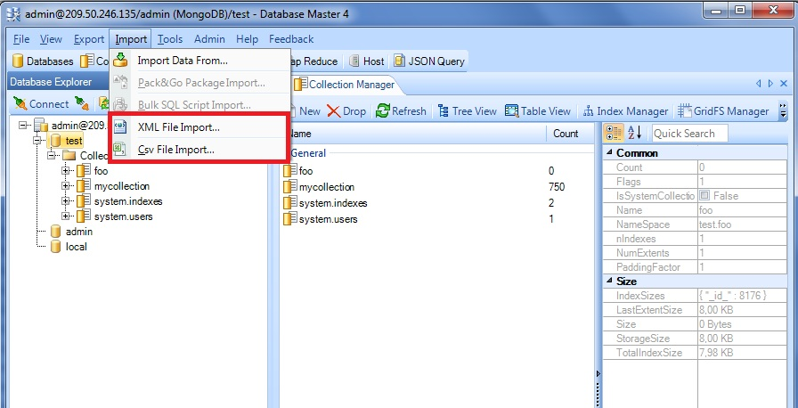

2\. Browse **XML/Csv** file, you want to import. Then browse a log file.

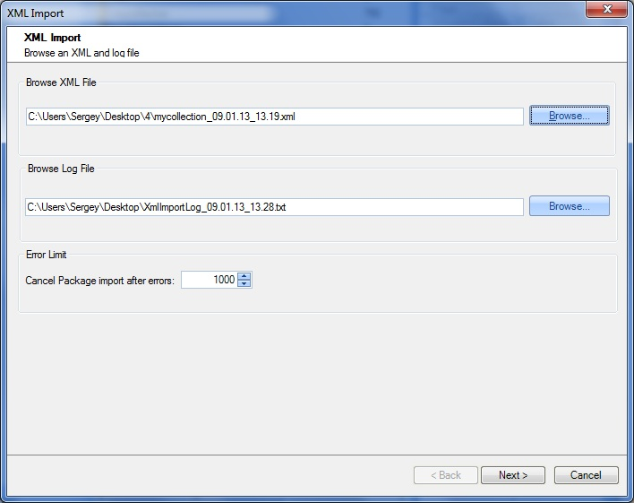

3\. Merge source tables to the target tables.

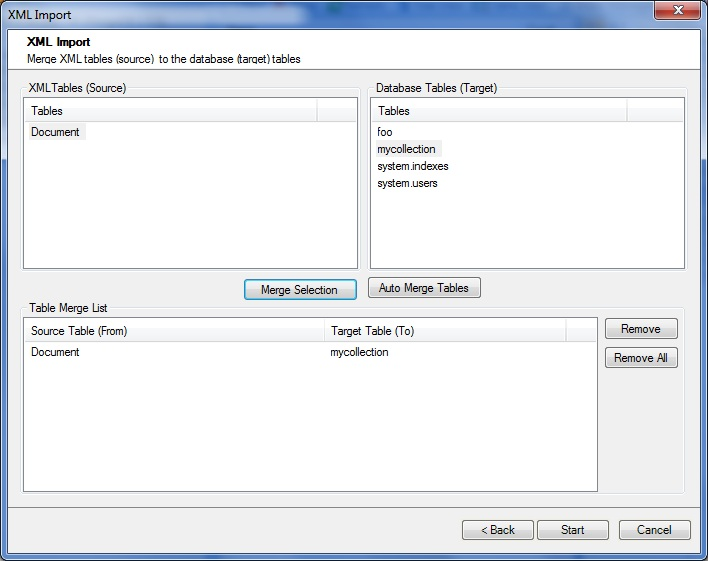

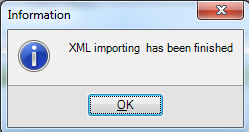

4\. Now you can go back to the platform's dashboard, open MongoDB in a web browser and find imported dumps in the **test** directory.

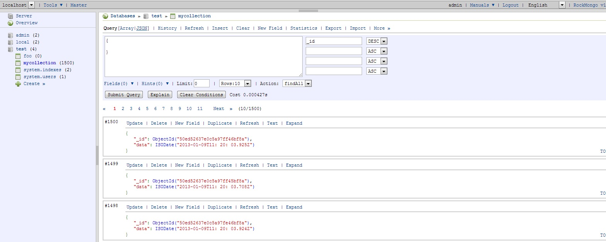

### Dump Export from MongoDB

1\. Click **Export > Data Export**.

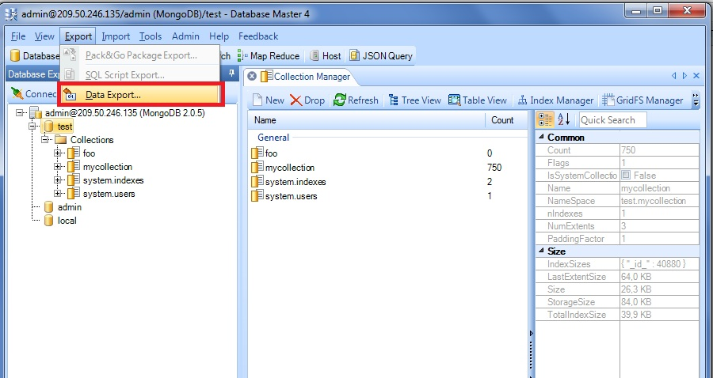

2\. Browse a target folder and select tables to export.

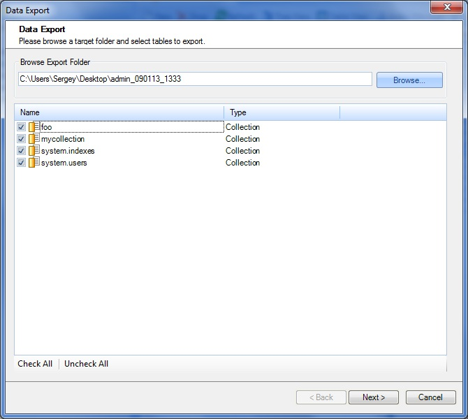

3\. Select data export options and click **Finish**.

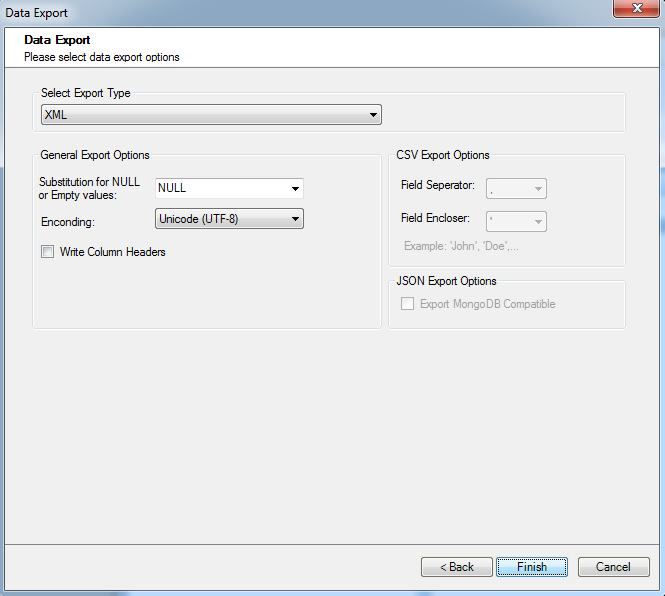

4\. Data export is successfully finished. You can check your target folder to ensure that everything is ok.

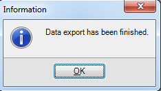

## RockMongo Admin Panel

1\. Click **Open in Browser** button for MongoDB node in your enviroment:

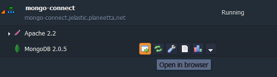

2\. In the opened window you'll be requested to log in with your credentials, which you've received within email after creating MongoDB node.

3\. To **Export** or **Import** dump files use the corresponding buttons:

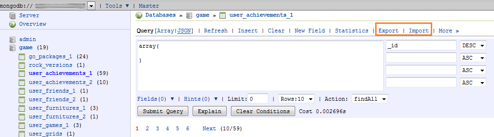

Hope this instruction will be useful for you.

## What's next?

- [MongoDB Auto-Clustering](/mongodb-auto-clustering/)
- [Upgrading to MongoDB 6/7](/updating-to-mongodb-7/)
- [MongoDB License Pricing](/mongodb-license/)
- [MongoDB Backup/Restore Add-On](/mongodb-backup-restore-addon/)
- [MongoDB Encryption in Transit Add-On](/mongodb-ssl-addon/)
- [MongoDB Remote Access](/remote-access-to-mongodb/)