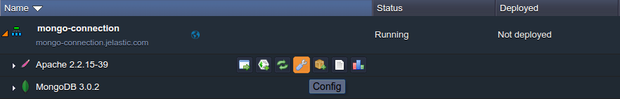

# PHP Connection to MongoDB

**MongoDB** is a widely used NoSQL database, implemented based on the document-oriented model and intended for storing semi-structured data. The guide below provides an instruction on how you can easily use it in a bundle with your PHP app, hosted within the platform.


## Create an Environment

Log into your platform account and [create](/setting-up-environment/) a new environment with the **MongoDB** node of the preferred version (can be found within the *NoSQL* wizard section).


Add all the rest of the necessary instances (if there are any - we'll also include *Apache* to subsequently deploy a test app to it; however, it could be located in a separate environment as well) and configure other required parameters, like amount of resources, region, environment name, etc.

Click the **Create** button when ready and wait for a couple of minutes for your environment to be set up.


## MongoDB Configurations

1\. Enter your email box and find a letter, which contains your MongoDB instance details and access data:


2\. Here, click on the *Access URL* link or switch to the dashboard and **Open in browser** your *MongoDB* node.


In the opened browser tab, you'll see the ***Sign in*** form for the MongoDB admin panel. Enter the admin credentials you've received within the abovementioned email and click **Login** to access it.

3\. Now, let's create a separate database to establish the connection to. For that, switch to the **Databases** tab and specify a *Name* for it within the ***Create Database*** section (for example, *mongodb-connect*).


Click **Save** to proceed.

4\. The next step is to create a separate DB user for working with our newly added database. Thus, switch to the **Execute** tab and paste the following command inside the shown input field:

<em>db.createUser({ user: "**user_name**", pwd: "**password**", roles:[{ role: "readWrite", db: "**db_name**"}]})</em>

where

* ***user_name***- name for your new DB user
* ***password*** - password for this user
* ***db_name*** - database (the above created one is suggested) this user will have the *read/write* permissions for


Then, select the corresponding database using the drop-down list below and **Execute** the specified command with the same-named button. You'll get the success response in just a few seconds.<a id="module"></a>

5\. Now you need to activate the dedicated connection driver for enabling the interaction between your app server and MongoDB. At the platform, it is included to all PHP app servers' builds by default.
{}**Note:** [Starting with the 4.3 PaaS version](/release-notes-43/#mongo-php-driver), there are two driver versions available at all of the newly created PHP app servers:

* *mongo.so* (currently, it's considered deprecated)
* *mongodb.so*

Both these extensions implement different API, so we recommend to use the legacy module for keeping old applications running, whilst adapt your new projects due to the latest one.{}



So, in order to enable the required driver, return to your dashboard, hover over the compute node in your environment and click on the appeared **Config** button.

6\. Within the opened configuration manager tab, expand the **etc** folder and choose the ***php.ini*** file inside.


Scroll down to the approximately *483rd* line and uncomment the string with the required driver (either ***mongo.so*** or ***mongodb.so*** extension) by removing the semicolons mark at its beginning.

7\. **Save** the performed changes and **Restart** your app server node to apply them.


## Application Deployment

Now you can proceed to application deployment into the environment you've just prepared using the platform [Deployment Manager](/deployment-guide/) (for projects, packed into a single archive or fetched directly from a GIT/SVN repo).

As an example, we'll use the following simple app, designed to verify the establishment of connection between the corresponding compute node and the specified *MongoDB* server by means of the latter *mongodb.so* extension.

***index.php***

```html
<html>

<head>
 <title>Test MongoDB Connection</title>
</head>

<body>
 <h1>Test MongoDB Connection</h1>
<form action="#" name="form" method="POST">
  <table cellspacing="10">
    <tr><td>Host</td><td><input type="text" name="host" value="<?php echo htmlspecialchars($_POST['host']); ?>" size="40"></td></tr>
      <tr><td>User</td><td><input type="text" name="username" value="<?php echo htmlspecialchars($_POST['username']); ?>" size="20"></td></tr>
    <tr><td>Password</td><td><input type="text" name="password" value="<?php echo htmlspecialchars($_POST['password']); ?>" size="20"></td></tr>
    <tr><td>Database</td><td><input type="text" name="database" value="<?php echo htmlspecialchars($_POST['database']); ?>" size="20"></td></tr>
    <tr></tr>
    <tr><td> </td><td><input type="submit" name="sub" value="Test Me!"></td></tr>
  </table>
</form>

<?php
if (@$_POST['sub']){
 $host=$_POST['host'];
 $username=$_POST['username'];
 $password=$_POST['password'];
 $userdb=$_POST['database'];
 $database=$userdb.".phptest";

  try{
    $manager = new MongoDB\Driver\Manager("mongodb://{$host}/{$userdb}", array("username" => $username, "password" => $password));
       if ($manager) {
        $bulk = new MongoDB\Driver\BulkWrite;
        $bulk->insert(['x' => 1]);
        $bulk->insert(['x' => 2]);
        $bulk->insert(['x' => 3]);
        $manager->executeBulkWrite($database, $bulk);

        $filter = ['x' => ['$gt' => 1]];
        $options = [
            'projection' => ['_id' => 0],
            'sort' => ['x' => -1],
        ];

        $query = new MongoDB\Driver\Query($filter, $options);
        $cursor = $manager->executeQuery($database, $query);
            }
  }catch(Exception $e){
      echo  "<center><h1>Doesn't work</h1></center>";
    print_r($e);
           exit;
  }
}

if ($host)
 echo "<center><h1>Good connection</h1></center>";

?>

</body>
</html>
```

Thus, if you'd like to test the connection itself, just [download](https://download.jelastic.com/public.php?service=files&t=1c95797713ca48b40dd0c7106d909337&download) the already wrapped package with the project, shown above, and deploy it.

{}**Tip:** For the legacy driver version (i.e. *mongo.so*), please use [this](https://download.jelastic.com/public.php?service=files&t=980accaada56df506cc9b196395b6645&download) test application. The workflow will be similar to the described below.{}


Consequently, you'll receive an environment, similar to the one shown above.


## Connection Check Up

1\. **Open** your environment **in Browser** with the same-named button - you'll see a simple form for entering your MongoDB database details.


The following values should be specified:

* ***Host*** - link to your database admin panel without the *https://* part (can be found within the corresponding email or just copied from the browser address bar after clicking **Open in browser** for your *MongoDB* node)
* ***User*** - name of the user you've assigned to the database (*dbuser* in our case)
* ***Password*** - password for the user, specified within the previous field
* ***Database*** - name of the required database (*mongodb-connect* in our case)

After the data is entered to the corresponding fields, click on the **Test Me!** button.

2\. If the specified information is correct, the Good connection message will be shown.


Otherwise, you'll get a notification that your connection ***Doesn't work*** and the detailed output of the error this was caused by.

3\. In addition, upon a successful connection establishment, the new ***phptest*** collection with a few new records inside will be added to the specified database.


Thus, you can navigate to your DB's admin panel for making sure everything works correctly and proceed with performing any other required operations.


## Useful to Know

The platform Developer's Center also contains a number of more specific MongoDB guides, that may come in handy for a variety of different tasks:

* configure a [Replica Set](/mongodb-replica-set/) with an uneven number of MongoDB nodes to simultaneously implement the master-slave replication and automated failover
* increase your information safety through setting [Backups Scheduling](/mongo-backup-restore/), which may prevent data loss or minimize its consequences (through recovering) if an unexpected server failure occurs
* use the [Remote Access](/remote-access-to-mongodb/) option for operating with your database directly via the preferred client application, getting rid of the necessity to log in to our dashboard for that
* examine how to [Import & Export Dump](/dump-import-export-to-mongodb/) files using the inbuilt or 3d-party DB management clients for easily backing up your data


## What's next?

* [MongoDB Auto-Clustering](/mongodb-auto-clustering/)
* [MongoDB Replica Set](/mongodb-replica-set/)
* [Remote Access to MongoDB](/remote-access-to-mongodb/)
* [Dump import/export to MongoDB](/dump-import-export-to-mongodb/)
* [Database Configuration](/database-configuration-files/)