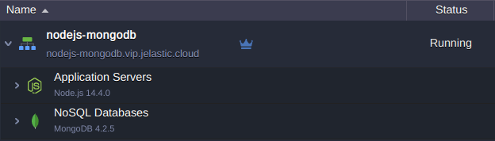

# Node.js Application Connection to MongoDB

**MongoDB** is a popular NoSQL database, which is natively supported by the platform and can be easily installed on the Cloud. Below, we'll consider a simple example of how to connect this DB stack from your **Node.js** application server.

1\. In order to follow this guide, you'll need *Node.js* and *MongoDB* servers either within the platform (you can [create](/setting-up-environment/) it at any time) or on any external resources.



In our case, both instances are hosted within a single environment.

2\. Connect to your application server via [SSH Gate](/ssh-gate/).


3\. Next, download and install an official [MongoDB driver for Node.js](https://github.com/mongodb/node-mongodb-native):
```bash
npm install -s mongodb
```


In a moment the package will be successfully installed.

4\. Now, create a file with a script to establish connection with your database. You can use any preferable text editor for this task, as well as any filename with the ***.js*** extension (e.g. ***vim script.js***).
```js
var MongoClient = require('mongodb').MongoClient;
// Connect to the db
MongoClient.connect("mongodb://{user}:{password}@{host}:{port}/{database}", { useUnifiedTopology: true, useNewUrlParser: true }, function(err, db) {
if(!err) {
   console.log("You are connected!");
   };
      db.close();
});
```

Here, you need to adjust the [connection string](https://docs.mongodb.com/manual/reference/connection-string/) (all the required information is provided within email for your MongoDB node):

* ***{user}*** - username to log into database with
* ***{password}*** - password for the appropriate user
* ***{host}*** - link to your MongoDB container
* ***{port}*** - port to be used for connection (use the default one - *27017*)
* ***{database}*** - database to be accessed (e.g. the default one - *admin*)


With this script you can access the specified database server and, if connection is successfully established, see the "*You are connected!*" phrase.

5\. Let's run the code, using the appropriate command:
```bash
node script.js
```


If everything is specified correctly, you should see the "*You are connected!*" string within terminal. Next, you can [extend code](http://mongodb.github.io/node-mongodb-native/2.2/api/) to execute all of the required actions.


## What's next?

* [Java Connection to MongoDB](/connection-to-mongodb/)
* [PHP Connection to MongoDB](/connection-to-mongodb-for-php/)
* [Python Connection to MongoDB](/connection-to-mongodb-python/)
* [MongoDB Auto-Clustering](/mongodb-auto-clustering/)
* [MongoDB Replica Set](/mongodb-replica-set/)