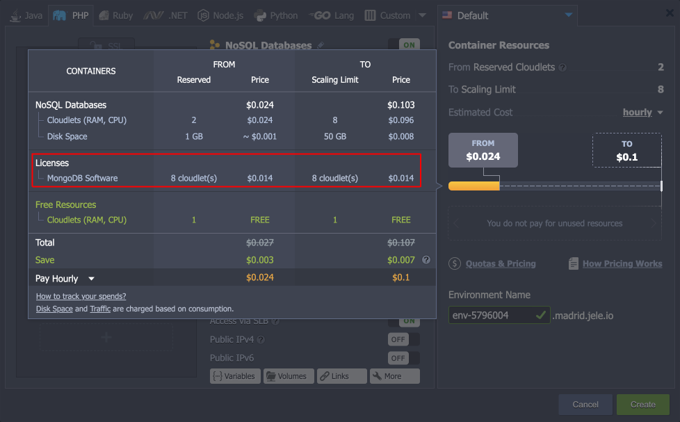
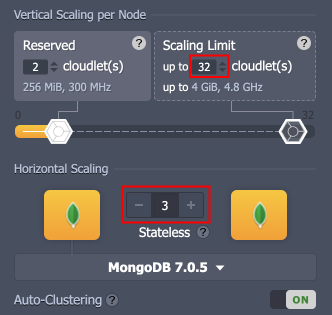
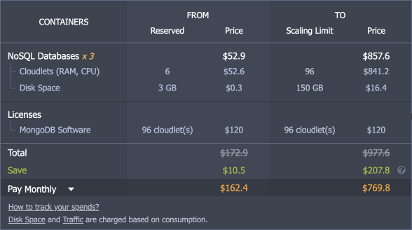

# MongoDB License Pricing

{}The availability of the **latest MongoDB versions** depends on the service hosting provider - check the list of [supported platforms](https://www.virtuozzo.com/application-platform-partners/?featuresSupport=MDB).{}

Historically, Virtuozzo Application Platform provided MongoDB software stack as a certified container without any additional charges. However, due to the license changes, MongoDB versions newer than **3.6.8** and **4.0.2** cannot be distributed freely and require additional agreement.

If you want to use the latest versions of MongoDB with the Virtuozzo Application Platform, an additional **license fee** will be automatically applied. The exact amount can vary for different hosting providers, but you can always check the price via the [topology wizard](/setting-up-environment/) (both before the installation and for the existing environments). Once the environment topology is set up, choose the *hourly/dayly/monthly* estimated cost period, and hover over the price in the right part of the wizard:

{}**Tip:** The Virtuozzo Application Platform provides a **[MongoDB Sandbox](/mongodb-sandbox/)** image for testing purposes. It is offered license-free but includes some restrictions compared to the production version.{}

The MongoDB license price corelates to the number of dynamic cloudlets (scaling limit) provided for the MongoDB nodes.

*<u>For example,</u>* for replica set with 3 nodes with 32 cloudlets each and the license cost of 10$/month for 8 cloudlets (equivalent to per 1 GB of RAM):

- 3 \* 32 = **96** (total cloudlets limit for MongoDB)

- 10 / 8 = **1.25** (license cost for a single cloudlet of resources)
- 96 \* 1.25 = **120** (total license cost)

## What's next?

- [MongoDB Auto-Clustering](/mongodb-auto-clustering/)
- [Upgrading to MongoDB 6/7](/updating-to-mongodb-7/)
- [MongoDB Backup/Restore Add-On](/mongodb-backup-restore-addon/)
- [MongoDB Encryption in Transit Add-On](/mongodb-ssl-addon/)
- [MongoDB Remote Access](/remote-access-to-mongodb/)
- [MongoDB Dump Import/Export](/dump-import-export-to-mongodb/)