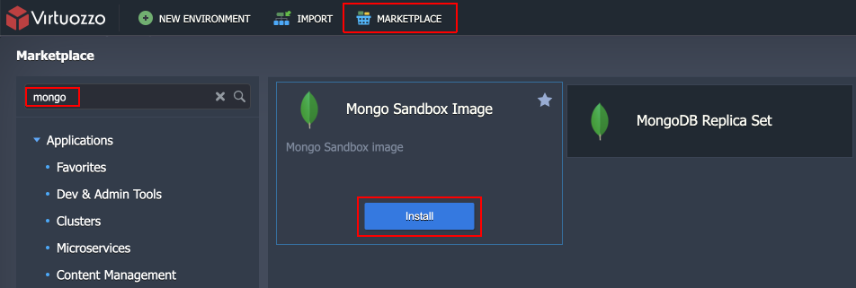
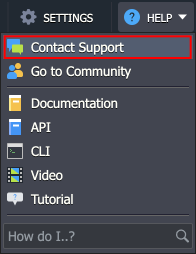

# MongoDB Sandbox

If you want to try out the latest version of MongoDB, you have the option to test it without the additional [license cost](/mongodb-license/). Go to the Marketplace tab at the top of your dashboard and search for the **MongoDB Sandbox** application.

If you cannot find the application, you can request adding the **MongoDB Sandbox** template. Contact your platform’s Support Team (e.g., accessible directly from the dashboard) and request access to the MongoDB sandbox image for your account.

Before using the MongoDB Sandbox template, note some of its limitations:

- The image is preconfigured with a resource limit of **8 cloudlets per container** (equivalent to 1 GB of RAM). The MongoDB replica set cluster can be configured with the same limitation.
- The sandbox template has **no extra license cost** that is applied to the production version of MongoDB.
- The image is provided for a **limited time** only (determined by your service hosting provider).
- The MongoDB Sandbox image is **for testing purposes** only, with no auto-upgrade to production. If you want to keep any data from the testing instance, you’ll need to migrate it manually.

## What's next?

- [MongoDB License Pricing](/mongodb-license/)
- [Upgrading to MongoDB 6/7](/updating-to-mongodb-7/)
- [MongoDB Backup/Restore Add-On](/mongodb-backup-restore-addon/)
- [MongoDB Encryption in Transit Add-On](/mongodb-ssl-addon/)
- [MongoDB Auto-Clustering](/mongodb-auto-clustering/)
