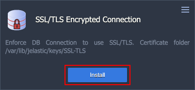
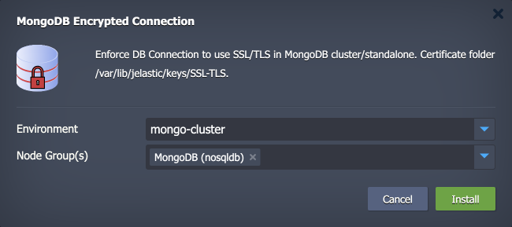
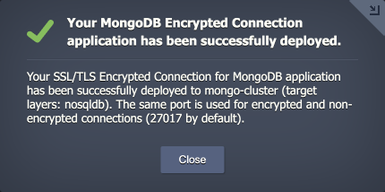
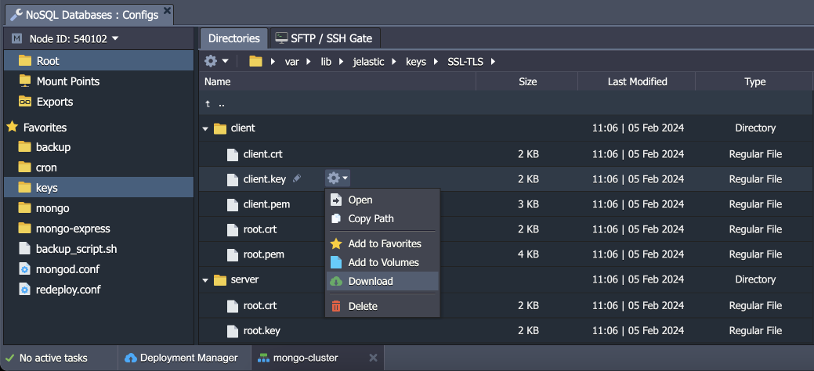
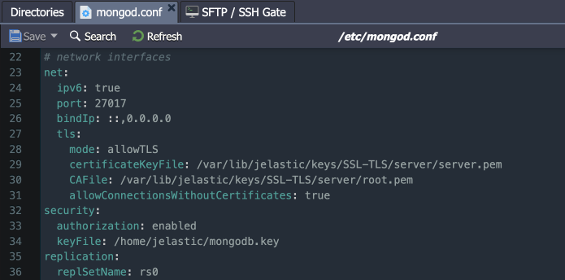
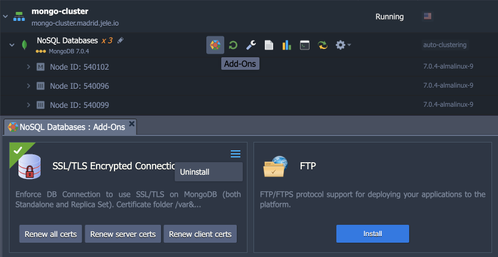
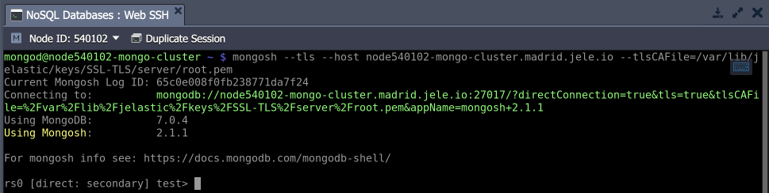

# SSL/TLS Encryption in Transit for MongoDB

MongoDB database at the Virtuozzo Application Platform is provided with a built-in add-on that implements “**encryption in transit**”. The add-on is compatible with the standalone and clustered solutions and its functionality ensures data protection with SSL/TLS encrypted connection during exchanges between servers. After the installation, all the related operations are handled automatically - data encryption before transmission, endpoints authentication, content decryption, and verification upon arrival.


## Add-On Installation

The add-on can be installed on top of the **MongoDB** database nodes of ***6 and later*** versions.

1\. In the platform dashboard, go to the Add-Ons section of the appropriate database layer, and click **Install** for the ***MongoDB Encrypted Connection*** solution.

{}**Tip:** The add-on is also available from the [Marketplace](/marketplace/) and can be imported from the appropriate GitHub [repository](https://github.com/jelastic-jps/mongodb-ssl-addon).{}




2\. Within the opened installation window, select the target **Environment** and **Node Group(s)** (multiple layers can be selected if needed) where the add-on will be installed.



Click **Install** to continue.

3\. Wait a minute and your database will be configured to work over an encrypted connection.




## Add-On Specifics

Below you can learn about the certificate generation process and its specifics:

- Certificates are generated with the ***/usr/local/sbin/selfcertgen*** utility.
- Certificates of the PEM format are used in MongoDB.
- Certificates are self-signed and issued for the particular node's hostname. It means that each node has a set of own certificates, and you must use the ones corresponding to the accessed node for authentication.
- Certificates are stored within the **/var/lib/jelastic/keys/SSL-TLS** folder (accessible via the ***keys*** shortcut in the file manager). Two subfolders are present:
  - ***server*** – server certificates are used to provide the TLS encryption of connection to the MongoDB database
  - ***client*** – downloadable client certificates can be used to authenticate client connection to the database server



**MongoDB configurations:**

- All the add-on configurations are provided via a separate ***/etc/mongod.conf*** configuration file:

```
net:
  tls:
    mode: allowTLS
    certificateKeyFile: /var/lib/jelastic/keys/SSL-TLS/server/server.pem
    CAFile: /var/lib/jelastic/keys/SSL-TLS/server/root.pem
    allowConnectionsWithoutCertificates: true
```



- The config provides paths to server SSL files. Also, it includes the “*allowConnectionsWithoutCertificates: true*” option to make usage of the secure connection optional. If removed, it will be impossible for the client to connect to this server using the plain non-encrypted connection.


## Add-On Configuration

The add-on can be found under the **Add-Ons** tab for the appropriate layer(s). You can use the following buttons to renew required certificates (if you think they are compromised or if accidentally removed):

- **Renew all certs** - generate all SSL certificates anew
- **Renew server certs** - generate server SSL certificates anew
- **Renew client certs** - generate client SSL certificates anew



To remove the add-on from the layer (including custom configs and generated SSL certificates), expand the menu in the top-right corner of the panel and click **Uninstall**.


## Secure Connection to MongoDB

Let’s check the secure connection to the MongoDB nodes by using the ***tls*** and ***tlsCAFile*** options in the connection string:

- ***--tls*** - specifies the usage of the TLS for this connection
- ***--host*** – sets the database hostname or IP
- ***--tlsCAFile*** – provides path to the CA certificate file

```
mongosh --tls --host {hostName} --tlsCAFile={path/to/root.pem}
```




## What's next?

- [MongoDB Auto-Clustering](/mongodb-auto-clustering/)
- [Upgrading to MongoDB 6/7](/updating-to-mongodb-7/)
- [MongoDB License Pricing](/mongodb-license/)
- [MongoDB Backup/Restore Add-On](/mongodb-backup-restore-addon/)
- [MongoDB Remote Access](/remote-access-to-mongodb/)
- [MongoDB Dump Import/Export](/dump-import-export-to-mongodb/)