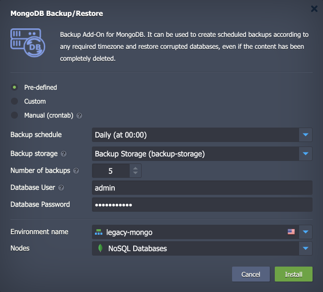
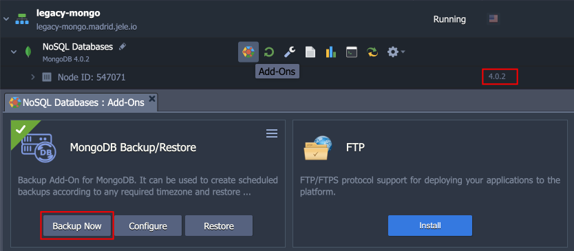
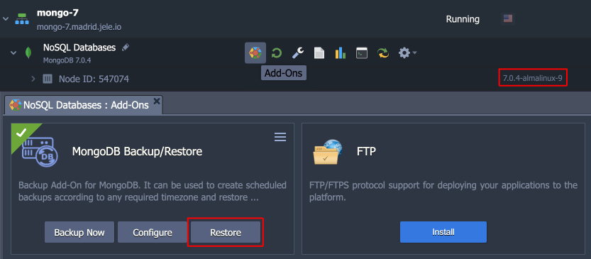
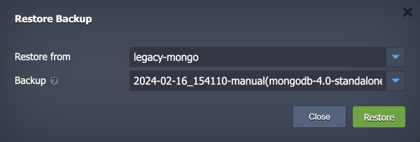
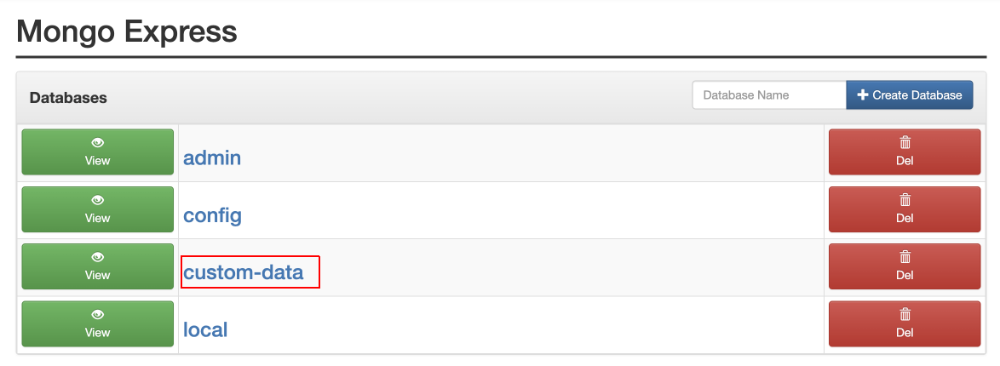

# Upgrading to MongoDB 6/7

Due to significant architectural changes between **MongoDB 3/4** and **MongoDB 6/7**, the regular upgrade flow through [redeployment](/container-redeploy/) is not possible. In this guide, we’ll show how such an upgrade can be done by leveraging the **Backup/Restore** add-on.

{}**Note:** Upgrade from **MongoDB 6** to **7** can be done via redeployment as usual (without the steps described in this guide). However, the <u>*downgrade is not supported*</u>.{}

1\. Install the ***Backup/Restore*** add-on for your legacy MongoDB instance. For example, locate it in the Marketplace or import it from [GitHub](https://github.com/jelastic-jps/database-backup-addon):

2\. Go to the **Add-Ons** section for your legacy MongoDB database. Here, you can manually create a backup with the **Backup Now** button. We recommend doing it right before the restoration step to ensure no or minimal data loss.

3\. Create a new environment with the MongoDB 6/7 instance (the same topology is recommended). Once created, install the ***Backup/Restore*** add-on for it as well and click the **Restore** option.

4\. Select to *restore from* the environment with the legacy MongoDB instance and choose the latest *backup* in the opened ***Restore Backup*** form. Click the **Restore** button and confirm via pop-up.

5\. Once the process is complete, connect to the new database via the admin panel or SSH to verify that your custom data is present.

That’s all! Now, you just need to reconfigure your applications to work with the new database (like updating connection string and credentials).

## What's next?

- [MongoDB Auto-Clustering](/mongodb-auto-clustering/)
- [MongoDB License Pricing](/mongodb-license/)
- [MongoDB Backup/Restore Add-On](/mongodb-backup-restore-addon/)
- [MongoDB Encryption in Transit Add-On](/mongodb-ssl-addon/)
- [MongoDB Remote Access](/remote-access-to-mongodb/)
- [MongoDB Dump Import/Export](/dump-import-export-to-mongodb/)