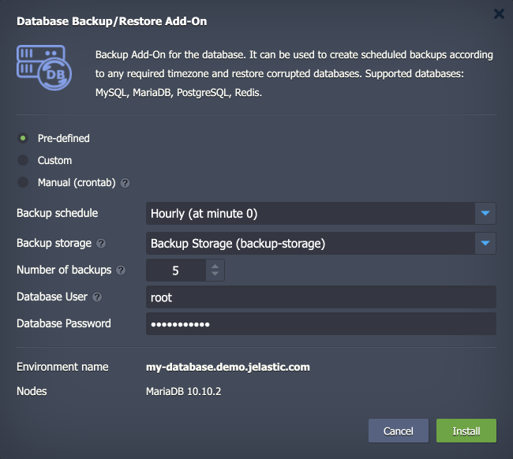
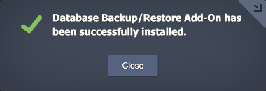
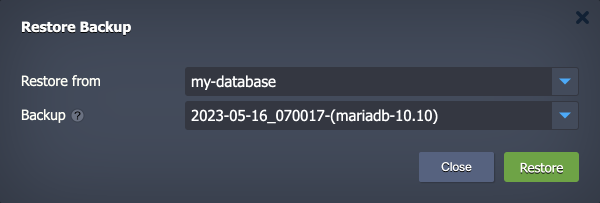

# Database Backup/Restore Add-On

**[Database Backup](https://github.com/jelastic-jps/database-backup-addon)** add-on is compatible with all the MySQL-based (MySQL/MariaDB/Percona), PostgreSQL, and Redis databases in the Virtuozzo Application Platform. It works in tandem with [Backup Storage](https://github.com/jelastic-jps/backup-storage) to help users automatically create and store database backups at the remote storage.

{}**Note:** When updating (redeploying) the PostgreSQL instance, it is *<u>highly recommended</u>* to create a database backup before the process. Refer to the official documentation for *[upgrading data via pg_dumpall](https://www.postgresql.org/docs/15/upgrading.html#UPGRADING-VIA-PGDUMPALL)* and *[pg_upgrade](https://www.postgresql.org/docs/current/pgupgrade.html)*.{}

## Add-On Installation

Before starting the add-on installation, you need to create a dedicated storage instance to keep all the backup data.

1\. If you don’t have one, it can be created in a few minutes using the dedicated **Backup Storage** package in the [platform Marketplace](/marketplace/).

If you already have such storage, you can skip to the fourth step.

2\. Within the installation window, you can choose between the ***Standalone*** and ***Cluster*** storage options. Next, specify the preferred **Number of nodes** (for Cluster option) and **Storage size**. Finalize by providing the standard data:

- **Environment** – environment domain name
- **Display Name** – [environment's alias](/environment-aliases/)
- **Region** – [environment's region](/environment-regions/) (if multiple ones are available)

3\. Click the Install button and wait several minutes for the storage to be created. It will be automatically added to the “*Backup storage nodes*” [group](/environment-groups/).

{}**Tip:** One storage can be used by as many databases as needed.{}

4\. Once the storage is ready, you can install the backup add-on. Hover over your database and click the **Add-Ons** icon.

Locate the required ***Database Backup/Restore Add-On*** and click **Install**.

5\. Provide the following data:

- Choose scheduling option
  - **Pre-defined** – select from a list of standard backup intervals (hourly, daily, weekly, monthly)
  - **Custom** – choose the exact Time, required Days of the week, and Time Zone

  - **Manual (crontab)** - provide a simple [cron-based expression](https://en.wikipedia.org/wiki/Cron#Overview) (using the UTC zone) to schedule backups

- **Backup storage** – choose from the list of the backup storages installed on the account
- **Number of backups** – set the number of the newest backups to keep for the current database
- **Database User** and **Database Password** – provide user credentials to access the database

6\. In a minute, you’ll see the installation success pop-up.

Your backup add-on is already working. Just wait for the specified time for backups to be created.

## Managing Add-On

After the installation, the add-on gives you the options to:

- **Backup Now** – creates an immediate backup
- **Configure** – adjusts parameters specified during the creation (schedule, storage node, quantity of backups, user credentials)
- **Restore** – restores from backup
- **Uninstall** – removes the backup add-on

*<u>During the backup process,</u>* a snapshot of the database is created. It is stored on the *Backup Storage* under the dedicated folder (named based on the backed-up database) and uses a distinct name (execution timestamp). Such a structure helps keep backups organized, especially when working with multiple databases.

*<u>During the restore process,</u>* the corresponding directory on the storage server is mounted to the master node of the target database. Next, the SQL dump from the required backup snapshot is restored and applied to the database.

{}**Note:** Take into consideration that all the operations are performed on the database ***layer’s master node*** only:

- *For the non-clustered databases with multiple nodes,* the data will be restored on one node only.
- *For the primary-secondary topology,* ensure that the primary node of the cluster is the master node of the layer.
{}

## Restoring Database

*Database restoration from the backup overrides all the existing data. Any recent changes that were made since the backup creation will be permanently lost.*

In order to restore a database from a backup, you need to select the **Restore** option for the add-on. A dialogue window with the following options will be opened:

- **Restore from** – choose the target environment (multiple options may be available if the backup add-on is used on several environments)
- **Backup** – select from a list of backups for the selected environment (names contain timestamps for quick identification)

Click **Restore** and confirm via pop-up. Once initiated, the action cannot be canceled or reverted. You'll see the success notification in the dashboard after the process completion.

## What's next?

- [DB Hosting Overview](/database-hosting/)
- [Manual Database Backups](/database-backups/)
- [Cluster Recovery Add-On](/db-cluster-recovery-addon/)
- [Remote Access](/remote-access-mysql/)
- [Dump Import/Export](/dump-import-export-to-mysql/)