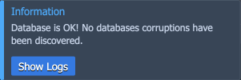

# MySQL/MariaDB/Percona Corruption Diagnostic Add-On

The **[Database Corruption Diagnostic](https://github.com/jelastic-jps/mysql-cluster/tree/master/addons/check-corrupts)** add-on is available for all the MySQL/MariaDB/Percona databases (including cluster topologies) and can perform diagnostics to detect file corruption. It checks the integrity of the cluster’s indexes, tables, and databases.

The list of supported stacks for corruption diagnostic:

- Standalone MariaDB/MySQL/Percona stacks
- Primary-Secondary Cluster based on MariaDB/MySQL/Percona stacks
- Primary-Primary Cluster based on MariaDB/MySQL/Percona stacks
- Galera Cluster based on MariaDB stack
- XtraDB Cluster based on Percona stack

## Add-On Installtion

The add-on can be installed either automatically along with database cluster installation or manually from [Marketplace](/marketplace/).

1\. Go to the **Add-Ons** section in the Marketplace and pick the **Database Corruption Diagnostic** add-on.

2\. In the opened installation window, provide the required data:

- **User** and **Password** - the database admin user credentials
- **Environment name** - select an environment with the required database cluster from the list
- **Nodes** - choose a layer with the database cluster

Click **Install** and wait a minute for the add-on to be installed.

## Add-On Usage

1\. You can find the ***Database Corruption Diagnostic*** add-on under the **Add-On** tab for the database layer.

2\. Click the **Corruption Diagnostic** button to run the diagnostic for your database.

{}**Note:** The operation will temporarily stop the database services, so be aware of the downtime before confirming.{}

3\. In a few minutes, you’ll see the diagnostic result in the pop-up notification with a link to the ***/var/log/db_recovery.log*** file with more details.

In case of detecting corrupted data, it is recommended to restore your database from a backup. You can use the **[Backup/Restore](/db-backup-restore-addon/)** add-on to schedule regular backup creation, ensuring you always have a backup to restore your database in case of an emergency.

## What's next?

- [DB Hosting Overview](/database-hosting/)
- [Cluster Recovery Add-On](/db-cluster-recovery-addon/)
- [Backup/Restore Add-On](/db-backup-restore-addon/)
- [Manual Database Backups](/database-backups/)