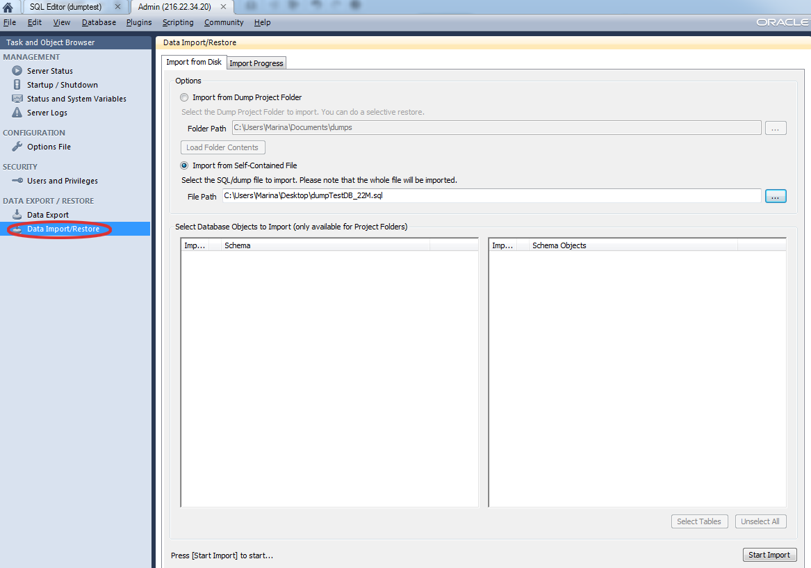
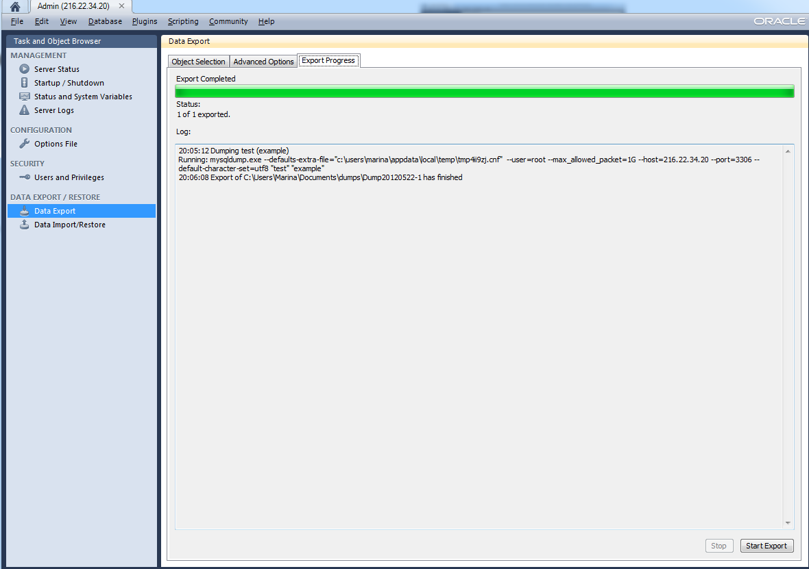

# Import and Export Dump Files to MySQL/MariaDB/Percona

## Dump Import

1\. Create a new server instance using any desktop client for **MySQL/MariaDB/Percona** (we use MySQL Workbench as an example).

2\. Specify your **host machine** (just paste your public IP into the address field) and click **Next**.

3\. Set the database connection values: **IP address, port number, username** and **password** (when you created the environment, the platform sent you an email with credentials to the database).

4\. Then your database connection will be tested for a couple of minutes.

5\. Set the type of remote management you want to use.

6\. Enter the name for your server instance.

7\. You can see that your server instance is successfully created.

8\. Open your instance and pick **Data Import/Restore** and choose the dump you want to import.

The import process can take several minutes.

9\. Go back to the platform dashboard and open **MySQL** (**MariaDB**) in a browser. Using the credentials, which the platform sent you, sign in into admin page. Select **test**, click on **example** and you'll see your imported dump.

## Dump Export

1\. Open the server instance you have created earlier in your desktop client and pick **Data Export** and select database objects to export. Specify the path to the directory, in which you want to export the dump.

2\. The export process can take several minutes, depending on the size of exported data.

 Your dump file will be in the directory, the path to which you have specified.

## What's next?

* [Java Connection to MySQL/MariaDB](/connection-to-mysql/)
* [PHP Connection to MySQL/MariaDB](/connection-to-mysql-php/)
* [Remote Access to MySQL/MariaDB](/remote-access-mysql/)