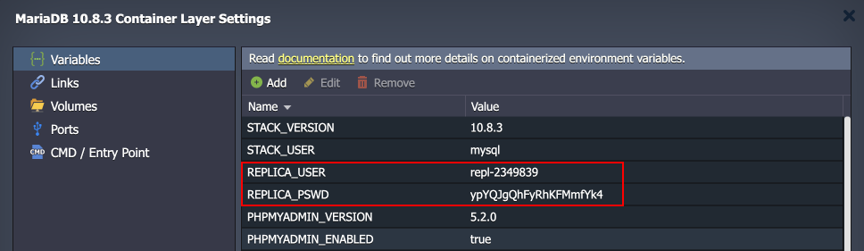
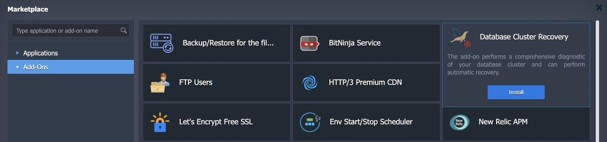
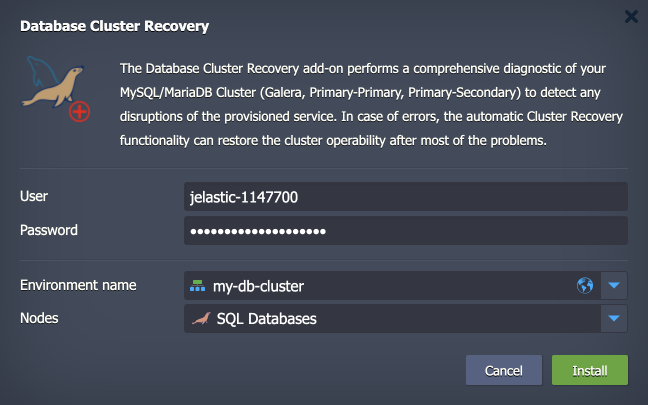
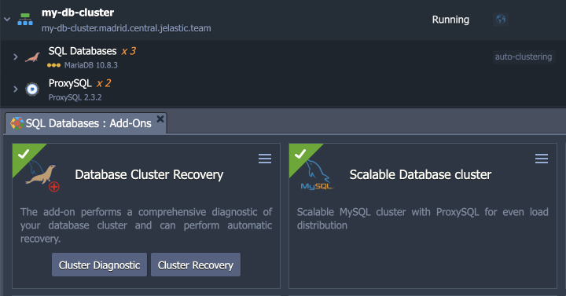
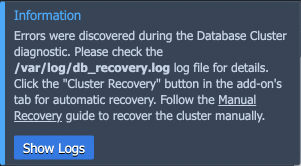
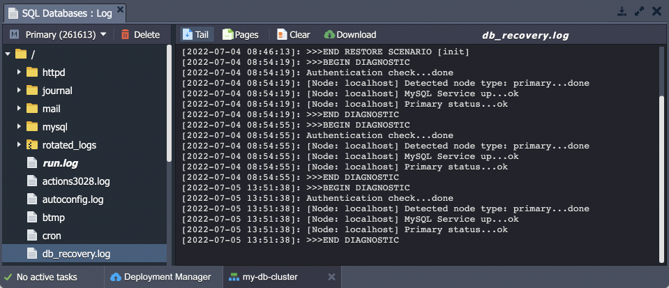

# Database Cluster Recovery Add-On

The platform has several popular out-of-box clustering options for the MariaDB/MySQL databases, which can be automatically implemented via the [auto-clustering](/auto-clustering/) feature. Such database clusters offer an advanced high availability and auto-scalability while remaining accessible to any user through automation.

In order to make the solution even more alluring, the platform offers a free diagnostic and recovery add-on to help with database maintenance. Currently, the **Database Cluster Recovery** add-on supports the following database clusters:

- **Primary-Secondary Cluster** based on the MySQL/MariaDB/Percona stacks
- **Primary-Primary Cluster** based on the MySQL/MariaDB/Percona stacks
- **Galera Cluster** based on the MariaDB stack
- **XtraDB Cluster** based on the Percona stack

## Add-On Specifics

The **Database Cluster Recovery** add-on can operate in the *diagnostic* and *recovery* modes. The first one scans the database to identify if there are any problems, and the second tries to resolve the issue based on the obtained information.

During diagnostic, the add-on checks the following:
- replication for the Primary-Secondary and Primary-Primary topologies
- the cluster size for Galera/XtraDB clusters
- Galera/XtraDB clusters status
- cluster services status

In order to perform the required recovery operations, the add-on applies the following adjustments to the database cluster during the installation:

A *replica* user is added to perform the validation of the clusters. Also, this user is used in the ProxySQL configuration. The credentials can be viewed via the dedicated [environment variables](/environment-variables/):

- **REPLICA_USER:** repl-xxxxxx
- **REPLICA_PSWD:** xxxxxxxxxxxx

Also, SSH access is configured between the database nodes (with the dedicated set of SSH keys) to allow data coping with *rsync* during the restoration procedure.

## Add-On Installation

The add-on is available via the platform Marketplace. Alternatively, you can import the appropriate ***[Database Cluster Recovery](https://github.com/jelastic-jps/mysql-cluster/tree/master/addons/recovery)*** package from GitHub.

In the opened confirmation window, provide the required data:

- **User** and **Password** - the database admin user credentials
- **Environment name** - select an environment with the required database cluster from the list
- **Nodes** - choose a layer with the database cluster

Click **Install** and wait a few minutes for the add-on to be installed. It will appear in the list of add-ons of the appropriate layer.

## Add-On Usage

The add-on can perform two actions that can be executed by clicking the appropriate buttons:

- ***Cluster Diagnostic*** - detects problems with the database cluster (scans if nodes are accessible and databases are consistent)
- ***Cluster Recovery*** - tries resolving common problems to restore cluster operability

The result of the ***Cluster Diagnostic*** action can be either “*Cluster is OK*” or “*Errors discovered*” dashboard notification.

For extended details, you can click the **Show Logs** button to open the ***/var/log/db_recovery.log*** file:

In case some problems are discovered, you can try to resolve them automatically with the ***Cluster Recovery*** action. It should handle most of the issues and fully restore cluster operability:

{}**Note:** We recommend [making a backup](/database-backups/) of the database before the recovery.{}

For additional details or in case of recovery failure, you can check the ***db_recovery*** [log](/view-log-files/) mentioned above. Also, check the **[Manual Recovery](https://github.com/jelastic-jps/mysql-cluster/blob/master/addons/recovery/docs/ManualRecoveryGuide.md#configuration-file-restoration)** guide if the problem is not resolved.

## What's next?

- [Create DB Server](/database-hosting/)
- [Database Backups](/database-backups/)
- [Galera Cluster Recovery](/galera-recovery/)