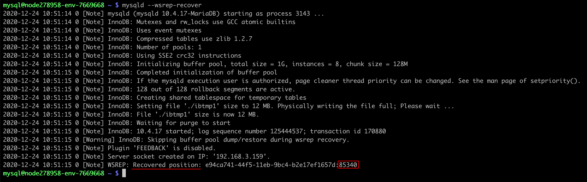

# Galera Cluster Limitations and Recovery

This instruction lists the most common limitations and problems when hosting a **[MariaDB Galera Cluster](https://www.virtuozzo.com/company/blog/mariadb-galera-cluster-replication/)** at the platform. Follow this guide to find possible issues and recovery solutions to the already occurred problems:

- [Galera Cluster Limitations](#galera-cluster-limitations)
- [Stop/Start/Restart Specifics](#stopstartrestart-specifics)
- [Node with Maximum Transactions](#node-with-maximum-transactions)
- [Starting Cluster after Crash](#starting-cluster-after-crash)
- [Single Node Failure](#single-node-failure)
- [Monitoring Galera Cluster](#monitoring-galera-cluster)


## Galera Cluster Limitations

*You can find a complete list of the Galera Cluster limitations on the [official website](https://mariadb.com/kb/en/mariadb-galera-cluster-known-limitations/).*

Below, we'll highlight the most relevant ones to the platform.

1\. **All tables must contain the Primary Key.**

{}*All tables should have a primary key (multi-column primary keys are supported). DELETE operations are unsupported on tables without a primary key. Also, rows in tables without a primary key may appear in a different order on different nodes.*{}

To search for tables without Primary Key, you need to run the following query:

```
select tab.table_schema as database_name,
tab.table_name
from information_schema.tables tab
left join information_schema.table_constraints tco
on tab.table_schema = tco.table_schema
and tab.table_name = tco.table_name
and tco.constraint_type = 'PRIMARY KEY'
where tco.constraint_type is null
and tab.table_schema not in ('mysql', 'information_schema',
'sys', 'performance_schema')
and tab.table_type = 'BASE TABLE'
order by tab.table_schema,
tab.table_name;
```

2\. **[MyISAM](https://mariadb.com/kb/en/myisam/) tables.**

{}*Currently, replication works only with the InnoDB storage engine. Any writes to tables of other types, including system (mysql.\*) tables are not replicated (this limitation excludes DDL statements such as CREATE USER, which implicitly modify the mysql.\* tables — those are replicated). There is however experimental support for MyISAM - see the wsrep_replicate_myisam system variable).*{}


An experimental parameter *[wsrep_replicate_myisam](https://mariadb.com/kb/en/galera-cluster-system-variables/#wsrep_replicate_myisam)* for supporting MyISAM tables has been added to the configuration file.


## Stop/Start/Restart Specifics

The main condition for stopping a cluster is a <u>*sequential*</u> shutdown of all its nodes. The last container sets itself in *bootstrap*, which means that the cluster will start from this node.

The platform automates such a flow so that you don't need to perform any additional actions. You can operate Galera Cluster just as any other regular environment and start/stop/restart via the dashboard. The special events will perform all the required actions (like the sequential withdrawal of nodes from the cluster) in the background.

When you restart just one node of the cluster, the actions are standard.


## Node with Maximum Transactions

*Before performing any actions, we highly recommend creating a backup for the **/var/lib/mysql** directory on each cluster node.*

When performing the cluster recovery operations, you need to know the node with the highest sequence number of the last transaction (as the cluster should be started from this node). You can get the sequence number of the last transaction from the ***seqno*** value in the ***/var/lib/mysql/grastate.dat*** file of each node:

```
mysql @ node270011-env-0668554 ~ $ cat /var/lib/mysql/grastate.dat | grep seqno
seqno: 1133

mysql @ node270016-env-0668554 ~ $ cat /var/lib/mysql/grastate.dat | grep seqno
seqno: 1134

mysql @ node270017-env-0668554 ~ $ cat /var/lib/mysql/grastate.dat | grep seqno
seqno: 1134
```

Usually, you just need to select a node with the highest parameter value. If all or several nodes have the same highest value, choose any of them (preferably the master container of the layer).

However, if at least one of the nodes has the ***-1*** value, you cannot be sure that nodes are consistent (the parameter is reset to -1 when the service is restarted on a non-working cluster). In such a case, you need to recover data by starting ***mysqld*** with the **--wsrep-recover** parameter:

```
$ mysqld --wsrep-recover
```

Search output for the ***Recovered position*** data - check the value at the very end of the line after the colons (*85340* in the example below):



```
....
2020-12-24 10:51:15 0 [Note] WSREP: Recovered position: e94ca741-44f5-11eb-9bc4-b2e17ef1657d:85340
....
```

Compare the ***Recovered position*** on all nodes. The one with the highest value should be used for bootstrap. Once again, choose any node if multiple ones have the highest value. Next, set the **safe_to_bootstrap** variable to *1* in the ***grastate.dat*** file and bootstrap from this node.


## Starting Cluster after Crash

1\. The ***mysql*** process on nodes may hang after the cluster crash. It may be displayed as "running", but you cannot perform normal operations like establishing a connection or stopping the process in a standard way (via the init script).

So, before starting a cluster, ensure that the ***mysql*** processes are not running on the nodes. The hang processes must be killed manually.

2\. After killing the ***mysql*** processes, restart all your MySQL containers.

3\. Check the value of the **safe_to_bootstrap** parameter in the ***/var/lib/mysql/grastate.dat*** file - it should be **0**.

```
CT-44999 /# grep safe_to_bootstrap /var/lib/mysql/grastate.dat
safe_to_bootstrap: 0
```

4\. On the [node with maximum transactions](#node-with-maximum-transactions), set **safe_to_bootstrap** to **1** and start the *mysql* process.

```
CT-44999 /# sed -i 's/safe_to_bootstrap: 0/safe_to_bootstrap: 1/g' /var/lib/mysql/grastate.dat
CT-44999 /# grep safe_to_bootstrap /var/lib/mysql/grastate.dat
safe_to_bootstrap: 1
CT-44999 /# service mysql start
```

5\. Next, sequentially start *mysql* on the remaining nodes:

```
# service mysql start
```

{}**Note:** It could be difficult to define a node with the highest transaction number after the cluster crash. In this case, you may set **safe_to_bootstrap** to **1** on the master node firstly.{}

If mysql is successfully started on the *second* node, you can proceed to the next ones.

However, in case of an error, check ***mysqld.log*** on this *second* node. Look for a message similar to the following one:

```
2020-11-19 16:55:20 0 [ERROR] WSREP: gcs/src/gcs_group.cpp:group_post_state_exchange():422: Reversing history: 3151891 -> 3150782, this member has applied 1109 more events than the primary component.Data loss is possible. Aborting.
```

If such a record exists, ​your *second* node has more transactions than the initially selected one (i.e. the first node where you set **safe_to_bootstrap** to **1**). Please, return to the [beginning of this section](#starting-cluster-after-crash) and start it anew, using the *second* node in the fourth step.


## Single Node Failure

The most frequent cause of a node crash is the impossibility of processing a request due to some ignored **[limitations](#galera-cluster-limitations)**. You can check the ***/var/log/mysql/mysqld.log*** log for such errors.

In order to restore a node, you need to:

- ensure no ***mysql*** processes are running on the node
- set the **safe_to_bootstrap** parameter to *0* in the ***/var/lib/mysql/grastate.dat*** file
- restart the node via the *init* script

```
/etc/init.d/mysql restart
```

{}**Note:** If there are problems with Galera cluster limitations, the error can reappear again after some time.{}


## Monitoring Galera Cluster

You can check the state and various parameters of the cluster by specifying them in the **SHOW GLOBAL STATUS LIKE** command on any node of the cluster. Depending on the provided value, you can see the different aspects of the cluster. For example:

```
mysql -uuser -ppass -e "SHOW GLOBAL STATUS LIKE 'wsrep_cluster_size';"
+ -------------------- + ------- +
| Variable_name        | Value   |
+ -------------------- + ------- +
| wsrep_cluster_size   |    3    |
+ -------------------- + ------- +

mysql -uuser -ppass -e "SHOW GLOBAL STATUS LIKE 'wsrep_cluster_status';"

+ ---------------------- + --------- +
| Variable_name          |  Value    |
+ ---------------------- + --------- +
| wsrep_cluster_status   | Primary   |
+ ---------------------- + --------- +

mysql -uuser -ppass -e "SHOW GLOBAL STATUS LIKE 'wsrep_local_state_comment';"
+ --------------------------- + -------- +
| Variable_name               | Value    |
+ --------------------------- + -------- +
| wsrep_local_state_comment   | Synced   |
+ --------------------------- + -------- +
```

{}**Tip:** Check out more examples in the [official Galera cluster](https://galeracluster.com/library/documentation/monitoring-cluster.html) documentation.{}

If your cluster includes ***ProxySQL*** nodes, the status may be checked by executing the following request on any of the *ProxySQL* nodes:

```
CT-44998 /# mysql -uadmin -padmin -P6032 -h127.0.0.1 -e "select * from runtime_mysql_servers;"
Warning: Using a password on the command line interface can be insecure.
+--------------+----------+------+-----------+--------+--------+-------------+-----------------+---------------------+---------+----------------+---------+
| hostgroup_id | hostname | port | gtid_port | status | weight | compression | max_connections | max_replication_lag | use_ssl | max_latency_ms | comment |
+--------------+----------+------+-----------+--------+--------+-------------+-----------------+---------------------+---------+----------------+---------+
| 2            | node3303 | 3306 | 0         | ONLINE | 1      | 0           | 1000            | 0                   | 0       | 0              |         |
| 3            | node3304 | 3306 | 0         | ONLINE | 1      | 0           | 1000            | 0                   | 0       | 0              |         |
| 3            | node3303 | 3306 | 0         | ONLINE | 1      | 0           | 1000            | 0                   | 0       | 0              |         |
| 2            | node3304 | 3306 | 0         | ONLINE | 1      | 0           | 1000            | 0                   | 0       | 0              |         |
+--------------+----------+------+-----------+--------+--------+-------------+------------
```

All nodes must be in ONLINE status.


## What's next?

* [Auto-Clustering of Instances](/auto-clustering/)
* [Create DB Server](/database-hosting/)
* [Database Auto-Configuration](/database-auto-configuration/)