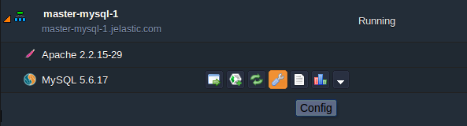
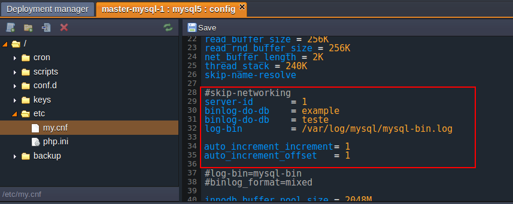
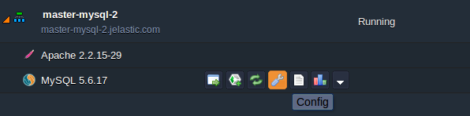

# Multi-Primary Replication for MySQL/MariaDB/Percona

The platform lets you easily set up two different types of database replication - **primary-secondary** and **primary-primary** - in order to solve a number of different problems with performance, to support database backups, to alleviate system failures and much more. Information on how to configure a master-slave replication for your MySQL database can be found [here](/database-master-slave-replication/).

And in this tutorial we are going to explain how to configure the master-master (multi-master) replication in MySQL, specifically to be applied on environments. The process is rather simple, but requires you to pay attention to some important details.

So let's get started!


## Create Environments

The first thing that you need in order to configure a database replication is, at least, two db servers. Let's create two environments with MySQL instances.

1\. Log into the platform. After your dashboard is opened, click on **Create Environment** in the top panel.


2\. With the help of the opened topology wizard, set up the following environments:

* **the first master DB environment**  

Add **Apache** application server with **PHP** support and **MySQL** database. Set up the cloudlet limits for each container. Name your environment (e.g. *mysql-master-1*) and click **Create**.


* **the second master DB environment**

To create the second environment (**master-mysql-2**) you will be required to repeat the steps of **master-mysql-1** environment creation.

Or, you can just [clone](/clone-environment/) the first environment, specifying the proper name in the corresponding frame:


3\. Keep in mind that versions and environments' configuration may vary according to your needs and will also depend on your hosting provider configuration. For example, instead of running PHP you may want to run a Java or Ruby application. Regardless, the references in the article should only be used for replicating MySQL servers running on this platform.

{}**Note:** If you want to replicate your environments between different hosting providers, you <u>*must*</u> enable **public IP** address for MySQL nodes.{}


## Configure the First Master DB

Now that MySQL servers are installed and running, we need to set them up for replication.

1\. Let's start with **master-mysql-1**. Click on MySQL **Config** icon for your first environment.



2\. In the opened Configuration manager, navigate to the **/etc/my.cnf** file, locate the **#skip-networking** string and insert the next parameters as shown below:

```ini
server-id    = 1  
binlog-do-db = example  
binlog-do-db    = teste  
log-bin     = /var/log/mysql/mysql-bin.log  
auto_increment_increment= 1  
auto_increment_offset    = 1
```



Let's consider in detail what exactly we are configuring with these options: 

* **server-id** - common option which is used by replication servers for identifying themselves. Should be unique for each server.  
* **bin-log-do-db = example** and **bin-log-do-db = teste** - tells the server to restrict binary logging to updates for the specified databases. Note: that these databases must not have been created yet. Once you are comfortable with the Multi-Master Replication you can include your own databases.  
* **log-bin = /var/log/mysql/mysql-bin.log** - defines whether the binary log is enabled or not. The option value, if given, is the basename for the log sequence.  
* **auto_increment_increment = 1** - used to control the interval between successive column values.  
* **auto_increment_offset = 1** - in the context of the multi-master replication can be used to avoid replication conflicts. In this article, we set the **1** value for the *master-mysql-1* server and **2** for the *master-mysql-2*.

Both **auto_increment_increment** and **auto_increment_offset** options are intended for use with master-to-master replication and should be set according to your application requirements. We suggest that you set **auto_increment_offset** option value to the same as the **server-id** parameter's one, to avoid replication conflicts.

3\. Once you've finished modifying the **/etc/my.cnf** file, just click **Save** and restart MySQL node in the **master-mysql-1** environment as shown below.


4\. In order to check MySQL was restarted successfully, you can navigate to the automatically opened **actions** tab.


If an error occurs during this stage, repeat the procedure again or contact your Technical Support.


## Configure the Second Master DB

Now it's time to start setting up the second DB server (the one that belongs to the **master-mysql-2** environment).

1\. Open the *configuration manager* for the MySQL node in the appropriate environment.



2\. Navigate to the same **/etc/my.cnf** file, find the **#skip-networking** parameter again, and paste the following lines after it:

```ini
server-id = 2
binlog-do-db = example
binlog-do-db = teste
log-bin = /var/log/mysql/mysql-bin.log
auto_increment_increment= 1
auto_increment_offset = 2
```

{}**Note:** We've changed the values of **server-id** and **auto_increment_offset** options, as they should be unique for each server.{}


3\. Once you've finished modifying, just click **Save** and restart MySQL **master-mysql-2** node, exactly in the same way you did for the node in the **master-mysql-1** environment.

4\. To check that MySQL has been restarted successfully, click on the appeared **actions** tab and see the results. If an error occurs during this stage, repeat the procedure again or contact your Technical Support.


## Enabling Master-Master Replication

Finally, let's adjust the replication itself. For that, you'll need to execute some commands with the help of **phpMyAdmin** panel.

1\. Click **Open in Browser** for the MySQL server in the first environment (**master-mysql-1**).


2\. You'll be redirected to the administrator panel. Log in to it with the credentials for *root* user you've received via email during environment creation and navigate to the **SQL** tab. In the window opened, execute the following commands:

```sql
create user 'replicator'@'%' identified by 'password';
grant replication slave on *.* to 'replicator'@'%';
```

{}**Note:** The *password* value should be substituted with your own one. DO NOT use the default value - it's not secure.{}


In such a way, we've created a new *replicator* user and granted him global permissions for performing the replication operations.

Remember the credentials you've specified and click the **Go** button below.

3\. In order to check the configuration is OK so far, execute this line:

```sql
show master status;
```

You should get a result similar to the following:


Remember the binlog file name and its position. We'll use them in the further configurations.

4\. Repeat the 1-3 steps for the second MySQL server, creating the same-named user and remembering the log file parameters.

{}**Note:** In case you've used cloning for the second environment creation, credentials for its MySQL server will remain the same as for the first one.{}

5\. Now it's time to activate the replication. Open the **SQL** tab in phpMyAdmin panel of the second MySQL server (the one that is included to the **master-mysql-2** environment) and run the following:

```sql
STOP SLAVE;
CHANGE MASTER TO MASTER_HOST = 'first_server_IP', MASTER_USER = 'replicator', MASTER_PASSWORD = 'password', MASTER_LOG_FILE = 'binlog_file_name', MASTER_LOG_POS = binlog_file_position;
START SLAVE;
```

where:

* **first_server_IP** - internal IP address of the MySQL server in the first environment. In case you would like to configure the replication between servers of different hosting providers, you should attach the external IP addresses to both of your DB nodes and specify the first server's one in this parameter.
{}**Note:** Internal/external IP address can be seen by pressing the **Info** button next to the appropriate server:


{}

* *password* - the one you've specified while creating the DB user for the first MySQL server
* *binlog_file_name* - value in the **File** column of the first server's status table
* *binlog_file_position* - position of the binlog file from the same table


6\. In order to check whether the commands were successfully executed or not, run the following:

```sql
show slave status;
```


7\. Open the administrator panel for MySQL node of the **master-mysql-1** environment and run the same lines substituting the parameters' values with the data of the second DB server:

```sql
STOP SLAVE;
CHANGE MASTER TO MASTER_HOST = 'second_server_IP', MASTER_USER = 'replicator', MASTER_PASSWORD = 'password', MASTER_LOG_FILE = 'binlog_file_name', MASTER_LOG_POS = binlog_file_position;
START SLAVE;
```

8\. Check if all was configured properly in the same way:

```sql
show slave status;
```

Congrats! Replication has been successfully enabled on both servers.


## Testing the Replication

And finally, let's ensure everything works like a charm.

1\. Log onto the first DB server and create a new *example* database:


As you can see, it is already marked as a replicated within the **Master replication** column.

{}**Note:** The name of this new database corresponds to the one we've specified in the servers' configurations (*binlog-do-db = example*). For further usage, you can create your own database and substitute *binlog-do-db* parameter's value with its name.{}

2\. Now, log into the second server in your MySQL cluster and check the newly created database appeared in the list.

Click on it and add a new table with at least one column:


Specify any desired values and click **Save**.


3\. Switch back to the admin panel of the first MySQL server and make sure replicated *example* database contains the ***jelastic*** table now.


You can also perform some other actions (e.g. operate with records, triggers, indexes, etc.) in order to check all the data is instantly replicated inside the MySQL cluster.

That was so easy! Enjoy complete data security with the platform hosting.


## What's next?

* [Java Connection to MySQL/MariaDB](/connection-to-mysql/)
* [PHP Connection to MySQL/MariaDB](/connection-to-mysql-php/)
* [Multi Master Replication](/multi-master-mysql-replication/)
* [Remote Access to MySQL/MariaDB](/remote-access-mysql/)