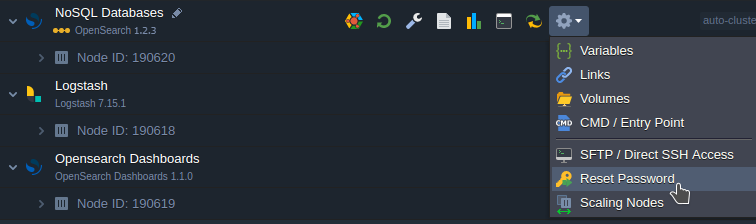
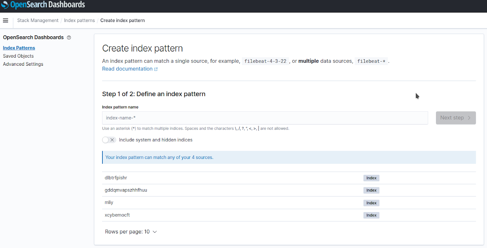
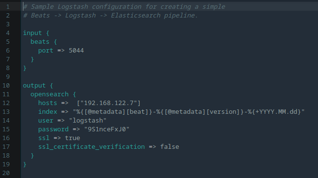
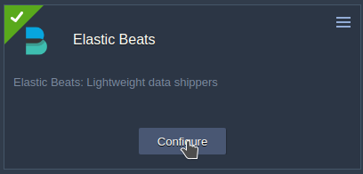
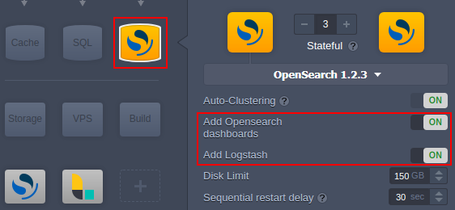
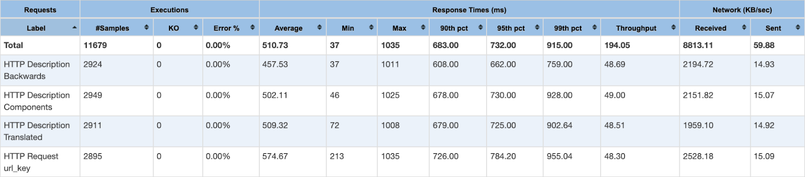
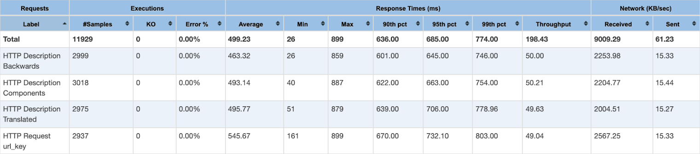

# OpenSearch Cluster

The **[OpenSearch Cluster](https://opensearch.org/)** is a community-driven, open-source search engine. It is most suitable for application search or log analytics cases, as it enables people to easily search, aggregate, view, and analyze data. OpenSearch provides a secure, high-quality search and analytics suite that can be easily modified and extended with additional functionality.

{}*OpenSearch is derived from Apache 2.0 licensed Elasticsearch 7.10.2, allowing the product to be freely used, modified, extended, monetized, and resold.*{}

This guide provides information on:

- [OpenSearch Cluster Components Overview](#opensearch-cluster-components-overview)
- [OpenSearch Cluster Installation](#opensearch-cluster-installation)
- [OpenSearch vs Elasticsearch Performance](#opensearch-vs-elasticsearch-performance)


## OpenSearch Cluster Components Overview

The platform provides OpenSearch Cluster using three certified stacks that are united into a single auto-clustering solution:

- **[OpenSearch](#opensearch)** - a community-driven, open-source search engine that provides a distributed, multitenant-capable full-text search
- **[OpenSearch Dashboards](#opensearch-dashboards)** (optional) - visualization for data stored inside the *OpenSearch* nodes (derived from *Kibana 7.10.2*) 
- **[Logstash](#logstash)** (optional) - data processing

{}**Tip:** Additionally, the **[Beats](#beats-add-on)** add-on can be installed for single-purpose data shippers that send data from the client nodes to *Logstash* or *OpenSearch*.{}

In such a solution, data is gathered on client nodes by **Beats** Data Shippers, sent to **Logstash** (which transforms it the needed way), and stored in **OpenSearch**. **OpenSearch Dashboard** is the supplementary visualization tool.

### OpenSearch

The **OpenSearch** stack is the core and the only mandatory component of the cluster. It is initialized in the *cluster mode* even when a single node is created, which makes horizontal scaling easier, faster, and safer.

After being created, the OpenSearch node is available on port *9200* for internal communication between nodes of the environment and port *4848* for external services through the shared load balancer. The HTTP basic auth is used in both cases (password can be reset using the **Reset Password** button).



The OpenSearch stack benefits from all the functionality available for other certified templates - dashboard file manager, Web SSH, dashboard log viewer, etc.

Also, platform's [redeploy](/container-redeploy/) functionality provides a simple update process. However, only redeployment to the same or newer version is allowed - a downgrade is restricted.

### OpenSearch Dashboards

The OpenSearch node is available via browser, but it only shows the JSON with API response (required for API calls). The main tool for visualizing the data is **OpenSearch Dashboards** (replacement on *Kibana*). All the interconnection configurations are done automatically - the solution is ready for usage out-of-the-box and does not need any manual configuration. Access is available by the same credentials as for the OpenSearch node.


After logging in, the OpenSearch Dashboards interface is displayed. The dashboard provides UI for convenient interaction with the OpenSearch API and editing your data (after creating the index pattern).



{}**Note:** The **OpenSearch Dashboards** is not a separate stack and cannot be created separately from OpenSearch. Also, it is limited to one node as scaling provides no additional benefits.{}

All the regular functionality of certified templates (dashboard file manager, Web SSH, firewall, logs) is also available for this node.

### Logstash

**Logstash** is a data processor component of the OpenSearch cluster that is automatically configured by the platform. Below, you can see an example of default auto-configuration for ***/etc/logstash/conf.d/logstash-sample.conf***:



The input for *[Beats](#beats-add-on)* is assigned on port *5044*, and the OpenSearch output is specified by setting the hosts, username, and password for interconnection. [Plugins](https://www.elastic.co/guide/en/logstash/current/working-with-plugins.html) for other types of inputs can be installed by the *logstash-plugin* tool, and configs can be added to the same file (with another port).

{}**Note:** The **Logstash** is not a separate stack and cannot be created separately from OpenSearch. You can add as many Logstash nodes as needed - scaling is in [stateful mode](/horizontal-scaling/#scaling-modes) to provide initial configs. However, each node can be reconfigured for different data transformations.{}

### Beats Add-On

**Beats** is a free and open platform for single-purpose data shippers. They send data from the client nodes to Logstash or OpenSearch.

You can install [Beats add-on](https://github.com/jelastic-jps/beats-jps-addon) on any node (except *alpine-based* ones) created inside the platform and specify the credentials to connect to the OpenSearch cluster or [custom Docker](/container-types/#custom-docker-containers) with the *ElasticSearch* instance. Two versions of the add-on are available:

- ***7.12.1*** - to ship data directly to OpenSearch (see [compatibility charts](https://opensearch.org/docs/latest/clients/agents-and-ingestion-tools/index/))

{}**Note:** For direct connection, you need to add the following line to the OpenSearch config and restart node:

```
compatibility.override_main_response_version: true
```
{}

- ***latest*** - to ship data to OpenSearch through [Logstash](#logstash)


During installation, you need to provide the following data:

- ***Installed Agents*** - choose the required Beats types:
  - **[Filebeat](https://www.elastic.co/beats/filebeat)** - forwards and centralizes logs and files. Pre-sets are already available for many certified nodes: *Apache* (all), *NGINX* (all), *HAProxy*, *Redis*, *Postgres*, *MySQL*, *MariaDB*, *Percona*, *MongoDB*. *[Tomcat/TomEE](https://arshpunia.medium.com/using-filebeat-to-ship-tomcat-logs-to-elasticsearch-7e4325373c7a)* requires special configurations.
  - **Metricbeat** - collects metrics from your systems and services.
  - **Journalbeat** - forwards and centralizes log data from *systemd journals*. Installed as an agent on your servers, Journalbeat monitors the journal locations that you specify, collects log events, and forwards them to *OpenSearch* or *Logstash*.
  - **Packetbeat** - monitors your network traffic to ensure a high level of performance and security. Packetbeat is a lightweight network packet analyzer.
  - **Heartbeat** - monitors services for their availability with active probing. It checks response time and if the given URLs are alive, then ships this information to other stacks for further analysis.
- ***Beats OSS Version*** - choose the desired version of the agent
- ***OpenSearch Host*** - enter the OpenSearch (or Elasticsearch) host
- ***Credentials*** - provide access information for the specified OpenSearch host (*User* and *Password*)
- ***OpenSearch Dashboards Host*** - enter the OpenSearch Dashboards host (may be needed for visualization purposes)
- ***Logstash Host*** - enter the Logstash host (if interconnection is done through the Logstash)

{}**Note:** Simultaneously sending data to OpenSearch and Logstash outputs is <u>*not supported*</u> - only one output can be used at once. If you want to pass the data through the *LogStash* - please specify only the LogStash host and port (the OpenSearch host and credentials data is not needed).{}

- ***Environment name*** - choose the target environment
- ***Nodes*** - choose the target layer

These settings can also be edited for the already installed add-on using the **Configure** button.




## OpenSearch Cluster Installation

The OpenSearch Cluster creation at the platform is a straightforward and fully automated process that can be performed directly from the [topology wizard](/setting-up-environment/).

Select the **OpenSearch** stack at the *NoSQL database* section.



The stack is automatically configured as a cluster due to the [auto-clustering](/auto-clustering/) feature. Also, you have additional options to add the **OpenSearch Dashboards** and **Logstash** components.


## OpenSearch vs Elasticsearch Performance

The OpenSearch project was forked from the last ElasticSearch release under the Apache 2.0 license and is almost the same in functionality. The API is completely the same.

Below, we are sharing the results of a performance test on two Magento environments with the same topology:

- *Magento with Elasticsearch*



- *Magento with OpenSearch*



As you can see, OpenSearch provides the same functionality and performance as Elasticsearch and can be used as its full-fledged replacement.


## What's next?

- [Database Hosting](/database-hosting/)
- [Auto-Clustering of Instances](/auto-clustering/)
- [MongoDB Auto-Clustering](/mongodb-auto-clustering/)
- [Horizontal Scaling](/horizontal-scaling/)