# Import and Export Dump Files to PostgreSQL

Create two database environments and connect to them using any desktop client (we use *pgAdmin4* as an example. Learn more in our [tutorial](/remote-access-postgres)).

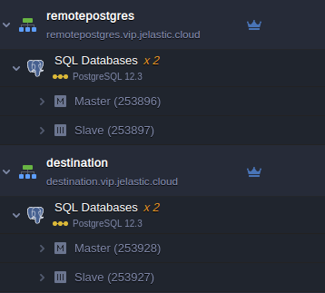
## Dump export from PostgreSQL

1. We put environments **remotepostgres.vip.jelastic.cloud** and **destination.vip.jelastic.cloud** to the respective server groups **backupsource** and **destination** at the *pgAdmin4* application.

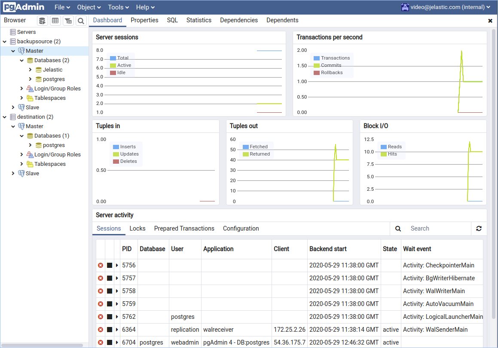

2. Make a right-click on the required database to be backed up e.g. **Jelastic** and choose **Backup**.

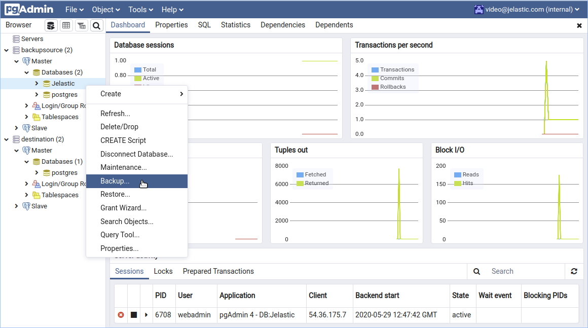

3. Specify your dump file name and the format of the output file. E.g. **mybackup** and **Tar** file format respectively.

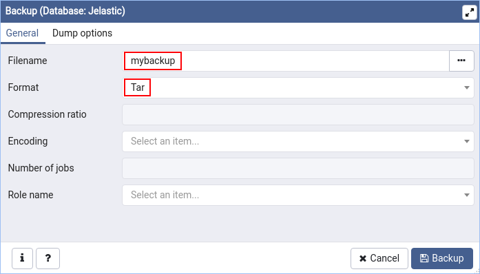

4. Click on the **Dump options** tab and select backup options for database objects.

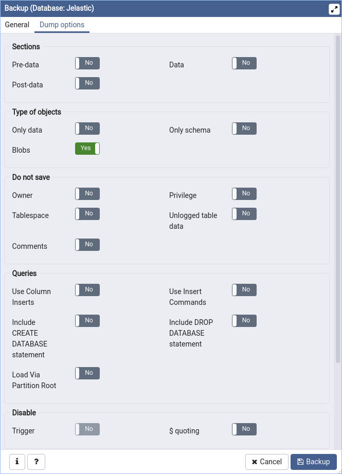

5. Finally, click the **Backup** button. The successful window should appear.

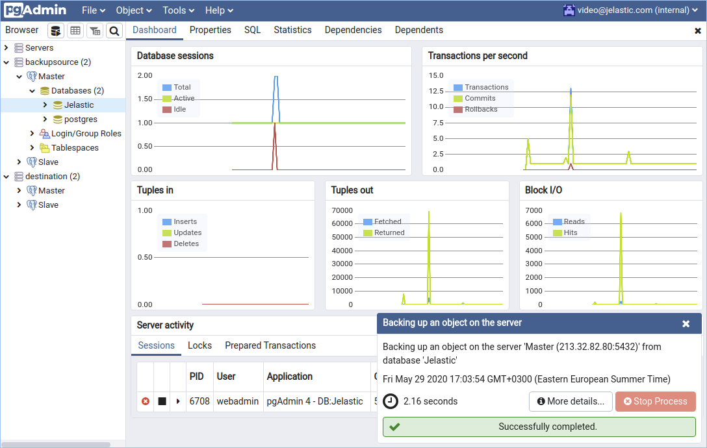
Your dump file will be stored in the user home directory or by the path to which you have specified at the host the *pgAdmin4* is running on.

## Dump import to PostgreSQL

1. Create an empty database at the destination server.

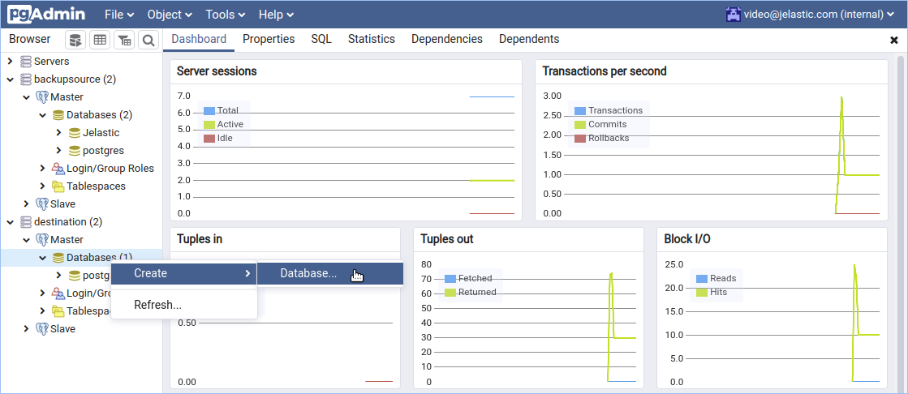

2. Set the name in the field **Database** either the same e.g. **Jelastic** or any arbitrary name.

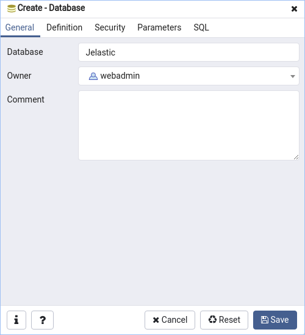

3. To perform dump import to PostgreSQL database make the right-click on the new database and choose **Restore**.

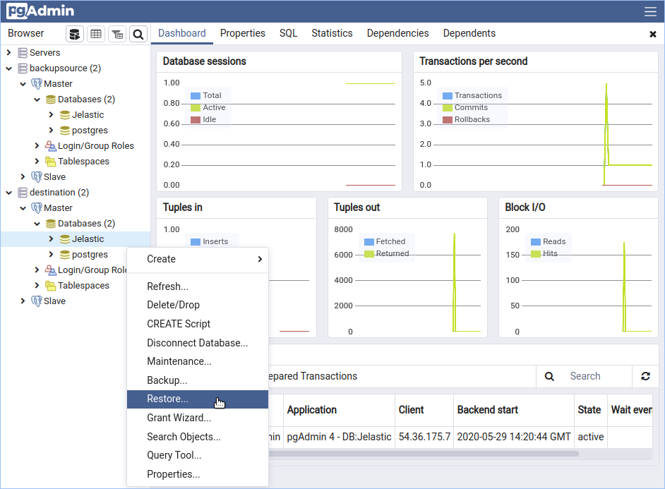

4. Select the file format used during the database backup operation. As for our example, we used **tar** format. Specify the name of the backup file or use file open dialogue at the right of the **Filename** field to choose the necessary file.

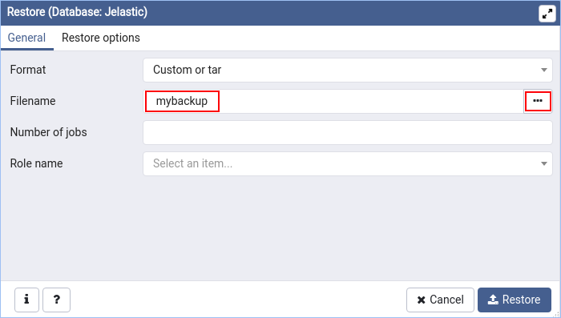

5. Set advanced restoring options if needed.

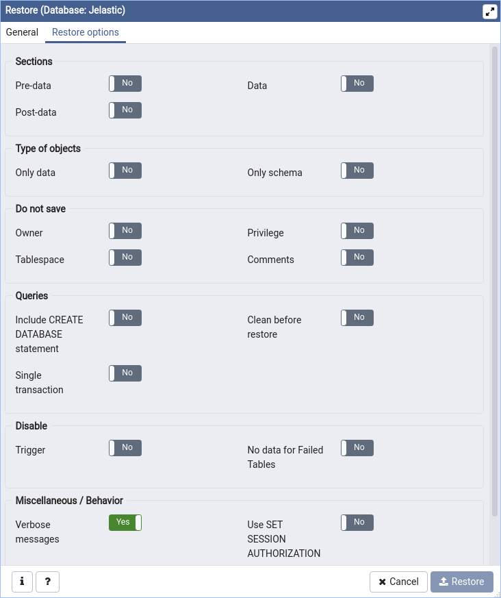

6. Finally, click on the **Restore** button.
7. Navigate back to the **Jelastic** database at the **destination** server group and make sure that the database was restored properly with its content at both servers **Master** and **Slave**.

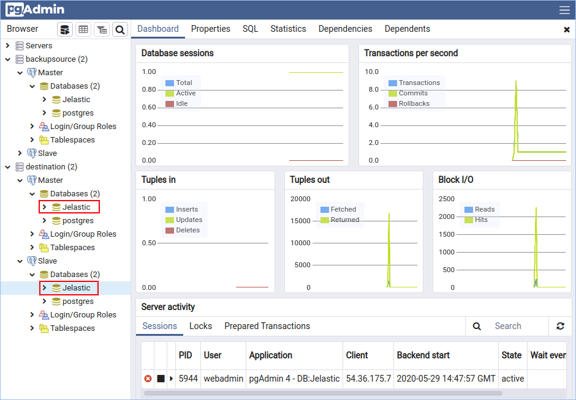

That's all! Hope this how-to was useful for you.

## What's next?

* [Remote Access to PostgreSQL](/remote-access-postgres)
* [Java Connection to PostgreSQL](/connection-to-postgresql)
* [PHP Connection to PostgreSQL](/connection-to-postgresql-for-php)
* [PostgreSQL Replication](/postgresql-database-replication)