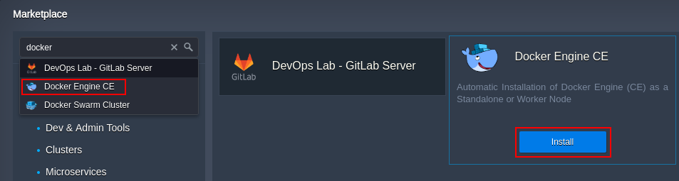
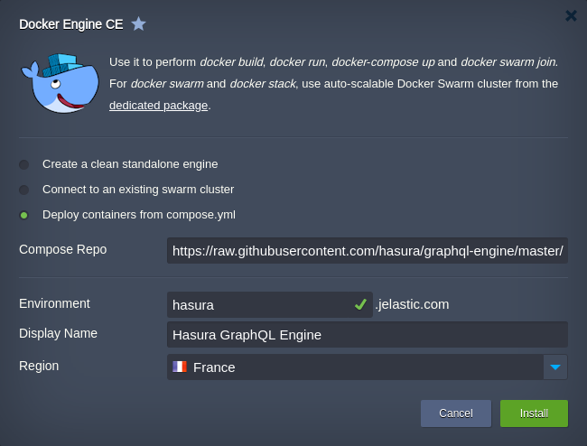
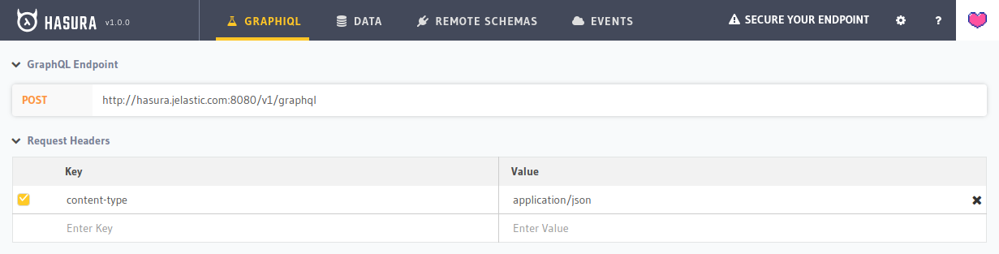
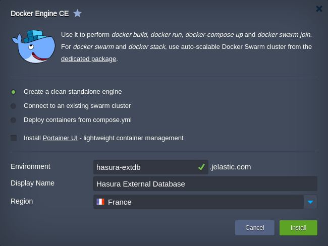
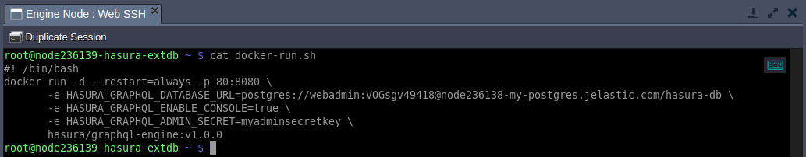
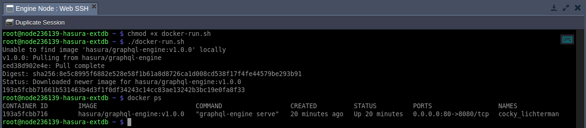
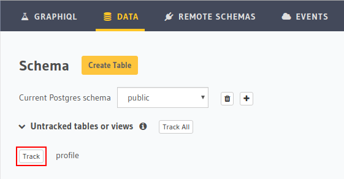
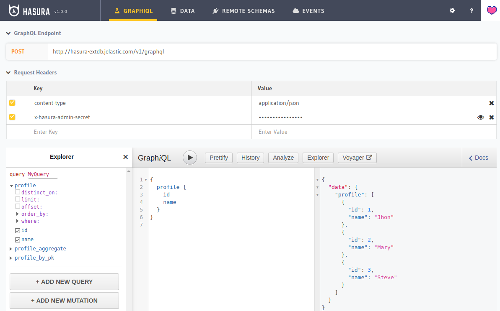

# How to Install Hasura GraphQL Engine

{}{}

**[Hasura](https://hasura.io/)** is an open-source engine based on the GraphQL query language for API. It allows you to create a connection, manage, and configure event triggers for the PostgreSQL database in minutes. Hasura helps you build GraphQL applications backed by PostgreSQL or incrementally move your existing projects.

In this tutorial, we'll overview two examples of the Hasura GraphQL engine installation at the platform:

* [Automatic Deployment with Local PostgreSQL Database](#automatic-deployment-with-local-postgresql-database)
* [Manual Deployment with External PostgreSQL Database](#manual-deployment-with-external-postgresql-database)


## Automatic Deployment with Local PostgreSQL Database

1\. Log in the dashboard and click **[Marketplace](/marketplace/)** at the top-left corner.


2\. Search for the ***Docker Engine CE*** package and initiate its installation.



3\. To automatically create Hasura and PostgreSQL database in the same container, choose the *Deploy containers from compose.yml* option, and provide the default config from the [Hasura on Docker](https://github.com/hasura/graphql-engine/tree/master/install-manifests/docker-compose) repository:

_[https://raw.githubusercontent.com/hasura/graphql-engine/master/install-manifests/docker-compose/docker-compose.yaml](https://raw.githubusercontent.com/hasura/graphql-engine/master/install-manifests/docker-compose/docker-compose.yaml)_



{}**Note:** The installation requires a [public IP](/public-ip/), which is a paid option available for billing users only.{}

Configure the remaining *Environment*, *[Display Name](/environment-aliases/)*, *[Region](/environment-regions/)* (if available) fields up to your needs, and click **Install**.

4\. After a successful installation, you can access the Hasura console to ensure that everything works properly.

*http://**{envDomain}**:8080/console*



That's it! Now, you can provide **Data** for your database via the same-named tab at the top and try out GraphQL queries afterward.


## Manual Deployment with External PostgreSQL Database

In case you already have a database, you can connect to it with the Hasura GraphQL engine.

1\. Create a clean standalone ***Docker Engine CE*** via [platform Marketplace](/marketplace/).



2\. After creation connect to the container via [Web SSH](/web-ssh-client/) and create a file with the following content (e.g. ***nano docker-run.sh***):

```bash
docker run -d --restart=always -p 80:8080 \
-e HASURA_GRAPHQL_DATABASE_URL=postgres://{username}:{password}@{host}/{dbname} \
-e HASURA_GRAPHQL_ENABLE_CONSOLE=true \
-e HASURA_GRAPHQL_ADMIN_SECRET=myadminsecretkey \
hasura/graphql-engine:v1.0.0
```



For the detailed information on the [docker run](https://docs.docker.com/engine/reference/run/) command, refer to the official documentation. In our case, the parameters are the following:

* ***-d*** - runs your services in the background
* ***--restart=always*** - to always start the daemon (e.g. after container restart)
* ***-p 80:8080*** - configures port redirect from the *80* port of the Docker Engine container to the *8080* one of the Hasura image running inside
* ***-e*** - sets environment variables (refer to the [full list](https://docs.hasura.io/1.0/graphql/manual/deployment/graphql-engine-flags/reference.html) for additional details)
    * *HASURA_GRAPHQL_DATABASE_URL* - connection link to your PostgreSQL database with special characters being URL encoded (if located at the platform, the required details can be viewed in the PostgreSQL after-creation email)
    * *HASURA_GRAPHQL_ENABLE_CONSOLE* - enables Hasura console
    * *HASURA_GRAPHQL_ADMIN_SECRET* - configures admin secret key to access console, *myadminsecretkey* in our case
* ***hasura/graphql-engine:v1.0.0*** - Docker image to be installed

3\. Make this file executable and run it to create Hasura Docker container.

```bash
chmod +x docker-run.sh
./docker-run.sh
```



You can additionally run the ***docker ps*** command to ensure that the Hasura service is up and running.

4\. In our case, the application console is on the port *80* so that you can click **Open in Browser** next to your environment for an automatic redirect. Otherwise, the required port should be added to the environment URL.


According to our settings, admin secret key should be provided to access console (*myadminsecretkey* in our case).

5\. Now, you can start working with your database via GraphQL API. For example, from the ***GraphiQL*** tab.

{}**Note:** If there are existing tables that should be tracked by Hasura, go to the **Data** tab and allow access to the required ones.


{}



Alternatively, you can use *GraphQL Endpoint* (specified at the top of the page) to create your POST request to the database via any preferred tool or script.


## What's next?

* [Marketplace](/marketplace)
* [Docker Engine CE](https://www.virtuozzo.com/company/blog/docker-engine-automatic-install-swarm-connect/)
* [Building Docker Image](/building-docker)