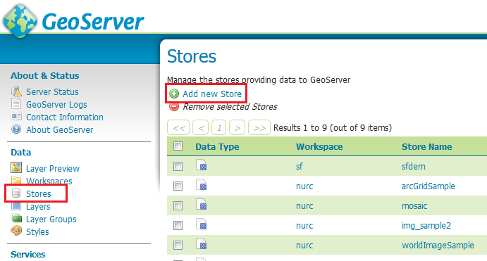

# PostGIS Extension to PostgreSQL Database for Hosting GeoServer

**PostGIS** is an spatial extension for the PostgreSQL object-relational database, which adds support for geographic objects allowing location queries to be run in SQL. With PostGIS extension PostgreSQL can be used as a backend spatial database for GIS.

**GeoServer**, in its turn, is an open source Java software server, used for generating, sharing and managing geospatial data. Using open standards GeoServer publishes data from any major spatial data source.

So, let's investigate how to extend PostgreSQL database with PostGIS and deploy the GeoServer to environment to work with shared geospatial data.


## Create Environment

First of all you need to create an environment as a basis for your application.

1\. Log into your PaaS account an click on the **Create environment** button.


2\. Select **Tomcat 7** as your application server and **PostgreSQL 9** as a database you want to use. Set up the resource limits for each node and enter your environment name (e.g. *geoserver*). Confirm the environment creation.


3\. In a few minutes your environment will appear on the dashboard.


## GeoSever Deployment

Now we can proceed to GeoServer software deploy.

1\. Open the **[GeoServer official web-site](http://geoserver.org/)** and download the latest stable release as a web archive.


2\. When downloading is completed, extract the archive you've got.


3\. Navigate back to the platform dashboard and upload the ***geoserver.war*** file, located in the folder with extracted archive content.


4\. Finally, press **Deploy to..** button next to this **.war** file in the packages list and choose created before environment in order to deploy GeoServer app to it.


## PostGIS Configurations

At this step we are going to add PostGIS extension for our PostgreSQL database.

1\. Open **phpPgAdmin** for the PostgreSQL database in your environment by pressing **Open in browser** button next to it.


2\. Log in with PostgreSQL credentials you've received via email after the environment creation.


3\. Now you need to create a new database. For that press **Create database** button in the opened window.


4\. Fill in the form:
    
* state the name for a new database (in our case, *nyc*)
* choose *UTF8* encoding in the drop-down list
* fill in the other fields if it is required

Click **Create** button.


5\. Choose newly created database in the expandable list on the left-hand panel and navigate to the SQL tab.


6\. Enter the following SQL queries and execute them:

```
CREATE EXTENSION postgis;
CREATE EXTENSION postgis_topology;
CREATE EXTENSION fuzzystrmatch;
CREATE EXTENSION postgis_tiger_geocoder;
```

where the attributes are:
    
* *postgis*: for PostGIS enabling (includes raster)
* *postgis_topology*: for Topology enabling
* *fuzzystrmatch*: fuzzy matching is needed for Tiger
* *postgis_tiger_geocoder*: for US Tiger Geocoder enabling

{}
**Note**: Don't forget to tick off the *Paginate results* line under the form in order not to get any errors.{}


That's all. PostGIS extension is enabled and can be used.


## Dataset Import

Now let's import PostGIS dump of a dataset to our PostreSQL database. As an example, we are going to use [nyc_buildings.zip](http://docs.geoserver.org/stable/en/user/_downloads/nyc_buildings.zip) with dataset of buildings from New York City.

1\. Download [nyc_buildings.zip](http://docs.geoserver.org/stable/en/user/_downloads/nyc_buildings.zip) package and extract it. You'll get the ***nyc_buildings.sql*** file.

2\. Enter **phpPgAdmin** for PostgreSQL with your credentials and navigate again to the SQL tab for your database with PostGIS extension (in our case, ***nyc*** database).


3\. Browse the extracted dataset (e.g. *nyc_buildings.sql*) on your local computer and upload as an SQL script.


4\. Tick off the *Paginate results* line under the form and **Execute** the script.


## Connect GeoServer with Database

Now we need to connect our GeoServer application with the PostgreSQL database. For this we'll create a ***data store*** for our **nyc** database.

1\. Navigate to the platform dashboard and open the GeoServer environment (press **Open in browser** next to it).


2\. In the opened browser tab log in with the default GeoServer credentials (*admin/geoserver*).


3\. Then navigate to the **Data > Stores** menu item in the left-hand panel and click **Add new Store** line.



4\. In the **New data source** window press ***PostGIS - PostGIS Database*** option.


5\. In the appeared **New Vector Data Source** window fill in the following fields:

* **Basic Store Info**  
Select the **cite** *Workspace* from the dropdown list.  
Enter the **Data Source Name** (for example, *nyc_buildings*) and a brief **Description**.  


* PostGIS database **Connection Parameters**    
***host*** - database host can be taken from the *Info* button  


***database*** - name of the database you've created with PostGIS extension (in our case, **nyc**)  
***user*** and ***passwd*** - credentials to the PostgreSQL you've received while creating the environment

Other fields are filled by default, you can leave the initial values.


Also scroll a little bit lower and check if the **Validate connections** line is ticked. Then press **Save**.


The connection is established and as a result you can see the uploaded to PostreSQL *nyc_buildings* in the list of application resources.


## Publish and Preview Dataset

At last we need to make just a few configurations to publish the dataset (e.g. *nyc_buildings*) and to make the required geographical object ready to use.

1\. **New Vector Data Source** (saved in the previous step) will appear in the list of **New Layers**.  
Press **Publish** next to the added layer (e.g. *nyc_buildings*).


2\. In the opened **Edit Layer** window enter a **Title** and an **Abstract** for your resource.


3\. Scroll a little bit lower and press ***Compute from data*** and ***Compute from native bounds*** buttons in the **Bounding Boxes** configuration block.


4\. Then switch to the **Publishing** tab and ensure the **polygon** layer style is selected as default.


5\. Finally, scroll down to the bottom of the page and press **Save** button. The layer is published.

6\. Now you can navigate to the **Data > Layer Preview** menu item.
Here you'll see a list of all layers configured in GeoServer with previews provided in various formats for each.


7\. Press **OpenLayers** button next to your layer (*NYC buildings*, in our case).


{}**Note**: you can select any other preview mode or download your resource in different formats using the options in the drop-down list next to the required layer.{}

8\. As a result you will see the required geographical object. In our case this is an interactive map of New York City buildings.


You can use the Preview Map to zoom and pan around the dataset, as well as display the attributes of features. Enjoy!


## What's next?

* [Java Connection to PostgreSQL](/connection-to-postgresql/)
* [Remote Access to PostgreSQL](/remote-access-postgres/)