# SSL/TLS Encryption in Transit for PostgreSQL

The platform provides a built-in add-on that implements “**encryption in transit**” functionality for PostgreSQL solutions. The add-on creates SSL/TLS encrypted connection to protect data while it moves between client and database servers. The protection includes data encryption before transmission, endpoints authentication, content decryption, and verification upon arrival.


## Add-On Installation

The add-on can only be installed on top of the **PostgreSQL** and **Pgpool-II** (for database clusters) nodes.

1\. Locate the appropriate PostgreSQL database layer in your dashboard, go to the **Add-Ons** section, and click **Install** for the *SSL/TLS Encryption* add-on.

{}**Tip:** The solution is also available from the [Marketplace](/marketplace/) or can be imported from the [repository](https://github.com/jelastic-jps/postgres-ssl-addon/tree/main) on GitHub.{}

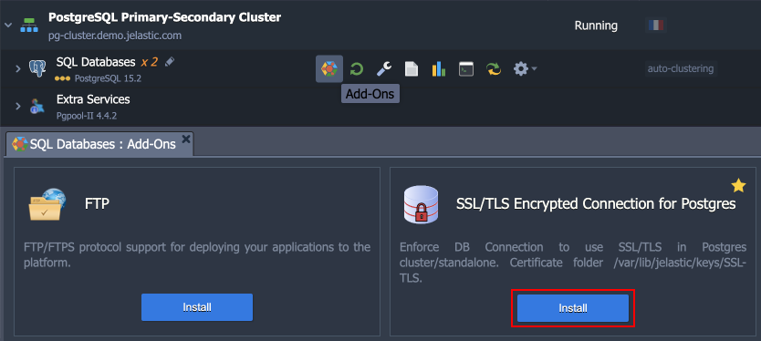

2\. Within the opened installation window, select the target **Environment** and **Node Group(s)** where the add-on will be installed.

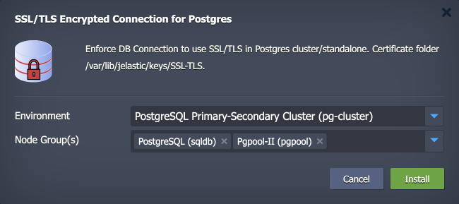

{}**Note:** Both layers should be selected if installed for the **PostgreSQL cluster with Pgpool-II** load balancing nodes.{}

Click **Install** to continue.

3\. In a minute, your database will be reconfigured to work over an encrypted connection.

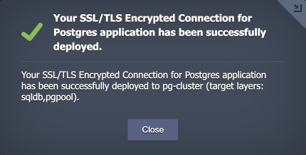


## Add-On Specifics

Below you can learn about certificates generation processes and specifics:

- Certificates are generated with the ***/usr/local/sbin/selfcertgen*** utility.
- Certificates are self-signed and issued for the hostname of the particular node. It means that each node has a set of own certificates, and you must use the ones corresponding to the accessed node for authentication.
- Certificates are stored within the **/var/lib/jelastic/keys/SSL-TLS** folder (accessible via the ***keys*** shortcut in the file manager). Two subfolders are present:
  - ***server*** – server certificates are used to provide the TLS encryption of connection to the PostgreSQL database
  - ***client*** – downloadable client certificates can be used to authenticate client connection to the database server (functionality is not available for the *Pgpool-II* nodes)

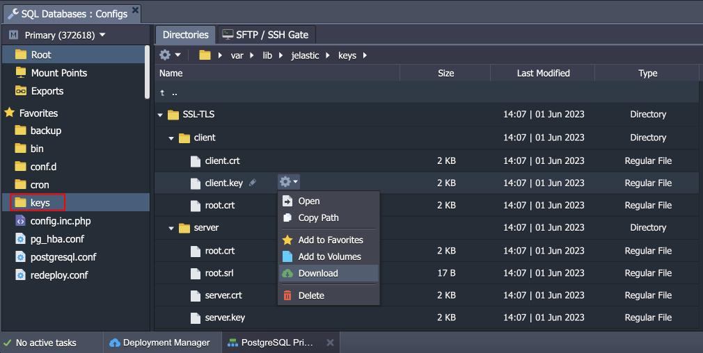

**PostgreSQL configurations:**
- The *md5* auth is changed to ***scram-sha-256*** to provide a better security level (considered the best practice by the PostgreSQL developers) and to support SSL in cluster topologies with the *Pgpool-II* load balancing nodes.
- If the *md5* was used as the default auth protocol before the SSL add-on installation - the setting is changed globally for the PostgreSQL daemon.
- The following changes are made to the ***/var/lib/pgsql/data/postgresql.conf*** configuration file:

```
ssl_cert_file = '/var/lib/jelastic/keys/SSL-TLS/server/server.crt'
ssl_ca_file = '/var/lib/jelastic/keys/SSL-TLS/server/root.crt'
ssl_key_file = '/var/lib/jelastic/keys/SSL-TLS/server/server.key'
ssl = on
```

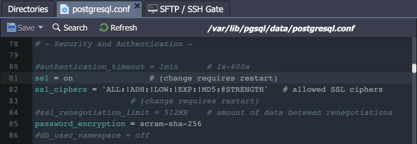

- Due to algorithm change, the existing database users’ passwords must be reset. It is done automatically for the default '***webadmin***' user (to the same password as before) but <u>*must be done manually for existing custom users*</u>.
- The '***hostssl***' rule is used instead of '*host*' in the ***/var/lib/pgsql/data/pg_hba.conf*** file to ensure the SSL auth for users.

```
hostssl all all 0.0.0.0/0 scram-sha-256
```

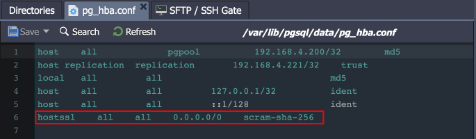

- If you want to enable user authentication via client certificates, you need to manually add “*cert*” as [auth method](https://www.postgresql.org/docs/current/auth-methods.html).

**Pgpool-II configurations:**
- The SSL option is enabled in the Pgpool-II configs (***/etc/pgpool-II/pgpool.conf***) automatically during the add-on installation.

```
ssl = on
enable_pool_hba = on
ssl_key = '/var/lib/jelastic/keys/SSL-TLS/server/server.key'
ssl_cert = '/var/lib/jelastic/keys/SSL-TLS/server/server.crt'
pool_passwd = 'pool_passwd'
```

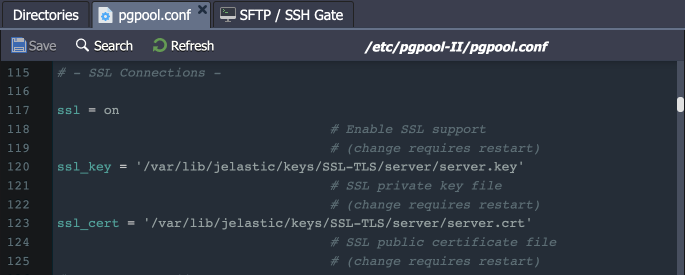

- The '***hostssl***' rule is used instead of '*host*' in the ***/etc/pgpool-II/pool_hba.conf*** file to ensure the SSL auth for users.

```
hostssl all all 0.0.0.0/0 scram-sha-256
```

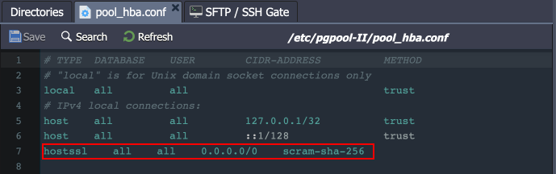

- The appropriate records <u>*must be added for custom users*</u> to the ***/etc/pgpool-II/pool_passwd*** file. Two records for the default ‘***webadmin***’ and ‘***pgpool***’ users are added automatically. For all the other users, please use the **pg_enc** utility:

```
pg_enc -m -f /etc/pgpool-II/pgpool.conf -u $USERNAME $PASSWORD
```

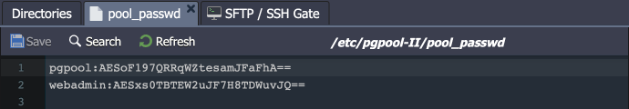


## Add-On Configuration

After the installation, the add-on can be found under the **Add-Ons** tab for the appropriate layer(s).

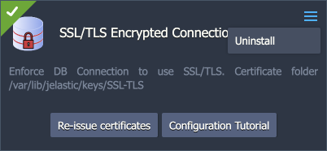

The available configuration options are straightforward:

- **Re-issue certificates** – generates SSL certificates for secure connection anew (e.g. if compromised or accidentally removed)
- **Configuration Tutorial** – opens the manual guide on *[Establishing SSL Connection to PostgreSQL](/ssl-for-pgsql/)*
- **Uninstall** (in the add-on's menu in the top-right corner) - removes the add-on, custom configs, and generated SSL certificates from the layer


## Secure Connection to PostgreSQL

1\. The “**encryption in transit**” (*server-side encryption*) functionality works immediately after the installation. You can check it by providing the client with the access credentials and establishing the connection. We’ll use the ***[psql](https://www.postgresql.org/docs/current/app-psql.html)*** utility for this example.

{}**Tip:** You can use an [endpoint](/endpoints/) or [public IP](/public-ip/) as your database entry point for external connection. Let’s check the endpoint example (to the *Pgpool-II* node for the cluster):

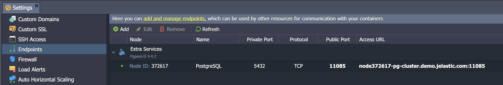
{}

Connect from the client with the following command (you can get the default access credentials from the email received after the database installation):

```
psql -U {userName} {dbName} -h {host} -p {port} -W
```

Here:

- ***{userName}*** - database username for the connection
- ***{dbName}*** - database name to connect to
- ***{host}*** - database entry point (endpoint, in our case)
- ***{port}*** - port for the connection (from the endpoint, in our case)

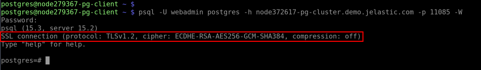

2\. Also, you can use the client certificates for authentication (***server- and client-side encryption***). In this case, SSL certificate files should be provided to the client. You can download them from the **/var/lib/jelastic/keys/SSL-TLS/client** directory of the required PostgreSQL node.

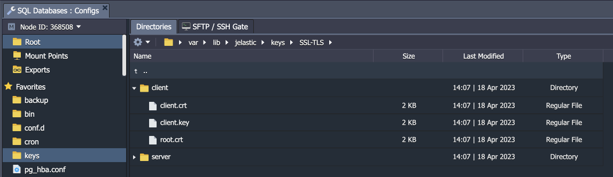

The client needs to upload the certificate files (*client.crt*, *client.key*, *root.crt*) to their computer/container/VM. After that, the connection to the required PostgreSQL node can be established as follows:

```
psql "sslmode=verify-ca sslrootcert={path/to/root.crt} sslcert={path/to/client.crt} sslkey={path/to/client.key} host={host} port={port} user={userName} dbname={dbName}"
```

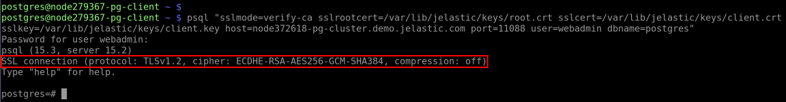

{}**Tip:** Alternatively, you can check authentication with client certificates as described in the **[SSL Connection to PostgreSQL](/ssl-for-pgsql/#establish-connection-via-pgadmin)** guide.{}


## What's next?

- [DB Hosting Overview](/database-hosting/)
- [SSL Connection to PostgreSQL](/ssl-for-pgsql/)
- [PostgreSQL Auto-Clustering](/postgresql-auto-clustering/)
- [Remote Access to PostgreSQL](/remote-access-postgres/)