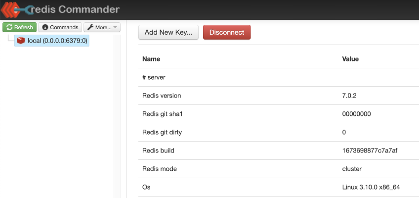

# Redis Cluster

**Redis Cluster** is a distributed implementation of Redis open-source, in-memory data structure store. It is often used for data storage, cache, message broker, and other tasks. The package for Redis Cluster provides a topology of at least three servers. Each such Primary node is complemented with a Secondary one to ensure reads load distribution and auto-recovery if the Primary goes down. Such a structure offers high performance and high availability.


The cluster can be scaled either automatically or manually. Each scaling operation is performed by pair of nodes - one Primary and one Secondary.

{}**Tip:** If you want to learn more about the [Redis Cluster specifics](https://redis.io/docs/reference/cluster-spec/), refer to the official documentation.{}


## Redis Cluster Installation

Automatic installation and configuration is available with the **[Redis Auto-Clustering](/auto-clustering/#redis)** option in the topology wizard.


Alternatively, you can import the ***Redis Cluster*** [package manifest](https://github.com/jelastic-jps/redis-cluster/blob/main/manifest.jps) or find it in the dashboard’s [Marketplace](/marketplace/). Either way, you’ll see the installation frame, where you can provide the following data:

- **Nodes count** - sets the total number of Redis nodes in the cluster. The scaling is performed via the *Primary-Secondary* pairs. The minimal number is **6** (3 Primary and 3 Secondary nodes) and the maximum is **12** (6 Primary and 6 Secondary)
- **Enable Horizontal Auto-Scaling** - complements cluster with [scaling triggers](/automatic-horizontal-scaling/#triggers-for-automatic-scaling) to perform automatic horizontal scaling. Automatic resharding and rebalancing will be done after adding and before removing the Primary node

{}**Tip:** The scaling will be performed according to the following conditions by default:

- add 2 nodes when CPU or Memory load is over 70% of the cluster total capacity for over 5 minutes (up to 12 total nodes)
- remove 2 nodes when CPU or Memory load is below 40% of the cluster total capacity for over 15 minutes (no less than 6 nodes)


{}

- **Enable External IP Addresses for cluster nodes** - assigns [public IP](/public-ip/) to each node and reconfigures cluster to work via public IP only
- **Environment** - provides environment name
- **Display Name** - sets the preferred environment [alias](/environment-aliases/)
- **Region** - selects the [environment region](/environment-regions/) from the list of available ones

Click **Install** when ready.


Once the deployment is finished, you’ll see an appropriate success pop-up with the Redis Cluster admin panel credentials. The same information will be sent to your email as well.


The cluster is ready to use. Try connecting to the admin panel to view the cluster details and perform the required configurations and customizations.



You can also connect via SSH (e.g. [Web SSH](/web-ssh-client/)) to make the necessary adjustments. For example, using the [*redis-cli* tool](https://redis.io/docs/tools/#cli) and password from the email, you can connect to the cluster and verify it is working correctly:

```
redis-cli
auth {passw0rd}
cluster nodes
```


This information can be received on any cluster node (both Primary and Secondary). In this output, you can see the number of nodes in the cluster, their IDs, addresses, roles, and shards (hash slots) allocated to each one.


## What's next?

- [Redis Overview](/redis/)
- [Create DB Server](/database-hosting/)
- [Automatic Horizontal Scaling](/automatic-horizontal-scaling/)
- [SSH Access](/ssh-access/)