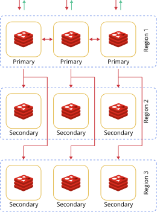
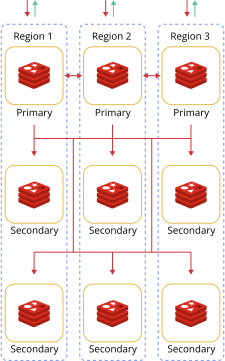
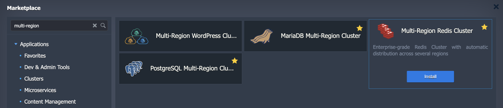
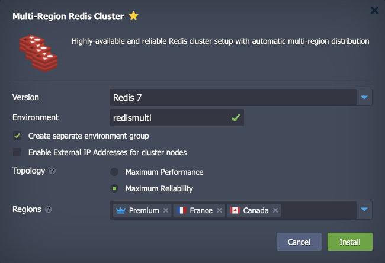
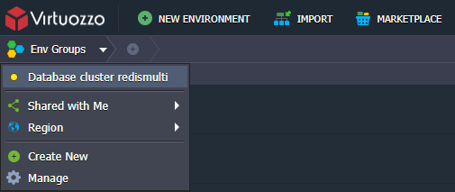
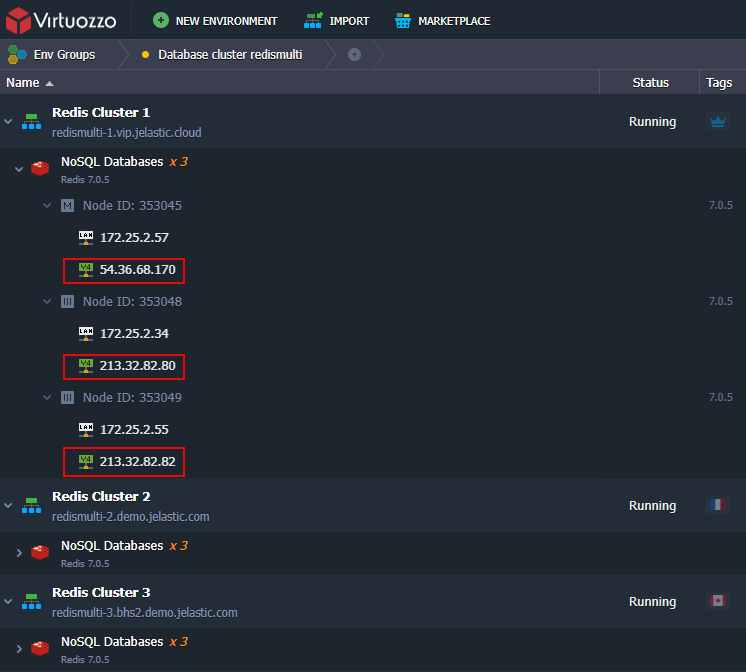

# Redis Multi-Region Cluster

**Redis Multi-Region Cluster** is a pre-packaged distributed implementation of Redis where data is sharded between cluster nodes in different regions. The solution has the following goals:

- *High performance and linear scalability.* There are no proxies (asynchronous replication is used), and no merge operations are performed on values.
- *Acceptable degree of writing safety.* The system tries (in a best-effort way) to retain all the writes originating from clients connected with most of the primary nodes. Usually, there are small windows where acknowledged writes can be lost. Windows to lose acknowledged writes are larger when clients are in a minority partition.
- *Availability.* Redis Cluster is able to survive partitions where the majority of the primary nodes are reachable, and there is at least one reachable replica for every primary node that is no longer reachable. Moreover, using replicas migration, primaries no longer replicated by any replica will receive one from a primary that is covered by multiple replicas.

## Database Cluster Topology

The [Redis Multi-Region Cluster](https://github.com/jelastic-jps/redis-multiregion) consists of node groups deployed into different regions (at least three). Depending on the required level of performance and high availability, you can choose between two topology options:

- **Maximum Performance** – provides maximum performance and horizontal scalability

- **Maximum Reliability** – ensures exceptionally high availability even if one or two data centers fail, but the solution is not scalable

Both topologies provide out-of-box high availability and failover capabilities for your database cluster. In case of a cluster node failure, both topologies ensure that the database cluster works without downtime. However, the ***performance*** topology can keep working upon one or two *nodes* failure, while the ***reliability*** one can recover even after one or two *regions’* unavailability.

## Cluster Installation

1\. Find the ***Multi-Region Redis Cluster*** application (the **Clusters** section or use the **Search** field) in the platform [Marketplace](/marketplace/).

2\. In the opened installation window, specify the following data:

- **Version** - select the preferred Redis version
- **Environment** - provide a name for [grouping](/environment-groups/) your database cluster environments
- **Create separate environment group** – tick to [isolate](/environment-isolation/#private-network-isolation) the environment group
- **Enable External IP Addresses for cluster nodes** – tick to add [public IP](/public-ip/) to the cluster nodes (three IPs per region), which is required if the Redis client is located outside the platform
- **Topology** – choose either ***Maximum Performance*** or ***Maximum Reliability*** topology (details can be found in the [Cluster Topology](#database-cluster-topology) section above)
- **Regions** - select platform regions where the cluster environments will be deployed. For the ***Maximum Reliability*** topology, the first region will host primary servers and other - secondary databases (replicas)

Click **Install** when ready.

3\. The installation process can take several minutes. After the completion, you’ll see the success window and receive emails with all the appropriate data, like entry point details and access credentials.

To easily view all the related environments, you can switch to the group specified in the previous step (*redismulti* in our case).

4\. The default entry points for your multi-region cluster are IPs assigned to cluster nodes (the primary ones are preferred). Also, it is strongly recommended that your client software supports cluster mode.

If the **Enable External IP Addresses for cluster nodes** option was enabled, please use the public IPs assigned to the cluster nodes.

## What's next?

- [Create DB Server](/database-hosting/)
- [Redis Overview](/redis/)
- [Redis Cluster](/redis-cluster/)