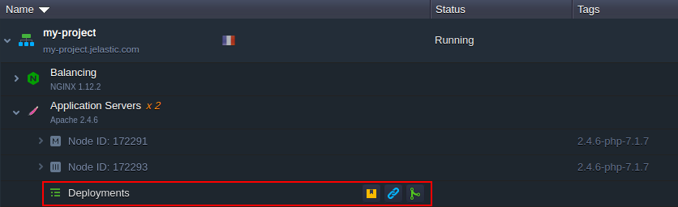

# Deployment Guide

The platform supports various ways of the applications automatic deployment, allowing to choose the most suitable option, which will suit your specific needs:

* ***Dashboard*** - corresponds to [deployment via archive](#archive-deployment-configurations) (provided either as *local file* or *URL*)
* ***VCS*** - allows to [deploy from your VCS](#git--svn-deployment-configurations) repository (e.g. *Git*, *SVN*, *Bitbucket*)
* ***Hub Registry*** - creates a custom container with your application based on the Docker image stored at your *[public](/docker-container-deploy/)* or *[private](/docker-container-deploy/)* registry

For more information on the last two options, use the appropriate links, while in this guide we'll describe deployment via archive and VCS repository. They can be called either from **[Deployment Manager](/deployment-manager/)** or by hovering over the ***Deployments*** record, which is provided for all application servers, and clicking one of the appropriate buttons.

The first two icons (*Local file* and *URL*) corresponds to deployment via archive and the last one (*Git / SVN*) - to deployment from the VCS repository. Choose the appropriate option and click it to proceed with your deployment configuration.

{}**Notes:**

* the VCS deployment type for Java application servers is performed with a help of the [Maven build node](/java-vcs-deployment/), refer to the linked guide for additional details
* [.NET deployment process](/deploy-dotnet-archive-url/) for the Windows-based IIS application server is different from the standardized flow described in this guide
{}

## Archive Deployment Configurations

The process is extremely simple and can be started in just a few seconds by setting two main parameters (i.e. providing required *archive* and specifying a target *environment*). Herewith, deployment can be tuned up to your specific needs by adjusting the additional configs.

Below, we've provided a detailed description for all the possible options within the deployment frame:

* **Local file** (or **URL**) - points to the archive file to be deployed (is automatically selected, when installing from Deployment Manager)
* **Environment** - selects a target environment with the application server (is automatically selected, when installing from application server)
* **Path** - sets the desired custom context; herewith, the available options may be limited due to the used programming language specifics (e.g. *Python* and *Node.js* have a single predefined deployment path only)
* **Hooks** - applies the provided [scripts](/deployment-hooks/) either before or after deployment process
* **Deploy Strategy** (for deployments into [scaled server](/horizontal-scaling/)) - allows to choose between relatively quicker *Simultaneous deployment* variant, which causes a brief downtime, and the *Sequential deployment with delay* option to perform deployment on servers one-by-one with a set delay between operations, which ensures application uptime
* **Enable zero-downtime deployment** (for PHP servers only) - adjusts (if option is ticked) the deployment flow to [avoid application downtime](/php-zero-downtime-deploy/)

Click **Deploy** to initiate the process itself.

## Git / SVN Deployment Configurations

The process is extremely simple and can be started in just a few seconds by setting two main parameters (i.e. selecting the required *repository* from Deployment Manager and specifying a target *environment*). Herewith, deployment can be tuned up to your specific needs by adjusting the additional configs.

Below, we've provided a detailed description for all the possible options within the deployment frame:

* **Repository** - allows to select the Git / SVN project from Deployment Manager (or jump to its addition form)
* **Branch** - defines the used repository branch (*master* by default)
* **Environment** - selects a target environment with the application server (is automatically selected, when installing from application server)
* **Path** - sets the desired custom context; herewith, the available options may be limited due to the used programming language specifics (e.g. *Python* and *Node.js* have a single predefined deployment path only)
* **Build** (for Java application deployments) - allows to choose the existing [Maven build node](/java-vcs-deployment/) (or add one into the target environment) and, if required, to select repository *Working Directory*
* **Hooks** - applies the provided [scripts](/deployment-hooks/) either before or after deployment process
* **Deploy Strategy** (for deployments into [scaled server](/horizontal-scaling/)) - allows to choose between relatively quicker *Simultaneous deployment* variant, which causes a brief downtime, and the *Sequential deployment with delay* option to perform deployment on servers one-by-one with a set delay between operations, which ensures application uptime
* **Check and auto-deploy updates** - enables periodical check ups for code changes in your repository (with configurable frequency); if any, project [automatic deployment](/git-svn-auto-deploy/) is initiated
* **Auto-resolve conflicts** - prevents the occurrence of merge conflicts by updating the contradictory files to the repository version (i.e. locally made changes are discarded)
* **Enable zero-downtime deployment** (for PHP servers only) - adjusts the deployment flow to [avoid application downtime](/php-zero-downtime-deploy/)

Click **Deploy** to initiate the process.

In a few minutes your application will be successfully deployed. Now, you can access it with the **Open in Browser** button, analyzed via [Logs](/view-log-files/) or managed with [file manager](/configuration-file-manager/) / via [SSH access](/ssh-access/).

### Editing Git / SVN Projects

If needed, you can adjust the already deployed VCS project by clicking the **Edit** button for the appropriate deployment.

Within the opened frame, you can edit the same parameters described above for the deployment frame. For example, it is possible to switch a branch, add hooks, enable updates auto-deploy, etc.

{}**Note:** If access credentials to the project's repository were changed, you need to provide new ones at the platform to continue working with this project. First, edit authentication for the repository at the **[Deployment Manager](/deployment-manager/)**.

Then, you need to **Edit** all the already existing projects from this repository. The platform will automatically ask if you wish to update the credentials.

Click **Yes** to apply new credentials for the project.{}

## What's next?

* [Deployment Manager](/deployment-manager/)
* [Java VCS Deployment](/java-vcs-deployment/)
* [ZDT Deployment for PHP](/php-zero-downtime-deploy/)
* [Deploy .NET Project](/deploy-dotnet-archive-url/)
* [Deployment Hooks](/deployment-hooks/)