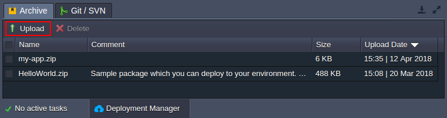
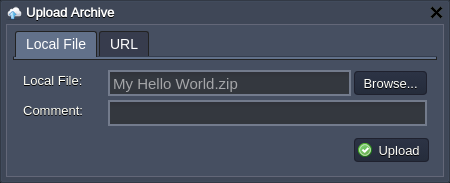
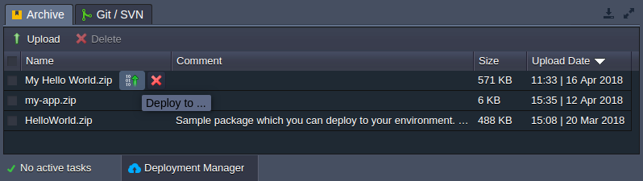
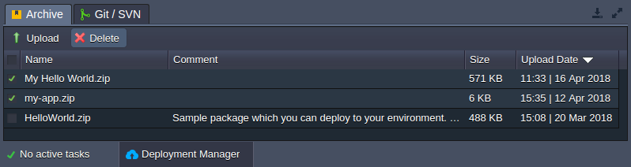
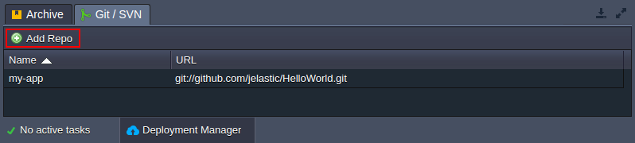
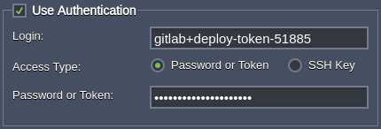
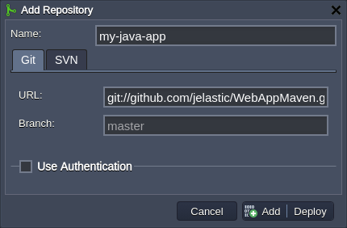
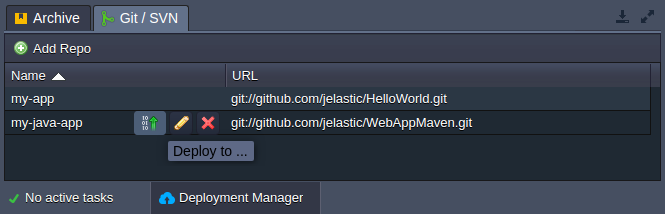

# Deployment Manager
The **Deployment Manager** is located at the bottom of the dashboard and is used to store applications to simplify their subsequent deployment into your environments. There are two subsections to provide support for the following deployment types:

* ***[Archive](#archive)*** - stores the application packages, which can be uploaded from your local machine or any external link
* ***<a href="#vcs" id="archive">Git / SVN</a>*** - saves the link to your project within the remote Git / SVN repository and the appropriate access credentials (if needed)

## Application Archives

1\. The ***Archive*** tab within the Deployment Manager section allows to view all application archives stored at your account. The list provides the following information:

* **Name** - name of the uploaded archive
* **Comment** - custom note for your application
* **Size** - size of the application archive
* **Upload Date** - date of the archive addition to the Deployment Manager

2\. Click **Upload** and within the appeared dialog box provide the appropriate file either from your local machine (the *Local File* tab) or anywhere over the Internet (*URL*):

{}**Note:** The maximum archive size for the local file upload is *150 MB*. If your application size exceeds this limit, please use the URL option.{}
Fill in the **Comment** field (if required) and **Upload**.

3\. In order to deploy an application from the archive, hover over the required file and click the appeared **Deploy to** button.

Within the opened frame you can [configure deployment](/deployment-guide#archive) up to your needs.

4\. The no longer required archives can be removed by selecting them with the appropriate checkboxes before the name and clicking the **Delete** button at the top panel.

Now, you know how the archive tab of the Deployment Manager works and can use it to organize your deployment packages.

## Git / SVN Projects

1\. The ***Git / SVN*** section of the Deployment Manager stores the link to the remote repository with your projects and, if required, the appropriate authentication credentials.

2\. In order to add a new project, click the **Add Repo** button and fill in the fields of the appeared ***Add Repository*** window:

* **Name** - name of your application (no spaces and special symbols are allowed)
* choose the ***Git*** repo type
    * *URL* - the appropriate URL to the repository
    * *Branch* - the required branch of the project (*master* by default)
    * optionally, tick the *Use Authentication* check box and provide either *Password or Token* or *[SSH Key](/git-ssh)* based credentials
{}**Note:** If your repository is protected with two-factor authentication, you need to use the appropriate access token (e.g. for [GitHub](https://help.github.com/en/articles/creating-a-personal-access-token-for-the-command-line) or [GitLab](https://docs.gitlab.com/ee/user/project/deploy_tokens/)) instead of your password.

Additionally, you can manage the scope of provided permissions during the access token generation to ensure your repository safety.{}

* choose the ***SVN*** repo type
    * *URL* - link to your repository
    * *Login* and *Password* - authentication credentials (if required)

You can just **Add** this project into Deployment Manager or **Add + Deploy** to immediately initiate [deployment](/deployment-guide#vcs) of this application.

3\. Hover over the Git / SVN project in Deployment Manager to access the **Deploy to**, **Edit** and **Delete** options.

Now, you know how to manage your VCS projects within the platform Deployment Manager.

## What's next?
* [Deployment Guide](/deployment-guide/)
* [Deployment Hooks](/deployment-hooks/)
* [SSH Access to GIT Repository](/git-ssh/)
* [Git / SVN Auto-Deploy](/git-svn-auto-deploy/)