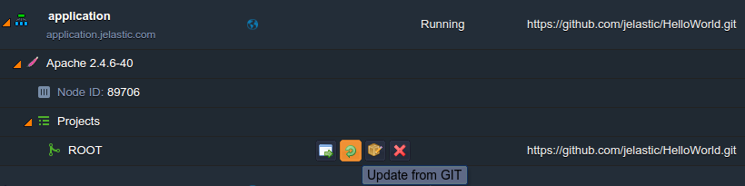

# GIT & SVN Auto-Deploy for Multiple Containers

When handling a highly-visited project, it's commonly recommended to leverage the platform [Multi-Nodes](/multi-nodes) feature for ensuring enough performance for your app. Also, you need to consider that with the [auto-deploy option](/git-svn-auto-deploy) enabled for such a project, all of the containers within your application server layer will be updated <u>simultaneously</u>.

Nevertheless, in case you'd like to achieve more high-availability (i.e. for the redeployment to be performed implicitly and <u>consequentially</u> at each node), here are a few options this can be ensured through:

* initiate this operation manually with the corresponding **Update from GIT/SVN** button (or **Build and Deploy** for Maven projects) next to app's context:


* use the appropriate [CLI method](/cli#vcs-deploy) for VCS projects' management:   
```bash
~/jelastic/environment/vcs/update --envName {env_name} --project {app_context}
```

* run redeployment through the direct *update* [API request](https://www.virtuozzo.com/application-platform-api-docs/) - see the details within the **Environment > Vcs** section of the linked documentation

In all of these cases, your application servers' containers will be redeployed one-by-one, and, thus, no downtime will be caused. Furthemore, for more convenience, you can also define the operation of update to be run automatically (e.g. once per required period or upon the source code changes) through building and integrating your own scripts with the abovedescribed CLI or API methods implemented.
{}
If you've faced any issues while configuring auto-update for your VCS project or still have some questions left, feel free to appeal for our technical experts' assistance at [Stackoverflow](http://stackoverflow.com/questions/tagged/jelastic).
{}


## What's next?
* [Deployment Manager](/deployment-manager/)
* [Java VCS Deployment](/java-vcs-deployment/)
* [ZDT Deployment for PHP](/php-zero-downtime-deploy/)
* [Deploy .NET Project](/deploy-dotnet-archive-url/)
* [Deployment Hooks](/deployment-hooks/)