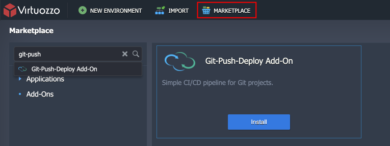

# Git-Push-Deploy Add-On

There is a number of options to deploy your source code from a Git repo to containers including redeploy of the whole container, instant redeploy via volumes or "git clone" approach. However, when it comes to automation of this process and moving to continuous deployment, many developers can face the complexity, as they need to know how to properly combine all the application components with the required interconnection points.

Specifically, in the containers world you have to manage builds of your stack images dealing with extra complexity of CI/CD pipeline. And the whole containers redeploy may not be the best approach if you do often commits without configuration changes in operating system, application server stack or its dependencies.


To ease deployment automation, the PaaS platform prepared a special dedicated **Git-Push-Deploy** package for code delivery into the preliminary built container images. This package implements a number of configurations to set up automatic deployment of committed changes within your Git application source repository to the cloud, making them available for further testing with minimal delays.


## Git-Push-Deploy Specifics

The Git-Push-Deploy package can be integrated with GitHub and GitLab repositories. It is developed for automatic delivery of updates within your **Java**, **PHP**, **Ruby**, **Node.js**, and **Python** application sources and can be applied to all application server's [certified stack templates](/software-stacks-versions/).

The workflow depends on the programming language used in your project:

- *for Java-based projects,* the package initiates the creation of a separate environment with a [Maven build node](/java-vcs-deployment/), which will be responsible for interaction with remote Git repository, triggering your application builds and their deployment to the application server
- *for PHP/Ruby/Node.js/Python applications,* the package sets up a pipeline for project deployment directly to the ROOT context on a web server (here, consider that Ruby app servers are supplied with a deployment mode instead of a context within the dashboard, though the actual project location is the same)


## Repository Pre-Configurations

For a proper add-on installation, you’ll need to provide a *Personal API Token* for your Git account. This enables package to setup a webhook for the corresponding repository, which will initiate application redeployment each time any change is contributed to its code.

So let’s generate one, follow the instruction below according to the used Git VCS, i.e. either [GitHub](#generating-access-token-on-github) or [GitLab](#generating-access-token-on-gitlab).

### Generating Access Token on GitHub

To get your [personal access token for GitHub](https://github.blog/2013-05-16-personal-api-tokens/) account, navigate to the **Settings > Developer Settings > Personal access tokens** and click the **Generate new token** button.


In the opened page, specify **Note** (token description) and **Select scopes** (at least *repo* and *admin:repo_hook*). Click **Generate token** at the bottom of the page.


Once redirected, copy and save the shown access token anywhere else (as it can’t be viewed again after you leave this page).


After this is accomplished, proceed to the **[Install Git-Push-Deploy Package](#install-git-push-deploy-package)** section right down this article.


### Generating Access Token on GitLab

To generate a [personal access token on GitLab](https://docs.gitlab.com/ee/user/profile/personal_access_tokens.html), enter your account **Settings** and switch to the ***Access Tokens*** tab.

Here, specify optional token **Name**, its **Expiry** date (can be left blank) and tick the **api** permission scope.


Click the **Create Personal Access Token** button.

In the opened page, copy and temporary store your access token value anywhere else (as you won’t be able to see it again after leaving this page).


Now, you are ready for package installation.


## Extra Pre-Configurations for Java Projects

If running a Java-based project, you need to preliminary ensure its proper interaction with Maven build node by adding a special Project Object Model ([POM](https://maven.apache.org/guides/introduction/introduction-to-the-pom.html)) file to its structure.

So, create a ***pom.xml*** file in your project repository root, with the following content as an obligatory basis:

```xml
<project>
   <modelVersion>4.0.0</modelVersion>
   <groupId>com.mycompany.app</groupId>
   <artifactId>my-app</artifactId>
   <version>1.0</version>
   <packaging>war</packaging>
   <build>
       <finalName>${project.artifactId}</finalName>
   </build>
</project>
```

where optional values are:

- **groupId** - group of a project (e.g. company name)
- **artifactId** - name of a project
- **version** - your application version

All the rest of parameters should be left unchanged.


## Install Git-Push-Deploy Package

**[Git-Push-Deploy package](https://github.com/jelastic-jps/git-push-deploy)** is an add-on, so it can be installed only on top of [environment](/setting-up-environment/). We have prepared two separate environments with **Tomcat** and **Apache PHP** application servers to show the workflow for different programming languages.

If you are going to use previously created environment, note that the package will overwrite the application deployed to ***ROOT*** context. So to keep your already deployed application, move it to the custom context. We recommend creating a new environment and then proceeding to the installation:

1\. Click the **Marketplace** button at the top pane of the dashboard and search for the ***Git-Push-Deploy*** add-on:



Click **Install** to continue.

2\. In the opened frame, specify the following details about your repository and target environment:

- ***Git Repo URL*** -  HTTPS link to your application repo (either *.git* or of a common view). You can fork our sample *[Hello World](https://github.com/jelastic/HelloWorld-CI-CD)* application to test the flow
- ***Branch*** - a project branch to be used
- ***User*** - enter your Git account login
- ***Token*** - specify the access token you’ve previously created for webhook generation
- ***Environment name*** - choose an environment your application will be deployed to
- ***Nodes*** - application server name (is fetched automatically upon selecting the environment)


Click **Install** to continue.

3\. Wait a minute for the platform to fetch your application sources from GitHub and configure webhook for continuous deployment.


**Close** the notification frame when installation is finished.

4\. Depending on a project type, the result will be the following:

- for **Java-based** infrastructure, you’ll see a new environment appeared at your dashboard with a [***Maven*** build node](/java-vcs-deployment/) inside; it will build and deploy your application to the *ROOT* context on a web server each time the source code is updated

{}**Pay attention** that it might take some time for Maven to compile a project (though the package installation itself has already finished), so you need to wait a few minutes before launching it. The current progress of this operation can be tracked in real time via ***vcs_update*** log file on Maven.{}

- for **PHP-based** infrastructure (and *the rest of supported languages*), your application will be deployed directly to the chosen server *ROOT*

{}**Note:** For ***Ruby*** application servers, the similar **Projects** section provides information on used deployment mode (*development* by default) instead of a context, whilst actual app location refers to server root as well.{}

To start your application, click on **Open in Browser** next to your web server.


That’s it! Now a new version of your application is automatically delivered to the application server upon each commit to a repository.


## Redeployment Policies for Different Stacks

The table below lists behavior of different application servers after receiving the updated code.

Stack Name|Policy
:---:|:---:
Tomcat|Restart
TomEE|Restart
GlassFish|Hot Redeploy via Server API
Jetty|Restart
JBoss|Restart
WildFly|Restart
SpringBoot|Restart
Apache PHP|[Advanced ZDT](/php-zero-downtime-deploy/)
NGINX PHP|[Advanced ZDT](/php-zero-downtime-deploy/)
Apache Ruby|Graceful Reload
NGINX Ruby|Graceful Reload
NodeJS|Restart
Python|Restart

To eliminate possible application downtime for a server with *Restart* update policy, [scale it out](/horizontal-scaling/) to be run over multiple containers. In this case, the required updates will be applied to the instances sequentially, with a 30-second delay by default.


## Test Automated Deploy from Git

And now let’s check how this process actually works. Make some minor adjustment to the code in a repo and ensure everything is automated:

1\. Click **Edit this file** for some item within your project repository and **Commit changes** to it - for example, we’ll modify the text at our HelloWorld start page.


2\. As a result, the appropriate webhook will be triggered to deploy the made changes into your hosting environment - refer to the repository **Settings > Webhooks** section for the details.


Upon clicking on this string you’ll see the list of **Recent Deliveries**, initiated by the webhook, and result of their execution.

3\. As the last checkpoint, return back to your application page and refresh it (whilst remembering that it may take an extra minute for Maven to build and deploy your Java-based project).


That’s it! As you can see, the modifications were successfully applied, so the solution works as intended.

Simply update your code, make commits as you usually do, and all the changes will be pushed to your PaaS environment automatically. No need to switch between processes or make manual updates eliminates human errors and accelerates time to market for your application.

{}Need some details or assistance? Feel free to ask for help within the comments below or get in touch with our technical experts at [Stack Overflow](https://stackoverflow.com/questions/tagged/jelastic).{}


## What’s next?

- [Deployment Guide](/deployment-guide/)
- [Java VCS Deployment](/java-vcs-deployment/)
- [PHP Zero Downtime Deploy](/php-zero-downtime-deploy/)
- [Deployment Hooks](/deployment-hooks/)
