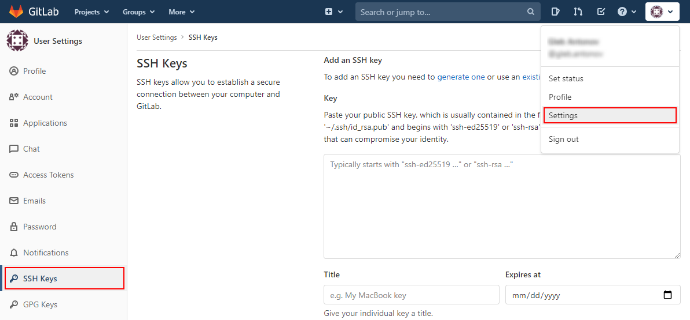
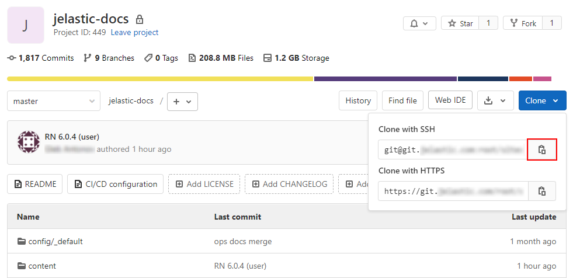

# SSH Access to GIT Repository

With the platform, you can easily [deploy your application](/deployment-guide/) from any remote public or private GIT/SVN repository for each of the supported programming languages: *Java*, *PHP*, *Ruby*, *Python*, and *Node.js*.

In order to achieve more security, you can also access your private GIT repositories via SSH and easily clone and update your applications from them. In addition, this gives you the ability to work with those repositories, which are located at the private servers, instead of common web-based hosting services for projects like GitHub, GitLab, Bitbucket, etc.

For accessing your private GIT repository using the secured SSH protocol, follow the simple steps below:

1. [Generate SSH Keychain](#generate-ssh-keychain)
2. [Add Private SSH Key to Platform Account](#add-private-ssh-key-to-platform-account)
3. [Add Public SSH Key to Git Account](#add-public-ssh-key-to-git-account)
     - [GitHub](#github)
     - [GitLab](#gitlab)
     - [Bitbucket](#bitbucket)
4. [Deploy Project via SSH](#deploy-project-via-ssh)

## Generate SSH Keychain

To start with, you need to create an SSH key pair (i.e. two related keys: private and public) for binding your GIT repository to the PaaS account. Follow the **[Generate SSH Key](/ssh-generate-key/)** instruction if you've never generated a keychain before.

{}**Note:** Your keys <u>*must not*</u> contain password protection (*passphrase*) in order to be used for establishing a connection between the platform and GIT accounts.{}

## Add Private SSH Key to Platform Account

Once you've got a pair of generated SSH keys, let's place each of them in the appropriate systems. First of all, you need to add your private key to the PaaS account.

1\. Log in to your PaaS account and navigate to its settings by means of clicking the same-named **Settings** button at the top-right section of the dashboard. 

2\. Within the opened **User Settings** tab, switch to the **SSH Keys > Private Keys** option and click on the **Add Private Key** button.

3\. Copy your private SSH key and paste it into the **Key** text field. Then type a **Name** for this key (e.g. *git-key*) and finish the addition with the **Add** button.

{}**Note:** If you've received an error while adding the key, make sure it is not protected with a passphrase. Otherwise, remove the protection and try again.{}

4\. As a result, your new private key will appear in the corresponding tab in just a moment.

You are always able to delete your keys if they aren't needed anymore - just click the appropriate red cross button. The key's deletion from the manager won't remove it from the existing GIT projects in the platform. Therefore, you will be able to continue working with them in the same way as before.

## Add Public SSH Key to Git Account

After your private key has been uploaded to your PaaS account, it's time to adjust your GIT repository account.

If your GIT repository is located at the remote private server, just upload the appropriate SSH public key and add it to the list of authorized ones. 

In case you are using some web-based projects' hosting service, follow the corresponding detailed step-by-step guide below. As an example, we'll pay attention to the three most popular services:

- [GitHub](#github)
- [GitLab](#gitlab)
- [Bitbucket](#bitbucket)

### GitHub

1\. Log in to your GitHub account using your credentials. Go to account's **Settings** (at the top right corner), choose the **SSH and GPG keys** tab at the left panel, and click on the **New SSH key** button.

2\. Paste your *public SSH key* to the **Key** input field, set a **Title** for your key (e.g. *jelastic-sshkey*), and click **Add SSH key**.

3\. Confirm the addition by means of typing the password for your GitHub account in the opened frame and selecting the appropriate button.

4\. Check your newly added key has appeared in the same **SSH keys** tab.

5\. To get the SSH link to your project, navigate to the desired repository (you must be logged in) and switch the link type to **SSH** in the *clone URL* section at the right-hand pane. Then click on the **Copy to clipboard** button (or do it manually).

### GitLab

1\. Log in to your GitLab account. Access the account's **Settings** (at the top right corner) and go to the **SSH Keys** tab at the menu to your left.

2\. Paste your public SSH key to the **Key** input field, set a **Title** (e.g. *jelastic-sshkey*), and **Expires at** date (optionally) for your key.

{}**Note:** The expiration date is informational only and does not prevent you from using the key. For example, it can be used by administrators to keep keys rotating.{}

Click the **Add key** button.
 
3\. Your key should appear in the **Your SSH keys** list below.

4\. To get the SSH link to your project, navigate to the desired repository (you must be logged in), expand the **Clone** menu and copy the ***Clone with SSH*** link.

### Bitbucket

1\. Log in to the Bitbucket account using your credentials and choose the **Manage Account** option from the user's settings menu at the top right corner of the page.

2\. Once the account settings page is opened, switch to the **SSH keys** tab (inside the *Security* section) using the left-hand categories list. Then, select **Add key** within the central part of the page.

3\. In the appeared frame, paste your public SSH key to the **Key** input field, set a **Label** for your key (e.g. *jelastic-sshkey*), and click the **Add key** button. 

4\. Check your newly added key has appeared in the same **SSH keys** tab.

5\. To get an SSH link to your project, access the desired repository's overview screen (you must be logged in) and switch the link type to **SSH** within the corresponding drop-down list at the top of the page. Copy the shown string.

## Deploy Project via SSH

Finally, now you can proceed to your project's deployment via the secured connection.

1\. Go to the ***[Deployment Manager](/deployment-manager/#git--svn-projects)*** at the bottom of the dashboard and click **Add repo**. Provide the following information within the opened form:

- **Name** - the name of your application (no spaces and special symbols are allowed)
- **URL** - the appropriate ***git*** URL to the repository
- **Branch** - the required branch of the project (master by default)
- tick the **Use Authentication** check box, choose the *SSH Key* option as your ***Access Type***, and ***Select Key*** from the list

Click **Add** to save your project information.

2\. Once the project is added to the *Deployment Manager*, hover over it and use the appeared **Deploy to** button to deploy your application.

In the opened window, you need to specify the deployment target and some additional configs:

- **Environment** - chose a target environment from the list

{}**Note:** For Java-based environments, you need to additionally select a [build node](/java-vcs-deployment/).

{}

- **Path** - type the context you would like your application to be deployed to (or leave the default one)
- **[Hooks](/deployment-hooks/)** - add pre- and post-deployment operations (if needed)
- **Check and auto-deploy updates** - enables [automatic periodic updates](/git-svn-auto-deploy/) of your project from the repository (performed only there are code changes) with a set interval
- **Auto-resolve conflicts** - prevents the merge conflict, the "*git reset --hard*" command will be called during each subsequent project update (contradictory files will be updated according to its repository version, discarding the locally made changes)
- **Enable [zero-downtime deployment](/php-zero-downtime-deploy/)** - adjusts the deployment flow to avoid application downtime (for PHP servers only)

When all the data is entered, click **Deploy** to proceed and wait until your project is successfully deployed.

3\. You can ensure your project files are now available. Open the **[Configuration File Manager](/configuration-file-manager/)** for your environment, go to the **webroot** directory, and check a folder named after the specified context (**ROOT** by default) inside.

4\. Finally, you can click on **Open in Browser** for your environment and ensure your application is running.

That's all! Enjoy the highly protected interaction with any version control system - clone and update your projects, hosted at the platform, directly from your private GIT repositories via SSH.

## What's next?

* [Deployment Guide](/deployment-guide/)
* [Deployment Manager](/deployment-manager/)
* [GIT & SVN Auto-Deploy](/git-svn-auto-deploy/)
* [SSH Access](/ssh-access/)
* [Gitblit for Apps Deploy](/gitblit/)