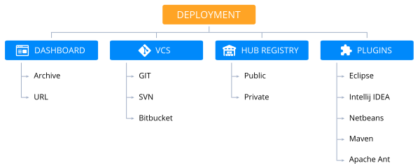
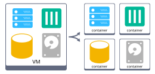
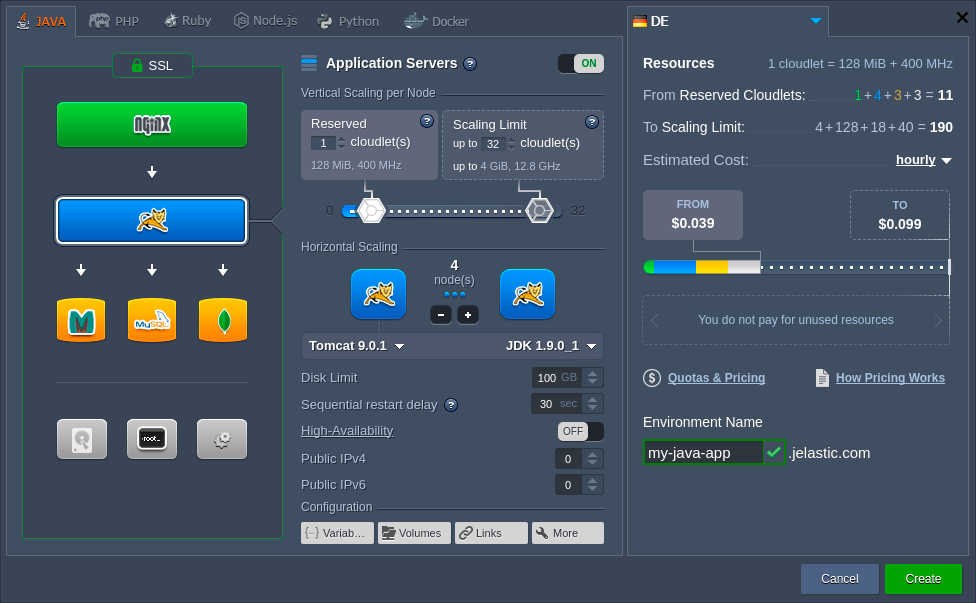

# Zero Code Change Deploy with No Vendor Lock-In for Smooth Migration across Cloud Platforms
Unlike the vast majority of hosting services, the platform does not force developers to follow any specific requirements of immutable infrastructure, proprietary runtimes or API to host a project. Such an approach becomes especially substantial when it comes to migrating from virtual machines to containers, decomposition of traditional (so-called legacy) monoliths to microservices, or while moving from one provider to the other.  

Removing the necessity of application redesign, [deployment](/deployment-guide) can be easily performed using archives (zip, tar.gz, war, jar, ear), FTPS/SFTP, GIT/SVN with automatic updates right from the dev panel or via integrated plugins for Maven, Eclipse, NetBeans, IntelliJ IDEA. All together, this makes the entry point easier and more seamless, reducing go-to-market time and eliminating vendor lock-in.

Zero code change approach, as well as application and system containers support, provide the ability to run both cloud-native microservices and legacy monolithic applications based on Java, PHP, Ruby, Node.js, Python and Docker.

In addition, deployment and further running of applications inside containers are not going to be restricted after migration from VMs, letting you to:

* Run several services inside a single container
* Use any required node port
* Attach multiple Public IPv4 or IPv6 per container
* Write to local or remote file system
* Access containers via SSH with compatibility to configuration management tools like Chef or Puppet
* Deploy well-known control panels for VPS and shared hosting management (cPanel, Plesk and ISPManager)
* Perform live migration similar to vMotion
* Deploy Docker Engine in the same way you do with VMs
* Execute other operations previously implemented within VPS

Also, the platorm keeps the same IPs and hostnames for each container after any planned or occasional downtime. As a result, you are freed from the necessity to rewrite them in order to let services keep tracking the right connections.

## Project Deployment with Zero Code Change
To make the above more evident, let's consider a few simple steps needed to deploy a project at the platform:

1\. Create an environment via comprehensive topology wizard with a wide range of pre-configured [software stacks](/software-stacks-versions) (i.e. application servers, databases, load balancers, cache and build nodes).

2. When the appropriate environment is created, you can [deploy your application](/deployment-guide) with one of the supported deployment options:
    * provide an archive (*zip*, *bzip2*, *tar*, *tar.gz*, *tar.bz2*, *war*, *jar* or *ear*) with prepackaged application resources by uploading it to the platform storage or giving a link to the location it's kept at
    * deliver installation files via [FTPS/SFTP](/ftp-ftps-support) channel
    * fetch sources from GIT/SVN repository (additionally, you can set up automatic update) 
    * use integrated plugins (*Maven*, *Eclipse*, *NetBeans*, *IntelliJ IDEA*)

After the process initiation, regardless of the selected deployment type, all the configurations (e.g. connecting to load balancer, memory usage tuning, enabling SSL or IP if needed, etc.) will be handled by the system automatically. There is no need to modify application source code - the only customization you may need to apply is to adjust some custom application settings due to a new location (e.g. IP addresses or domain names - all the appropriate server configs are always available for editing directly through the platform dashboard with the embedded [File Manager](/application-configuration)).

This way you can easily migrate any application to PaaS from other Cloud, VPS or VM without special code adjustment required.

## What's next?
* [What is PaaS & CaaS](/what-is-paas-and-caas/)
* [PaaS Cluster Overview](/software-stacks-versions/)
* [Deployment Guide](/deployment-guide/)