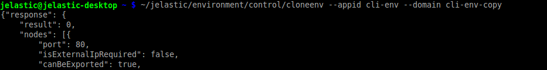

# CLI Tutorial: Environment Cloning
The [environment cloning](/clone-environment) feature is also supported by CLI and can be easily called to help you in creation of new branches/multiple versions of your application. So, to duplicate your environment, just execute the next line:
```bash
~/jelastic/environment/control/cloneenv --appid  {src_env} --domain  {new_env}
```
where:

* ***{src_env}*** - name of the environment you'd like to clone
* ***{new_env}*** - name for your the environment copy



In a few minutes, you'll get a new environment within your account, that is similar to the source one.


## What's next?
Learn some other popular CLI operations:

* [environment creation](/cli-create-environment/)
* [environment start/stop](/cli-environment-control/)
* [environment migration](/cli-environment-migration/)
* [server scaling](/cli-scaling/)
* [container redeploy](/cli-container-redeploy/)
* [Docker volumes](/cli-docker-volumes/)
* [mount points](/cli-mount-points/)
* [VCS projects deployment](/cli-vcs-deploy/)
* [swap Public IPs](/cli-ip-swap/)