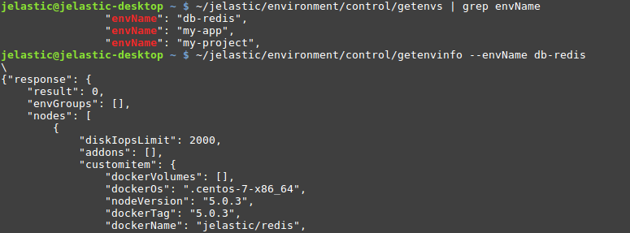
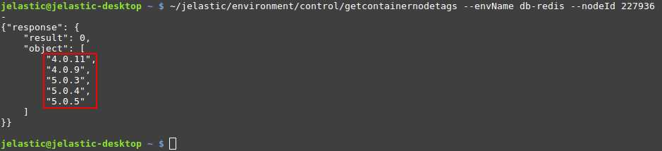
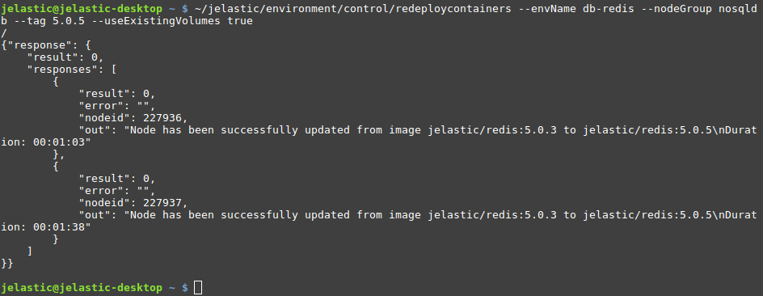

# CLI Tutorial: Container Redeploy

In this guide, we'll show how to [redeploy](/container-redeploy) a container from one image tag to another. Herewith, if needed, an option for whole layer redeployment is supported.

1\. At first, locate the environment name and node ID/layer of the container(s) that should be redeployed. You can either view the required info via the dashboard or use the ***GetEnvs*** and ***GetEnvInfo*** methods to get the data directly from the terminal (for all or particular environment respectively).

Here, you can get all the info on the environment - *layer names*, *node IDs*, *Docker images*, *tags*, etc.

2\. Once you've got the container's ID and layer (*nodeGroup name*), you can view the list of tags available for the image. We'll use the ***GetContainerNodeTags*** method with environment name and node ID as parameters:
```bash
~/jelastic/environment/control/getcontainernodetags --envName {envName} --nodeId {nodeId}
```

In our case, a list of tags for the *jelastic/redis* image is displayed.

3\. Now, you have all the data required for container redeploy via CLI. Call the appropriate ***RedeployContainers*** method:  
```bash
~/jelastic/environment/control/redeploycontainers --envName {envName} [--nodeGroup {nodeGroup}] [--nodeId {nodeId}] --tag {tag} [--useExistingVolumes {useExistingVolumes}] [--login {login}] [--password {password}]
```
The following parameters are used:  

* ***{envName}*** - name of the environment, where container(s) should be redeployed
* ***{nodeGroup}*** - identifier of the [environment layer](https://docs.cloudscripting.com/creating-manifest/selecting-containers/#all-containers-by-group) to update *(optional)*
* ***{nodeId}*** - identification number of the particular container to be redeployed *(optional)*
{}**Note:** 
You need to state either ***{nodeGroup}*** or ***{nodeId}*** parameter to define the operation target. The method ignores ***{nodeGroup}*** if both are provided and fails if neither is specified.
{}

* ***{tag}*** - image version to be deployed
* ***{useExistingVolumes}*** - set it to *true* to keep data in the mounted volumes present within the updated container(s) (*optional)*
* ***{login}*** and ***{password}*** - credentials to access an image from the private registry (*optional)*



The process can take several minutes and should respond with *"result": 0* (i.e. operation success). The response includes versions before and after redeploy, as well as the duration of each container's update.


## What's next?
Look through some other CLI usecases:

* [environment creation](/cli-create-environment)
* [environment start/stop](/cli-environment-control)
* [environment cloning](/cli-clone-environment)
* [environment migration](/cli-environment-migration)
* [server scaling](/cli-scaling)
* [Docker volumes](/cli-docker-volumes)
* [mount points](/cli-mount-points)
* [VCS projects deployment](/cli-vcs-deploy)
* [swap Public IPs](/cli-ip-swap)
* [installing JPS](/cli-install-jps)