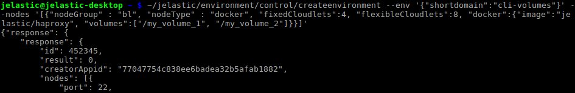
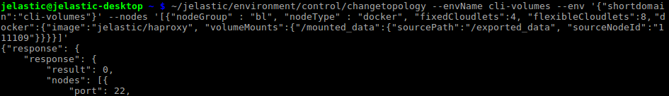
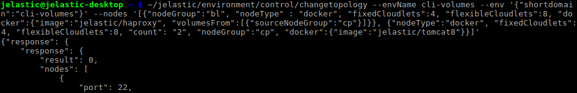
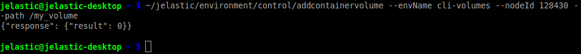
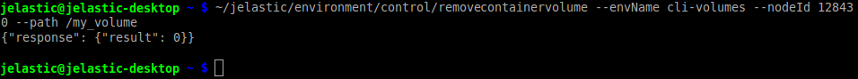
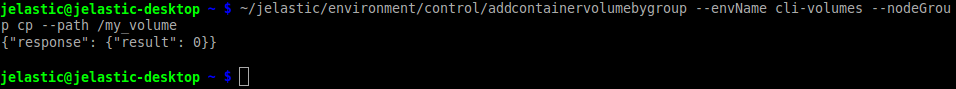
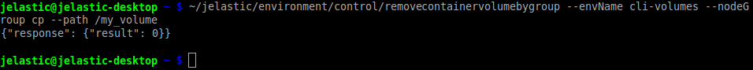

# CLI Tutorial: Container Volumes

[Container (Docker) Volumes](/container-volumes/) management functionality at the platform allows creating a persistent [local storage](/local-filesystem-storage/), designed to be not affected by various operations during container lifecycle. Creation of such a storage right inside a container helps to ensure high level of integrity and prevent loss of important data.

Using platform CLI, you can set up container volumes in two ways:

* [within topology settings](#set-volumes-via-environment-topology)
* [via direct CLI methods](#direct-volumes-management)


## Set Volumes via Environment Topology

The first way to create container volume we'll consider is to define it right during the [environment creation](/cli-create-environment/) (or when [changing its topology](/cli-scaling/)). So, in order to setup your local container storage, the following [parameters](/create-env-api/#docker-based-environment-configurations) can be used while executing the appropriate CLI method:

* ***volumes*** - sets list of local volumes
* ***volumeMounts*** - allows to configure [mount points](/mount-points/)
* ***volumesFrom*** - imports existing volumes from node on your account

{}**Tip:** These parameters can be used within your [JPS](/jps/) manifests as well.{}

1\. All of these parameters are to be declared within the appropriate ***docker*** section. For example, the first parameter can be set in the following way:

```
... "docker":{... "volumes": ["{local_volume}", "{local_volume}", ...]}
```



Here, ***{local_volume}*** is a placeholder for the path your local volume should be placed inside a container. You can specify multiple volumes at once using comma separator.

E.g., within the image above, we create an environment with the *jelastic/haproxy* image inside and two local volumes attached, namely: */my_volume_1* and */my_volume_2*.

2\. The second ***volumeMounts*** parameter has the next syntaxis:  

```
... "docker":{... "volumeMounts" : {"{local_path}" : {"sourcePath" : "{remote_path}", "sourceNodeId" : "{node_ID}", "readOnly" : {true/false}}, ...}}
```



The highlighted data should be changed to the appropriate values:

* ***{local_path}*** - path to the folder within nodes of the specified environment layer the mounted content should be placed at
* ***{remote_path}*** - the required directory location at the remote container (i.e. address of source data)
* ***{node_ID}*** - unique identifier of the node your data will be mounted from
{}**Note:** Alternatively to the *"sourceNodeId"* parameter, you can also use:

* *"sourceNodeGroup"* - defines [environment layer](/create-env-api/#docker-based-environment-configurations), which master node will be used as a source for mount operation
* *"sourceHost"* - external IP or [custom domain](/custom-domains/) name of the data storage server (including [external one](/configure-external-nfs-server/)){} 

* ***{true/false}*** - the appropriate values define *read only* or *read & write* rights for client nodes while operating mounted data (*false* by default)

As an example, using the command on image above, we've mounted data from the *111109* node of the used account.

3\. With the last ***volumesFrom*** parameter, it's possible to mount all the existing volumes from one node to another (i.e. copy them), e.g.:

```
... "docker":{... "volumesFrom":[{"sourceNodeId" : "{node_ID}", "readOnly" : {true/false}, "volumes" : ["{local_volume}", "{local_volume}", ...]}]}
```
  

Here:

* ***{node_ID}*** - unique identifier of the node the data should be mounted from
{}**Note:** Alternatively, it is possible to use *"sourceNodeGroup"* to define the [environment layer](/create-env-api/#docker-based-environment-configurations), which master node will be used as a source for mount operation.{}

* ***{true/false}*** - the appropriate values define *read only* or *read & write* rights for client nodes while operating mounted data (*false* by default)
* ***{local_volume}*** - list of volumes to be mounted (if not specified all of them will be copied)

In such a way, using the command in the image above, we've added a new layer with two *jelastic/tomcat8* Docker images and mounted the volumes to the existing *jelastic/haproxy* node.


## Direct Volumes Management

The platform provides you with a number of CLI methods, that are developed specially for volumes management and do not affect the rest of environment topology:

1\. The first one is the ***AddContainerVolume*** command, which lets you add a new volume to the existing environment:

```
~/jelastic/environment/control/addcontainervolume --envName {env_name} --nodeId {node_ID} --path {path}
```

where:

* ***{env_name}*** - domain name of the environment you'd like to modify
* ***{node_ID}*** - unique identifier of the node in chosen environment, a new container volume should be added to
* ***{path}*** - path in local filesystem to your volume directory



2\. The removal process is absolutely similar to the just described addition process and uses the same parameters:

```
~/jelastic/environment/control/removecontainervolume --envName {env_name} --nodeId {node_ID} --path {path}
```



3\. In case you need to add volumes not to a single node, but to a whole environment layer at once, the ***AddContainerVolumeByGroup*** method will be more suitable:

```
~/jelastic/environment/control/addcontainervolumebygroup --envName  {env_name} --nodeGroup  {node_group} --path  {path}
```

Here, the ***{node_group}*** parameter allows to define a layer in the current environment (e.g. *cp*, *bl*, *storage*, etc.), which nodes should be modified with a new volume.



4\. Surely, you can remove a volume for the whole layer in a single command as well:

```
~/jelastic/environment/control/removecontainervolumebygroup --envName  {env_name} --nodeGroup  {node_group} --path  {path}
```



In such a way, using these CLI methods, you can easily take control over your container volumes and manage them in a matter of minutes. And in case you are in need of adding some [Mount Points](/cli-mount-points/) alongside with volumes, use the linked guide for detailed instruction.

{}If you face any issues while working with platform CLI, feel free to appeal for our technical experts' assistance at [Stackoverflow](https://stackoverflow.com/questions/tagged/jelastic).{}


## What's next?

Follow the linked guides for more platform CLI tutorials:

* [environment creation](/cli-create-environment/)
* [environment start/stop](/cli-environment-control/)
* [environment cloning](/cli-clone-environment/)
* [environment migration](/cli-environment-migration/)
* [server scaling](/cli-scaling/)
* [container redeploy](/cli-container-redeploy/)
* [mount points](/cli-mount-points/)
* [VCS projects deployment](/cli-vcs-deploy/)
* [swap Public IPs](/cli-ip-swap/)
* [installing JPS](/cli-install-jps/)