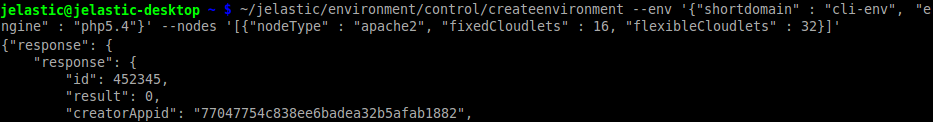
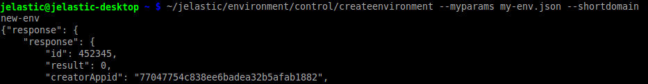
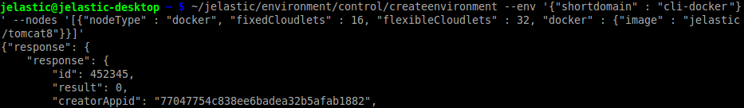

# CLI Tutorial: Environment Creation
Creation of environments via command line can come in handy for the variety of different solutions (e.g. handling [complex DevOps scenarios](https://www.virtuozzo.com/application-platform-ops-docs/devops-jenkins)). So, let's consider the ways this can be accomplished through.

1\. At the beginning, we'll consider a few variants this operation can be implemented through.

* The most straightforward way to create a new environment with CLI is to declare the required parameters manually via the appropriate command. Simply execute the following ***createenvironment*** method with your custom parameters specified:
```bash
~/jelastic/environment/control/createenvironment --env '{"shortdomain" : " {env_name}", "engine" : " {engine_type}"}' --nodes '[{"nodeType" : " {node_type}", "fixedCloudlets" :  {cloudlets_amount}, "flexibleCloudlets" :  {cloudlets_amount}}]'
```

In the example above, the highlighted placeholders should be substituted with the following data:

* ***{env_name}*** - name for the new environment
* ***{engine_type}*** - engine for being used in this environment
* ***{node_type}*** - stack type identifier, according to the [list](/application-manifest#nodeTypeList)
* ***{cloudlets_amount}*** - number of fixed and flexible cloudlets to allocate for a particular node
 
{}**Tip:** The more detailed information on available parameters can be found within the corresponding [API method](https://docs.jelastic.com/api/#!/api/environment.Control-method-CreateEnvironment) description and at the [CreateEnvironment API](/create-env-api) overview.{}



Pay attention that in the image above CLI responded with the <i>result</i> property equal to *0* - this means that the performed operation has passed successfully and without errors (this is applicable for all of the commands you run).

* The second option, supported by platform CLI, is to use JSON file with all of your environments' parameters stated inside. Created once, such file can be used multiple times, which is much faster and convenient than defining everything manually each time.  

For example, let's create a simple JSON with the next environment topology:
```json
{
  "env": {
    "shortdomain": "{env_name}",
    "engine": "{engine_type}"
  },
  "nodes": [
    {
      "nodeType": "{node_type}",
      "fixedCloudlets": "{cloudlets_amount}",
      "flexibleCloudlets": "{cloudlets_amount}"
    }
  ]
}
```

Just don't forget to change the highlighted parameters in the same way it was described within the previous step.

Now, all you need to do in order to create an environment is to use the ***createenvironment*** method with just a single *--myparams* parameter, that includes path to your *.json* file as a value (or just its name if it's located within the user's home folder):
```bash
~/jelastic/environment/control/createenvironment --myparams {path_to_file}
```
In addition, you can redefine or add some of the settings (namely &ndash; *shortdomain*, *region* and *displayName*) to the env section of your configuration file, by stating them inside square brackets within this method parameters. For example, with the optional &ndash; *shortdomain* string (like in the image below) you can override the same-named setting from JSON, so the environment will be created with the same topology but under a different name.


2\. Creation of a [Docker-based environment](/dockers-management) is almost similar to the above described methods, but includes a few specific parameters. So, in order to get a Docker container using platform CLI, you need to execute the following line:
```bash
~/jelastic/environment/control/createenvironment --env '{"shortdomain" : "{env_name}"}' --nodes '[{"nodeType" : "docker", "fixedCloudlets" : {cloudlets_amount}, "flexibleCloudlets" : {cloudlets_amount}, "docker" : {"image" : "{image_name}"}}]'
```

According to the command above, the *nodeType* parameter needs to be stated in ***docker*** and the newly added ***{image_name}*** placeholder should be replaced with the address of Docker template you'd like to deploy (in the *server.com/images/image_name:tag* format).

Herewith:

* in case a template is located within the Registry Hub, the registry hostname can be skipped 
* optionally, you can add the version tag after the &ldquo;*:*&rdquo; separator at the end of image address
* in order to get authenticated at a private ***registry***, the additional registry parameter should be declared, with *url* to it and the appropriate credentials (i.e. *password* and *user*) stated as values. 

{}**Note:** The full list of the special Docker parameters can be found at the appropriate [document](/create-env-api#docker).{}



In a short while, your Docker-based environment will be created, being ready to work.


## What's next?
Now, you can proceed with other operations, like:

* [environment start/stop](/cli-environment-control/)
* [environment cloning](/cli-clone-environment/)
* [environment migration](/cli-environment-migration/)
* [server scaling](/cli-scaling/)
* [container redeploy](/cli-container-redeploy/)
* [Docker volumes](/cli-docker-volumes/)
* [mount points](/cli-mount-points/)
* [VCS projects deployment](/cli-vcs-deploy/)
* [swap Public IPs](/cli-ip-swap/)
* [installing JPS](/cli-install-jps)