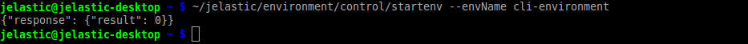

# CLI Tutorial: Environment Start/Stop
Among the most common operations for environment management provided by CLI, the *start* and *stop* ones can be denoted. Wise usage of these methods can help to significantly cut your spends, especially for development and testing environments (for example, you can stop them for the nighttime, while you are sleeping, and start again at the morning to continue the development).

1. In order to stop an environment, that is temporarily non-required, execute the following command (where the highlighted ***{env_name}*** placeholder needs to be substituted with the corresponding environment name):
```bash
~/jelastic/environment/control/stopenv --envName {env_name}
```

As you can see, CLI responses with the "result" property equal to *0*, meaning that the operation passed successfully and without errors.

2. Later on, you can start your environment with a similar *startenv* method and make it operable again:
```bash
~/jelastic/environment/control/startenv --envName {env_name}
```


Yes, the environment management is that simple!


## What's next?
Check out some other CLI methods
* [environment creation](/cli-create-environment/)
* [environment cloning](/cli-clone-environment/)
* [environment migration](/cli-environment-migration/)
* [server scaling](/cli-scaling/)
* [container redeploy](/cli-container-redeploy/)
* [Docker volumes](/cli-docker-volumes/)
* [mount points](/cli-mount-points/)
* [VCS projects deployment](/cli-vcs-deploy/)
* [swap Public IPs](/cli-ip-swap/)
* [installing JPS](/cli-install-jps)