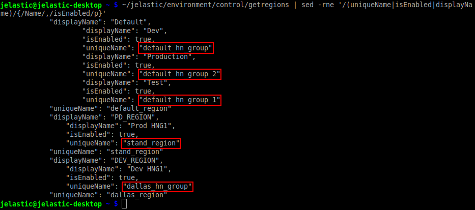
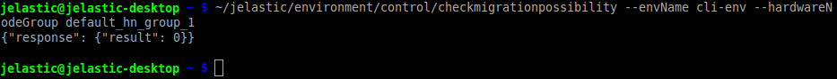
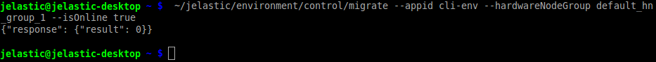

# CLI Tutorial: Environment Migration

Sometimes, it may be required to move your application to another [environment region](/environment-regions/) with better conditions and\or location or, for example, to distribute several [cloned](/cli-clone-environment/) environment copies among different hardware sets to achieve increased availability. To perform this remotely, you'll need to execute the corresponding ***migrate*** CLI method via your terminal. So, let's consider it in more details.

1\. To start with, you have to get the list of regions which are available at a Platform.  
For that, the ***getregions*** command should be used, with the appropriate search filter being applied in order to shorten the output and simplify the perception:

```
~/jelastic/environment/control/getregions | sed -rne '/(uniqueName|isEnabled|displayName)/{/Name/,/isEnabled/p}'
```



You'll see the list of environment regions, available for your account (i.e. where *"isEnabled"* states in *true*), with their names at dashboard (*displayName*) and unique identifiers (*uniqueName*). Here, the last parameter is the one you need to remember.

{}**Note:** The first list level displays global info on data centers, whilst the regions' parameters you actually require to retrieve for further operations are shown a level below (such lines are shifted to the right).

To make it more clear, the appropriate *uniqueName* values are circled in the image above.{}

2\. It is also a good practice to check the migration possibility before running the operation itself. Use the appropriate simple ***CheckMigrationPossibility*** CLI method for this:

```
~/jelastic/environment/control/checkmigrationpossibility --envName {env_name} --hardwareNodeGroup {region_id}
```

Here:

* ***{env_name}*** - name of the environment you'd like to relocate
* ***{region_id}*** - unique identifier of the target environment region from the previous step



3\. Now you have all the required data to call the migration procedure:

```
~/jelastic/environment/control/migrate --envName {env_name} --hardwareNodeGroup {region_id} --isOnline {true/false}
```
The only new parameter here is the *isOnline* one, which can be set as ***{true/false}*** for using the [live](/environment-regions-migration/#live-migration) or [offline](/environment-regions-migration/#offline-migration) migration mode correspondingly.



Soon (the exact time of migration may vary depending on your environment content) the operation will be finished and your application will be successfully relocated.


## What's next?

Check guides below for additional examples of CLI methods:

* [environment creation](/cli-create-environment/)
* [environment start/stop](/cli-environment-control/)
* [environment cloning](/cli-clone-environment/)
* [server scaling](/cli-scaling/)
* [container redeploy](/cli-container-redeploy/)
* [Docker volumes](/cli-docker-volumes/)
* [mount points](/cli-mount-points/)
* [VCS projects deployment](/cli-vcs-deploy/)
* [swap Public IPs](/cli-ip-swap/)
* [installing JPS](/cli-install-jps/)