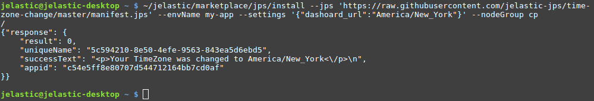
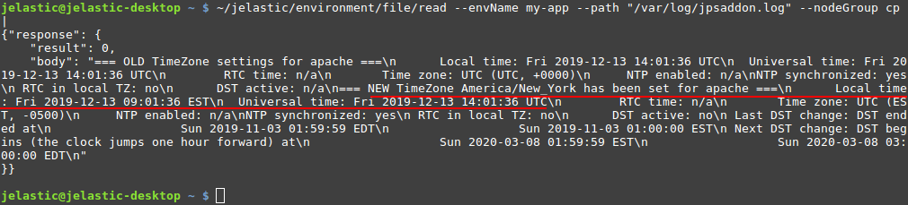
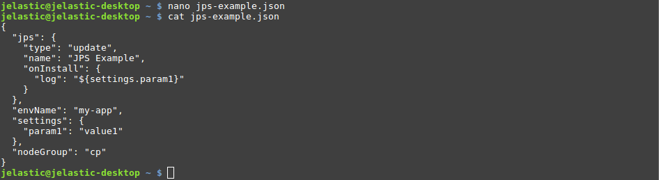
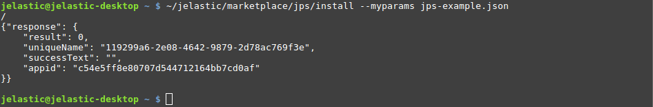
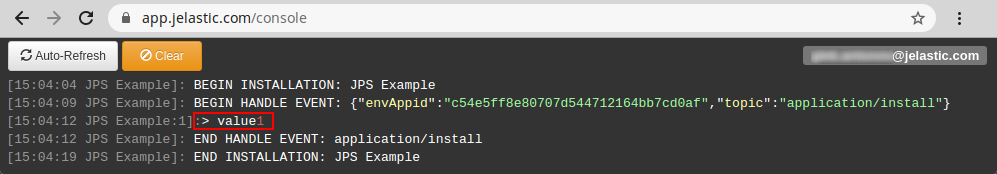

# CLI Tutorial: Install JPS

In this tutorial, we'll show how to install a [JPS package](/application-manifest/) via CLI. Such a solution can contain steps to create a new environment with predefined customization (e.g. application deployment and configuration) or perform some actions on the existing instances.

Let's start by learning about the appropriate ***Install*** method that executes the JPS packages and all of its parameters:

```
~/jelastic/marketplace/jps/install --jps {jps} [--envName {envName}] [--settings {settings}] [--nodeGroup {nodeGroup}] [--displayName {displayName}] [--region {region}] [--envGroups {envGroups}] [--ownerUid {ownerUid}] [--logsPath {logsPath}] [--loggerName {loggerName}] [--skipNodeEmails {skipNodeEmails}]
```

Here, the parameters in square brackets ***[ ]*** are optional:

* ***jps*** - link to your [manifest file](/application-manifest/) or its body
* specific settings for <u>*jpsType: install*</u> manifests (new environments):
    * ***[displayName]*** - [alias](/environment-aliases/) for the created environment
    * ***[region]*** - unique name of a [region](/environment-regions/) (e.g. get it with the *GetRegions* method), where an environment should be created
    * ***[envGroups]*** - list of [env groups](/environment-groups/) the created environment should be included to (specified as JSON array, e.g. *["mygroup", "group/subgroup"]*)
* specific settings for <u>*jpsType: update*</u> manifests (add-ons for existing environments):
    * ***[nodeGroup]*** - an environment layer the add-on should be applied to (*bl*, *cp*, *cache*, *sqldb*, *nosqldb*, *storage*, *vps*, *build* or your custom one for [Docker containers](/container-types/))
* ***envName*** - a name of the newly created/target environment for the application/add-on installation respectively
* ***[settings]*** - list of settings required by the package (specified as a JSON object with key/value pairs)
* ***[ownerUid]*** - user ID of the [shared account](/account-collaboration/), where JPS package should be installed
* ***[loggerName]*** - a name displayed next to the timestamp of each operation in the JPS installation log file (learn more about [loggerName](https://docs.cloudscripting.com/troubleshooting/#loggername))
* ***[logsPath]*** - path to the file to log JPS installation flow (***cs.log*** by default)
* ***[skipNodeEmails]*** - enables (*true*, by default) or disables (*false*) email notifications about new nodes creation by this package (learn more about [skipNodeEmails](https://docs.cloudscripting.com/creating-manifest/basic-configs/#skip-node-emails))

Now, we can proceed to the real case examples:

* [TimeZone Change Add-on Installation via URL](#timezone-change-add-on-installation-via-url)
* [JPS Installation Using Configuration File with Parameters](#jps-installation-using-configuration-file-with-parameters)


## TimeZone Change Add-on Installation via URL

The **[TimeZone Change](/timezone-management/#timezone-add-on)** add-on allows easily switch timezone on any container to the desired one. The sources and manifest file of the add-on can be found at the [JPS Collection](https://github.com/jelastic-jps) repository at GitHub.

1\. Install platform CLI and log into your account, if you haven't before. The required steps are described in the [overview guide](/cli/).

2\. Call the ***Install*** method with the required parameters:

```
~/jelastic/marketplace/jps/install --jps {jps} --envName {envName} --settings {settings} --nodeGroup {nodeGroup}
```



Here:

* ***{jps}*** - link to the TimeZone Change add-on manifest file, i.e. *https://raw.githubusercontent.com/jelastic-jps/time-zone-change/master/manifest.jps*
* ***{envName}*** - name of your existing environment, e.g. *my-app*
* ***{settings}*** - according to the manifest, this particular add-on requires you to provide one additional parameter - the desired [timezone](https://en.wikipedia.org/wiki/List_of_tz_database_time_zones), e.g. *{"dashoard_url":"**America/New_York**"}*
* ***{nodeGroup}*** - target [layer](/paas-components-definition/#layer) of the environment, e.g. *cp*

If there are no issues, the script will respond with *"result": 0* (i.e. operation success).

3\. For this add-on, you can check the detailed result in the ***/var/log/jpsaddon.log*** file. Let's ***Read*** it.

```
~/jelastic/environment/file/read --envName {envName} --path "/var/log/jpsaddon.log" --nodeGroup {nodeGroup}
```



As you can see, the timezone has been successfully set as the one specified in the previous step, *America/New_York* in our case. The local time on the corresponding containers is adjusted accordingly to this new timezone.


## JPS Installation Using Configuration File with Parameters

If needed, you can provide all the parameters within a single file and refer to it upon executing a CLI method.

1\. Let's create a JSON file (using any preferable editor) with the required parameters. In our case, we'll run a simple JPS, which logs the value of the provided parameter:

```json
{
  "jps": {
    "type": "update",
    "name": "JPS Example",
    "onInstall": {
      "log": "${settings.param1}"
    }
  },
  "envName": "my-app",
  "settings": {
    "param1": "value1"
  },
  "nodeGroup": "cp"
}
```



{}**Tip:** It is possible to provide a URL to your manifest file instead of specifying it explicitly in the ***jps*** parameter (similar to the [TimeZone example](#timezone-change-add-on-installation-via-url)).{}

2\. Next, call the ***Install*** method using the created configuration file.

```
~/jelastic/marketplace/jps/install --myparams {myparams.json}
```



{}**Tip:** If needed, you can explicitly provide a parameter to redefine the value inside the file. For example, it is possible to change the environment name without adjusting the configuration file itself:

```
~/jelastic/marketplace/jps/install --myparams {myparams.json} --envName {envName}
```
{}

3\. You can ensure that the value of the provided parameter was successfully logged via the platform console (*https://app.**[{platformDomain}](/paas-hosting-providers/)**/console*).



Utilization of the configuration files with a list of predefined parameters is a great way to simplify and automate frequent calls.


## What's next?

Check out other CLI tutorials:

* [Environment Creation](/cli-create-environment/)
* [Environment Start/Stop](/cli-environment-control/)
* [Environment Cloning](/cli-clone-environment/)
* [Environment Migration](/cli-environment-migration/)
* [Server Scaling](/cli-scaling/)
* [Container Redeploy](/cli-container-redeploy/)
* [Container Volumes](/cli-container-volumes/)
* [Mount Points](/cli-mount-points/)
* [VCS Project Deployment](/cli-vcs-deploy/)
* [Swap Public IPs](/cli-ip-swap/)