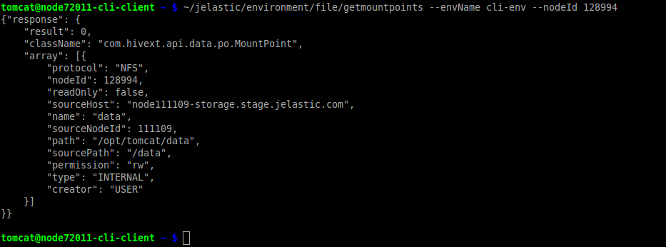
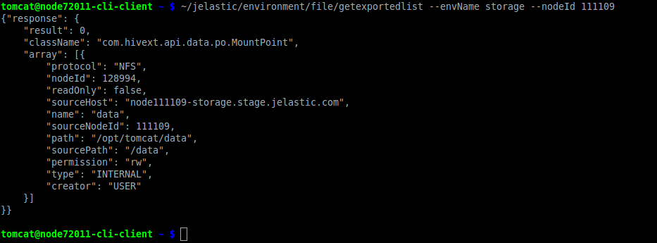
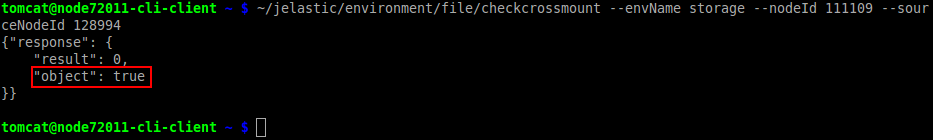
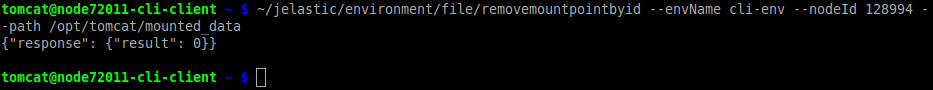
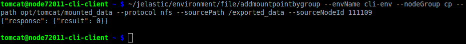

# CLI Tutorial: Mount Points

[Mount Points](/mount-points) are used to manage connection between data storage server and client, allowing you can work with the shared remote files as easy as with the local ones. With platform CLI it's possible to configure such mounts via terminal and to include them into specialized scripts for automation. 

Below, we'll observe all of the available commands for the mount points management.

1. First of all, you can get the list of existing mount points with the corresponding ***GetMountPoints*** CLI command:
```bash
~/jelastic/environment/file/getmountpoints --envName  {env_name} --nodeId  {node_ID}
```

where
* ***{env_name}*** - domain name of environment, where you want to check for mount points
* ***{node_ID}*** - unique identifier of the node to be checked
{}**Note:** Also, it is possible to use *"nodeGroup"* instead of *"nodeId"* to select the environment layer and show all mount points on it (e.g. *cp*, *bl*, *storage*, etc.).{}

2. In a similar way, you can check exports list by using the appropriate ***GetExportedList*** method with the same parameters as for the previous command:
```bash
~/jelastic/environment/file/getexportedlist --envName  {env_name} --nodeId  {node_ID}
```


3. In order to add mount point to a single node the following ***AddMountPointById*** CLI method is used:
```bash
~/jelastic/environment/file/addmountpointbyid --envName  {env_name} --nodeId  {node_ID} --path  {local_path} --protocol  {protocol} --sourcePath  {source_path} --sourceNodeId  {source_node_ID} --readOnly {true/false}
``` 

where
* ***{env_name}*** - domain name of environment, where you want to add mount point
* ***{node_ID}*** - unique identifier of the node within the selected environment data will be mounted to
* ***{local_path}*** - path to folder on client node data will be shown at
* ***{protocol}*** - protocol to be used (the **nfs** one is required)
* ***{source_path}*** - path to the files on your data storage server
* ***{source_node_ID}*** - identifier of the source node
{}**Note:** Alternatively, a *sourceHost* parameter can be used in order to point to the data storage server via IP or domain name.{}
* ***{true/false}*** - *read only* or *read & write* rights for the mounted data on the client node correspondingly (*false* by default)
{}**Tip:** In case you are not sure if mount points are allowed between nodes (due to the possible cross mounts issues), you can pelimitarly perform a check up:
```bash
~/jelastic/environment/file/checkcrossmount --envName {env_name} --nodeId {env_name} --sourceNodeId {source_node_ID}
```

As you can see in the image above, there will be cross mount (i.e. ***true*** value), if we try to mount from our storage (*111109*) to *128994* node, because data is already shared in opposite direction (from *128994* to *111109*). But if your received value is ***false***, mount point between nodes can be added.{}

4. The mount points removal process (***RemoveMountPointById***) do not use any new parameters compared to the addition method:
```bash
~/jelastic/environment/file/removemountpointbyid --envName  {env_name} --nodeId  {node_ID} --path  {local_path}
```


5. Also, it is possible to add mount points to the whole environment layer, without the necessity to call separate command for each node:
```bash
~/jelastic/environment/file/addmountpointbygroup --envName  {env_name} --nodeGroup  {env_layer} --path  {local_path} --protocol  {protocol} --sourcePath  {source_path} --sourceNodeId  {source_node_ID} --readOnly {true/false}
``` 

where
* ***{env_name}*** - domain name of environment, where you want to add mount point
* ***{env_layer}*** - name of the environment layer, data will be mounted to
* ***{local_path}*** - path to folder on a client node, where data will be displayed
* ***{protocol}*** - protocol to be used (the **nfs** one is required)
* ***{source_path}*** - path to the files on data storage server
* ***{source_node_ID}*** - identifier of the source node
{}**Note:** Alternatively, a *sourceHost* parameter can be used in order to point to the data storage server via IP or domain name.{}
* ***{true/false}*** - *read only* or *read & write* rights for the mounted data on the client node correspondingly (*false* by default)

6. Similarly, you can unmount data from all of the layer's nodes with the appropriate ***RemoveMountPointByGroup*** method:
```bash
~/jelastic/environment/file/removemountpointbygroup --envName  {env_name} --nodeGroup  {env_layer} --path  {local_path}
```


That's all! Now, you know how to manage your mount points via platform CLI.


## What's next?

Learn how to perform some other operations via platform CLI:

* [environment creation](/cli-create-environment/)
* [environment start/stop](/cli-environment-control/)
* [environment cloning](/cli-clone-environment/)
* [environment migration](/cli-environment-migration/)
* [server scaling](/cli-scaling/)
* [container redeploy](/cli-container-redeploy/)
* [Docker volumes](/cli-docker-volumes/)
* [VCS projects deployment](/cli-vcs-deploy/)
* [swap Public IPs](/cli-ip-swap/)
* [installing JPS](/cli-install-jps)