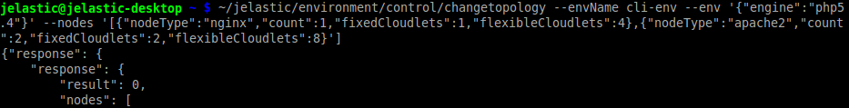

# CLI Tutorial: Server Scaling

When the environment is already created, in some cases it may be required to change its topology - for example, to scale a particular server or the whole environment layer (using the [vertical](/automatic-vertical-scaling) and/or [horizontal](/multi-nodes) scaling respectively) due to the changed incoming load. This may be accomplished with the corresponding ***changetopology*** CLI method:

```bash
~/jelastic/environment/control/changetopology --envName {env_name} --env '{"engine" : "{engine_type}"}' --nodes ['{"nodeType" : "{node_type}","count" : {nodes_amount}, "fixedCloudlets" : {cloudlets_amount}, "flexibleCloudlets" : {cloudlets_amount}}, {"nodeType" : "{node_type}", "count" : {nodes_amount}, "fixedCloudlets" : {cloudlets_amount}, "flexibleCloudlets" :  {cloudlets_amount}}']
```



The whole [set of possible parameters](/create-env-api) is the same as for the [createenvironment](/cli-create-environment) method, except the *--envName **{env_name}*** - here it is used to point to the already existing environment, that should be adjusted.

As for the rest of options, in this example we use the following ones:

* ***{engine_type}*** - engine the instances of the chosen environment are powered by (an obligatory string)
* ***{node_type}*** - stack type identifier, according to the [list](/application-manifest#nodeTypeList)
* ***{nodes_amount}*** - amount of nodes to be set (applies [horizontal scaling](/multi-nodes))
* ***{cloudlets_amount}*** - number of fixed (*fixedCloudlets*) and/or flexible (*flexibleCloudlets*) cloudlets to be allocated for the specified node type (applies [vertical scaling](/automatic-vertical-scaling))

{}**Note:** For the proper work of horizontally scaled application server, do not miss to add a [load balancing node](/http-load-balancing) to your environment topology beforehand (if it's absent).{}
Reconfiguration of environment topology may take several minutes in order to be accomplished.


## What's next?
More CLI usage examples can be found in the following documents:

* [environment creation](/cli-create-environment/)
* [environment start/stop](/cli-environment-control/)
* [environment cloning](/cli-clone-environment/)
* [environment migration](/cli-environment-migration/)
* [container redeploy](/cli-container-redeploy/)
* [Docker volumes](/cli-docker-volumes/)
* [mount points](/cli-mount-points/)
* [VCS projects deployment](/cli-vcs-deploy/)
* [swap Public IPs](/cli-ip-swap/)
* [installing JPS](/cli-install-jps)