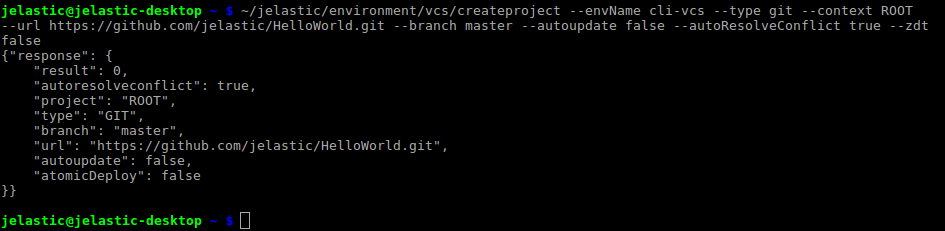
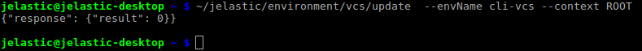
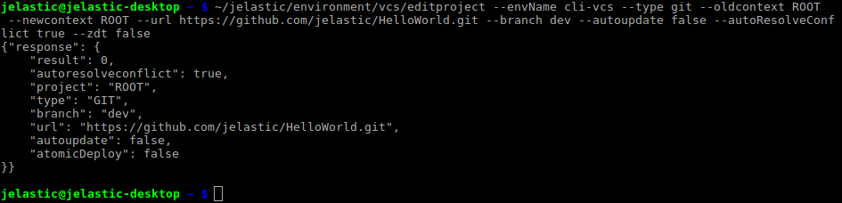

# CLI Tutorial: VCS Project Deployment  

Deployment via VCS is a rather popular and convenient way for project's integration into the Cloud, as it simplifies operating with app's sources and allows to easily update its version (either manually or automatically with a certain interval). And the variety of options, available for the VCS deployment management via CLI, gives you the full control on your app.

1\. For example, in order to <u>create a new project</u>, the following command should be run:
```bash
~/jelastic/environment/vcs/createproject --envName  {env_name} --type  {type} --context  {context} --url  {url} [--branch  {branch}] --autoupdate {true/false} [--interval  {interval}] --autoResolveConflict {true/false} --zdt {true/false}
```
Here, the list of parameters can be divided into the following groups:

* main configurations
    * ***{env_name}*** - name of your environment
    * ***{type}*** - VCS type, either *git* or *svn*; in the first case, the additional ***{branch}*** parameter is needed to point to the corresponding projects' version
    * ***{context}*** - context name for a new project
    * ***{url}*** - link to the appropriate repository
* additional options (their activation is defined with the ***{true/false}*** values)
    * *autoupdate* - enables regular [autoupdate](/git-svn-auto-deploy) of your deployed project; if activated, requires the additional ***{interval}*** parameter for setting the frequency of redeployments
    * *autoResolveConflict* - switches on the corresponding same-named option
    * *zdt* - allows to activate [ZDT deployment](/php-zero-downtime-deploy) for PHP projects
    
{}**Note:** In case you need to connect to a private repository, the additional authentication parameters <i>[--login **{login}**] [--password **{password}**] [--keyId **{keyId}**]</i> should be added to the main command.
Here, you need to obligatory state the ***{login}*** option (to specify your VCS account login) and append one of the following settings depending on the desired (*password* or *SSH key*) access types:

* ***{password}*** - the corresponding VCS account password
* ***{keyId}*** - name of the private SSH key you've specified while its addition to the dashboard; this allows to establish a [secure connection](/git-ssh) to the repo with the paired public SSH key is attached{}

After executing, you'll be shown a brief info on the created project within the received response.
{}**Tip:** The above described command correspond to the ***Add project*** dashboard frame's functionality, so in case you return to the GUI panel and click the **Edit** button next to the newly appeared project, you'll see all the appropriate options applied within its settings. *If the project is not displayed, just refresh the page with your dashboard.*{}

2\. The next step is running the update command in order to apply these settings and, actually, <u>deploy your project</u>.
```bash
~/jelastic/environment/vcs/update  --envName  {env_name} --context  {context}
```
Set the same parameters' values as in the previous step.

Subsequently, this command can be also used for manual redeployment of your app based on the updated VCS sources.

3\. In case you need to <u>edit project settings</u> (e.g. to switch the version branch), the *editproject* method should be executed:
```bash
~/jelastic/environment/vcs/editproject --envName  {env_name} --type  {type} --oldcontext  {oldcontext} --newcontext  {newcontext} --url  {url} [--branch  {branch}] --autoupdate {true/false} [--interval  {interval}] --autoResolveConflict {true/false} --zdt {true/false}
```
The majority of parameters are already familiar for you, except the following ones that have substituted the previously used *{project}* property:

* ***{oldcontext}*** - name of the project (i.e. context) that should be changed
* ***{newcontext}*** - new context for the project (it's obligatory for specifying; however, could be stated the same as ***{oldcontext}***)

The rest of options' values can be changed based on your needs.



{}**Note:** This command just updates the corresponding project's settings, while for their appliance the ***update*** method should be called (we've considered it in the *2nd* step).{}
That's all! Now you can create and manage your own VCS projects at the platform right through your terminal.


## What's next?
For more usage examples refer to the following documents:

* [environment creation](/cli-create-environment/)
* [environment start/stop](/cli-environment-control/)
* [environment cloning](/cli-clone-environment/)
* [environment migration](/cli-environment-migration/)
* [container redeploy](/cli-container-redeploy/)
* [Docker volumes](/cli-docker-volumes/)
* [mount points](/cli-mount-points/)
* [swap Public IPs](/cli-ip-swap/)
* [installing JPS](/cli-install-jps)