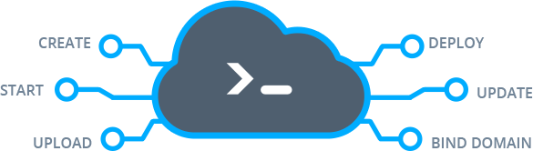

# Platform CLI Overview

The platform command-line interface (**CLI**) is designed to simplify interaction with your Cloud Platform account, allowing you to execute required commands via your local machine's terminal. It can handle the vast majority of available operations remotely, complementing the wide stack of capabilities provided via the [dashboard](/dashboard-guide/) and [platform API](https://www.virtuozzo.com/application-platform-api-docs/).



The main benefit here is the advanced and comparatively simple automation tools that CLI provides to developers. Simple text commands can be easily grouped into scripts and, in such a way, mold a powerful mechanism for accomplishing various objectives: from the most common and frequent tasks' automation to monitoring of apps and managing complex DevOps processes.

So, let's start with the [platform CLI installation](#cli-installation) and reveal some [key points](#getting-started) of its usage before proceeding further.

Subsequently, you can dive deeper with the [platform CLI tutorials](#cli-tutorials) on particular operations.


## CLI Installation

In order to install the platform CLI at your local machine, you need to run just a single line of code via your terminal:

```
curl -s ftp://ftp.jelastic.com/pub/cli/jelastic-cli-installer.sh | bash
```

{}**Notes:**

* please ensure you have [Java](https://java.com/en/download/help/download_options.xml) of the *8 version or higher* installed beforehand
* in case you are using Windows OS, you need to get the Unix-like environment installed first (e.g. [Cygwin](https://cygwin.com/)) and run all the appropriate commands within it
{}

Consequently, the platform CLI will be installed to the dedicated **jelastic** folder at your **home** directory. The structure of the folders and bash scripts inside represents the hierarchy of [platform API](https://www.virtuozzo.com/application-platform-api-docs/), which results in a complete similarity of the corresponding working processes, so you can quickly get used to our CLI.


## Getting Started

The base of the platform CLI is represented with an executable *.jar* archive and some pre-configured commands (bash scripts) for operating. With the help of these commands, you are able to monitor, control and automate your environment's lifecycle.

1\. To get started, the authentication should be passed. It is called automatically on the first CLI command use, e.g.:


Just follow the appearing questionnaire, specifying the asked values:

* ***Platform URL*** - PaaS installation URL in the *app.[{hoster_domain}](/paas-hosting-providers/)* format
* ***Email*** - email (login) bound to your account
* ***Password*** - your account password

If the entered data is correct, you'll see the logo and version of the currently used platform.

{}**Tip:** The authentication can also be initiated manually. For example, if you need to switch the current session and log in as another user or at a different PaaS installation. Use the following command:

```
~/jelastic/users/authentication/signin --login  {email} --password  {password} --platformUrl  {platformUrl}
```

Here, the values in braces should be substituted with the corresponding account parameters (described above).


The *&ldquo;result&rdquo;: 0* property within the received response (circled in the image above) means that the operation has passed successfully and without errors. Such behavior stands for all of the commands you run.{}

2\. The information on the actual user session (i.e. platform address and your credentials) is stored within the automatically generated ***~/.config/jelastic/jelastic.properties*** file. It is automatically fetched when necessary, allowing you to concentrate on performed operations with no repetitive authentication steps required.

By default, the CLI command is considered successfully executed even if the called API method returns an error. You can change this behavior with the ***jelastic.non_zero_exit_code*** parameter added to the configuration file. It defines if the CLI command should respond with zero code as usual (*false* - default value) or with a non-zero code when the executed API method returns an error (*true*).

3\. In case you are new to our API and need details on its command-line interface structure, you can access the embedded help file:

```
~/jelastic/help
```


Here, you can see the hierarchical list of the available command types (methods). Each method has the dedicated same-named folder with several scripts (i.e. available functions) inside.

4\. In order to get the list of all possible operations for a particular method, you can use a simple listing command for the appropriate directory, for example:

```
ls ~/jelastic/environment/control
```


Each of the presented functions can be easily called using the full path to it.

5\. For more information on a particular operation, run it without parameters to see the complete list of missed requirements.


You can also check our [API documentation](https://www.virtuozzo.com/application-platform-api-docs/) for getting additional information.

6\. By default, the "loading" animation is displayed while waiting for any command execution. It provides a visual representation of the action in progress.

However, if you need to save the response into a file (e.g. to use it in some automation tasks), this element may be redundant and corrupt JSON formatting. To hide the loading animation, append your command with the following argument:

```
--silent true
```

In such a way, the received output can be immediately used by your automation scripts without any additional edits.

{}**Tip:** The installed CLI automatically checks for updates. When a new version becomes available, you'll see the corresponding notification with the upgrade instructions.{}

Now, as you have some basic knowledge of platform CLI, you can continue exploring it on your own.


## CLI Tutorials

Ensuring the full-functional remote management, platform CLI works with all types of environments and applications. It supports all of the appropriate actions, from the simplest to the complex ones. To reveal its capabilities with real showcases, we present some of the most common examples of its usage:

* [environment creation](/cli-create-environment/)
* [environment start/stop](/cli-environment-control/)
* [environment cloning](/cli-clone-environment/)
* [environment migration](/cli-environment-migration/)
* [server scaling](/cli-scaling/)
* [container redeploy](/cli-container-redeploy/)
* [container volumes](/cli-container-volumes/)
* [mount points](/cli-mount-points/)
* [VCS projects deployment](/cli-vcs-deploy/)
* [swap Public IPs](/cli-ip-swap/)
* [install JPS](/cli-install-jps/)

Subsequently, when you catch the idea of how to work with platform CLI and the possibilities it provides, you can start creating your own automation scripts for some frequent environment lifecycle operations.

You can find complete information on all of the available commands and methods within the [platform API](https://www.virtuozzo.com/application-platform-api-docs/) documentation.


## What's next?

* [API Overview](/api-overview/)
* [API Methods](https://www.virtuozzo.com/application-platform-api-docs/)
* [Container Redeploy](/container-redeploy/)
* [GIT & SVN Auto-Deploy](/git-svn-auto-deploy/)