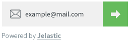
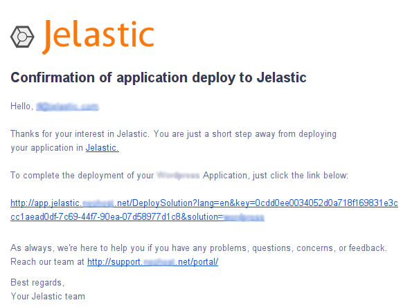
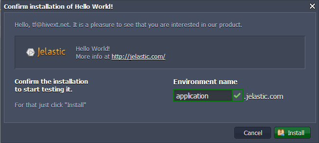
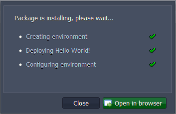
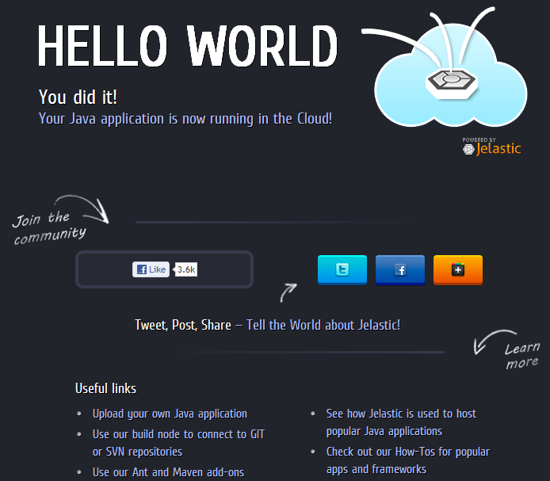

# App Installation via Widget
When the widget is placed at the site any user can initiate the installation of the packaged application by clicking the **Get it hosted now!** button and performing just several steps to complete the deployment.

 
1\. In the appeared field it is needed to enter the email address and press the pointer.

 
2\. After that a confirmation link will be sent to the stated email. 
Click it to be redirected to the platform dashboard.

If PaaS account with the entered email is already registered a user will be logged in automatically.

If there is no such PaaS account, a user will be signed up automatically and get the email with the login (the entered email) and password.

3\. At the dashboard the **Confirm installation of application** window will be opened with a short information about the application. 

Type the name of the environment required to be created for deploying the application and click **Install**.

4\. The process of installation begins. Wait a minute for Creating, Deploying and Configuring to be finished.

5\. Click **Open in browser** button. In a minute the installed application will be opened.

## What's next?
* [Installation Widget](/application-installation-widget/)
* [Application Manifest](/application-manifest/)