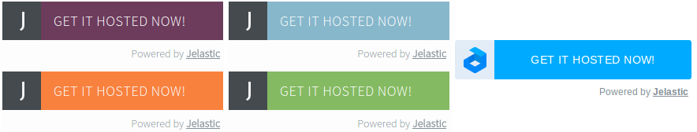

# Installation Widgets

With the platform packaging standard ([JPS](/jps)), it is possible to compose an installation template and get the button of one the next types for a one-click application deployment:



To include such widget at your website, follow the instruction below:

1\. Insert the *JavaScript software development kit* (SDK) script to the page the button should be displayed at, ideally right after the *<body>* tag opening:
```html
<html>  
<body>
<script>
   (function(d, s, id) {
       var js, fjs = d.getElementsByTagName(s)[0];
       if (d.getElementById(id)) return;
       js = d.createElement(s); js.id = id;
       js.async = true;
       js.src = "//go.jelastic.com/widgets.js";
       fjs.parentNode.insertBefore(js, fjs);
   }(document, 'script', 'jelastic-jssdk'));
</script>

...
</body>

</html>
```

2\. Then, place the code of your plugin wherever you want it to appear on your page:

```html
<div
      data-manifest="{link_to_json_file}"
      data-width="280"
      data-theme="modern"
      data-lang="en"
      class="je-app"
      data-hoster-select="1"
      data-key="app.{hoster_domain}"
      data-min-version="4.8">

```
Here, the attributes are:

{{%collgroup one="18%" two="46%" three="14%" four="22%" five="0%"%}}

Parameter|Description|Obligatory|Default/Example Value
---|---|---|---
***data-manifest***|Link to the JSON file of your packaged application|+|<i>{link_to_json_file}</i>
***data-width***|Width of the widget|-|*280*
***data-theme***|Colour style of the widget. The possible values are: *flat-blue*, *flat-purple*, *flat-orange*, *flat-green* and *modern*|+|*modern*
***data-lang***|Localization to be used at the user's dashboard (the stated value should point to the language, that is already available at a particular platform)|-|*en*
***class***|This parameter should always have the "*je-app*" value|+|*je-app*
***data-hoster-select***|Enables the hosting provider selection possibility **Note:** For the *modern *widgets only|-|*0/1*
***data-keys***|List of available for selection service providers, separated with semicolon ";" (skip it if you want all the hosters to be listed). **Note:**For the *modern *widgets with the *data-hoster-select* enabled only|-|*app.{[hoster_domain_1](/paas-hosting-providers/)};app.{[hoster_domain_2](/paas-hosting-providers/)}*
***data-key***|A particular hosting provider platform an application should be installed to (in a form of URL to the appropriate dashboard). <br>**Note:** If it's not specified, the geographically closest platform will be chosen by means of GeoIP|-|*app.{[hoster_domain](/paas-hosting-providers/)}* (where the *{[hoster_domain](/paas-hosting-providers/)}* value should be obligatory replaced with domain of the chosen provider)
***data-min-version***|Minimal platform version an application can be installed to (in the ***x[.x][.x]*** format). Hosting providers with lower PaaS versions won't be available for choosing.<br>**Note:** If not a single platform suits this criteria, user will be faced an error after submitting installation request|-|*4.8*


## Widget Localization

In case you need to customize the texts of widget elements (e.g. in order to provide the appropriate translation), please append the following strings to the above mentioned *div* tag attributes:

```html
<div
  *...*
  data-text="Get it hosted now!"
  data-tx-empty="Type your email and click the button"
  data-tx-invalid-email="Invalid email, please check the spelling"
  data-tx-error="An error has occurred, please try again later"
  data-tx-success="Check your email">
</div>
```
After that, state the needed values inside the quotes according the following parameters' descriptions:

Parameter|Description|Default Value
---|---|---
***data-text***|The initial label, displayed inside the widget|*Get it hosted now!*
***data-tx-empty***|This text is displayed upon hovering over the widget|*Type your email and click the button*
***data-tx-invalid-email***|This text appears when an email is entered incorrectly|*Invalid email, please check the spelling*
***data-tx-error***|Warning message to be displayed in case any error occurs|*An error has occurred, please try again later*
***data-tx-success***|This text is shown when installation is successfully completed |*Check your email*


## Widget Testing

Before placing the widget at your site, you can check whether everything works properly using the link of the following type (it will initiate the process of installation):

```
https://app.{hoster_domain}?manifest={manifest_code}
```
where:

* ***{[hoster_domain](/paas-hosting-providers/)}*** - platform domain of the chosen hosting provider (the last column in the linked table)
* ***{manifest_code}*** - content of your packaged application's manifest (*JSON* file). Herewith, it should be [compacted](http://jsoneditoronline.org/) (i.e. have no whitespaces - use the appropriate button above the editor) and [URL-encoded](http://meyerweb.com/eric/tools/dencoder/) (just paste the continuous string you've got and click on **Encode**). The eventually received value can be inserted to the link above.


Also, you can use the *http://* or *https://* link to the JSON file with your manifest, uploaded wherever in the Internet, instead of the last ***{manifest_code}*** parameter. Pay attention, that such an URL should not contain the question mark "*?*" (otherwise it won't work properly), so in this case you'll need to use some [URL shortener](https://goo.gl/).
{}**Note:** All the values should be specified without the curly brackets.{}

### Testing Link Samples

And here are a few examples of such links with application manifests (you should be registered at the specified platform):

* for a simple HelloWorld app installation, with the encoded manifest (the first one [here](/application-manifest-example)) directly in the URL

``` {linenos=false}
https://app.{hoster_domain}?manifest=%7B%22jpsType%22%3A%22install%22%2C%22jpsVersion%22%3A%220.2%22%2C%22application%22%3A%7B%22id%22%3A%22helloworld%22%2C%22name%22%3A%22Hello%20world!%22%2C%22version%22%3A%221.0%22%2C%22type%22%3A%22php%22%2C%22homepage%22%3A%22http%3A%2F%2Fjelastic.com%2F%22%2C%22logo%22%3A%22https%3A%2F%2Fjelastic.com%2Fassets%2Fimg%2Fjelastic-logo-middle.png%22%2C%22description%22%3A%7B%22text%22%3A%22Hello%20World%22%7D%2C%22env%22%3A%7B%22topology%22%3A%7B%22engine%22%3A%22php5.3%22%2C%22nodes%22%3A%5B%7B%22extip%22%3Afalse%2C%22count%22%3A1%2C%22cloudlets%22%3A16%2C%22nodeType%22%3A%22apache2%22%7D%5D%2C%22ssl%22%3Afalse%2C%22ha%22%3Afalse%7D%2C%22deployments%22%3A%5B%7B%22archive%22%3A%22http%3A%2F%2Fapp.jelastic.com%2Fxssu%2Fcross%2Fdownload%2FRDYYHFNuUQYJBFpPZQ08F0UWCRlUHxdBD0ZlTS4gcQJFFBJUDwIBQmNTTEBI%22%2C%22name%22%3A%22Hello%20World%22%2C%22context%22%3A%22ROOT%22%7D%5D%7D%2C%22success%22%3A%7B%22text%22%3A%22Hello%20World%20is%20successfully%20installed%22%7D%7D%7D
```

* for a packaged WordPress CMS, with the link to the corresponding JSON manifest file in the URL

*<span>https</span>://app.{hoster_domain}?<span style="word-break: break-all;">manifest=https://app.jelastic.com/xssu/cross/download/RDYYHABmUQEPVFxKZQVqFxBFWRYEGEUUDEM%2BS3p5cQ5CR0dWDwIBQmNTTEBI</span>*  

{}**Tip:** If you have packaged your own application due to our instructions, you can contact your hosting provider and negotiate adding your JPS to the default one-click deployment applications in the dashboard. In such a way, your app will be also available for automatic deploy via the [Marketplace dashboard section](/marketplace) to all users within your hosting platform.{}


## What's next?

* [Customer Side](/app-packaging/)
* [Manifest Creation](/application-manifest/)
* [Marketplace](/marketplace/)
* [JPS Overview](/jps/)

<script>
    (function(d, s, id) {
        var js, fjs = d.getElementsByTagName(s)[0];
        if (d.getElementById(id)) return;
        js = d.createElement(s); js.id = id;
        js.async = true;
        js.src = "//go.jelastic.com/widgets.js";
        fjs.parentNode.insertBefore(js, fjs);
    }(document, 'script', 'jelastic-jssdk'));
</script>
